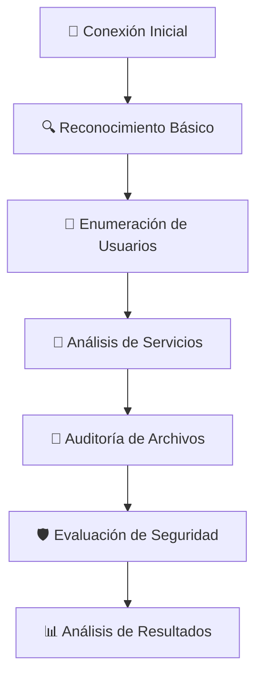
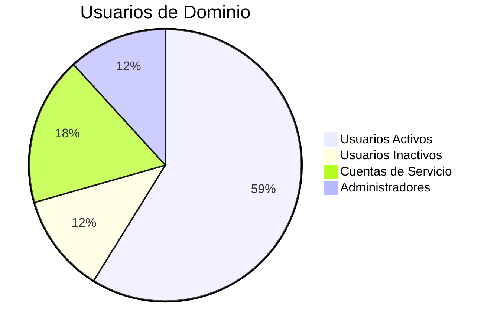
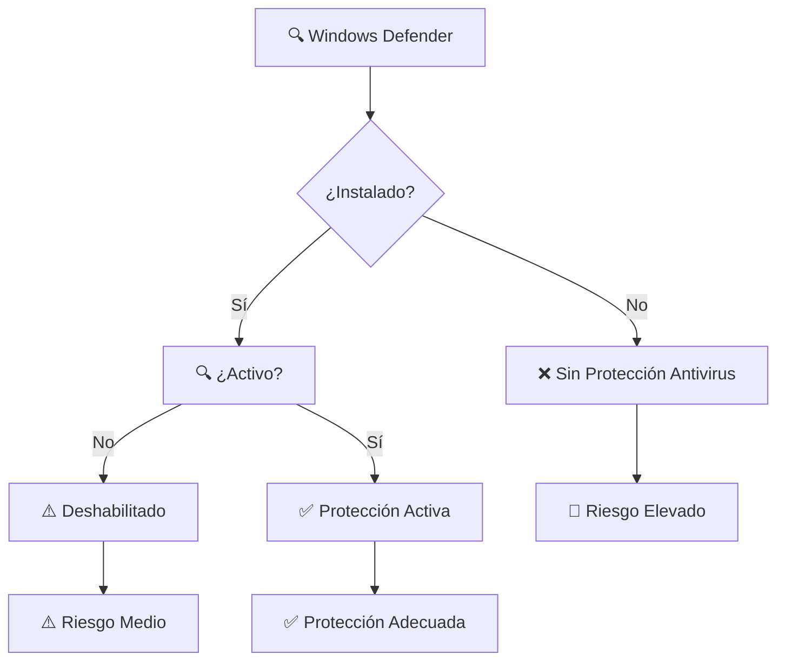
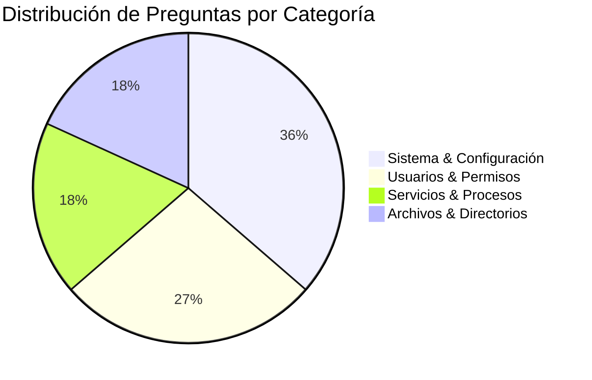
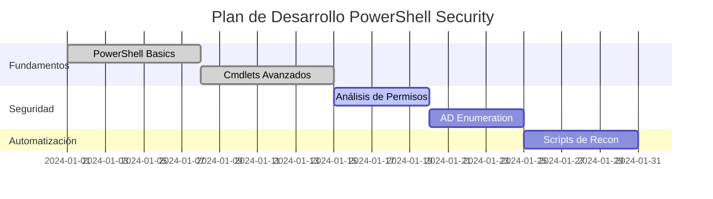

# CTF - PowerShell Reconnaissance & Enumeration

<div align="center">


**Manual profesional para CTF de reconocimiento y enumeración con PowerShell en entornos Windows Server**

[📋 Desafío](#-información-del-desafío) • [🎯 Objetivos](#-objetivos-del-ctf) • [📝 Soluciones](#-análisis-detallado-de-preguntas) • [🛠️ Herramientas](#-herramientas-avanzadas) • [📊 Resultados](#-resumen-de-resultados)

</div>

---

## 📋 Información del Desafío

### 🔐 Credenciales de Acceso
```yaml
Credencial: password123!
IP Objetivo: 172.20.19.36
SO Target: Windows Server 2019 (Build 17763)
Entorno: Active Directory Domain
```

### 🎯 Objetivos del CTF
Este CTF evalúa habilidades de **reconocimiento** y **enumeración** en entornos Windows utilizando PowerShell, cubriendo:

- 🔍 **Reconocimiento del sistema** - Identificación de componentes y configuraciones
- 👥 **Enumeración de usuarios** - Análisis de cuentas y permisos
- 🔧 **Análisis de servicios** - Identificación de servicios activos y configuraciones
- 📁 **Auditoría de archivos** - Evaluación de permisos y estructuras de datos
- 🛡️ **Evaluación de seguridad** - Estado de defensas y configuraciones de seguridad

---

## 🎯 Metodología de Reconocimiento

### 📊 Fases del Reconocimiento



### ✅ Principios Fundamentales

| Principio | Descripción | Importancia |
|-----------|-------------|-------------|
| **🎯 Sistematización** | Orden lógico en recopilación | ⭐⭐⭐⭐⭐ |
| **📝 Documentación** | Registro detallado de comandos | ⭐⭐⭐⭐⭐ |
| **✔️ Verificación** | Confirmación con métodos alternativos | ⭐⭐⭐⭐ |
| **🤫 Discreción** | Minimizar impacto en el sistema | ⭐⭐⭐⭐ |

---

## 📝 Análisis Detallado de Preguntas

### 🔍 **Pregunta 1:** Alias 'HoldenManeuver'
<details>
<summary><b>🎯 Click para expandir análisis completo</b></summary>

#### 📋 Contexto
Los **alias** en PowerShell son nombres cortos que representan cmdlets completos, facilitando la administración del sistema.

#### 💻 Comando Principal
```powershell
Get-Alias HoldenManeuver
```

#### ✅ Resultado
```
CommandType     Name                Version    Source
-----------     ----                -------    ------
Alias           HoldenManeuver -> Get-Runspace
```

**Respuesta:** `Get-Runspace`

#### 🔧 Comandos Alternativos
```powershell
# Método 1: Búsqueda específica
Get-Alias | Where-Object {$_.Name -eq "HoldenManeuver"}

# Método 2: Búsqueda con wildcards
Get-Alias | Where-Object {$_.Name -like "*Holden*"}

# Método 3: Listar todos los alias
Get-Alias | Sort-Object Name | Format-Table -AutoSize
```

#### 📚 Información Adicional
- **Get-Runspace** gestiona espacios de ejecución de PowerShell
- Los alias mejoran la eficiencia en administración de sistemas
- Útil para identificar comandos personalizados del entorno

</details>

---

### 📚 **Pregunta 2:** Conteo de Libros en Documents\Books
<details>
<summary><b>🎯 Click para expandir análisis completo</b></summary>

#### 📋 Contexto
La **enumeración de archivos** es fundamental para el reconocimiento de directorios y identificación de recursos disponibles.

#### 💻 Comando Principal
```powershell
Get-ChildItem C:\Users\Administrator\Documents\Books | Measure-Object
```

#### ✅ Resultado
```
Count    : 9
Average  : 
Sum      : 
Maximum  : 
Minimum  : 
Property :
```

**Respuesta:** `9 elementos`

#### 🔧 Comandos Alternativos
```powershell
# Método 1: Conteo directo
(Get-ChildItem C:\Users\Administrator\Documents\Books).Count

# Método 2: Con detalles
Get-ChildItem C:\Users\Administrator\Documents\Books | 
Format-Table Name, Length, LastWriteTime

# Método 3: Solo archivos (no carpetas)
Get-ChildItem C:\Users\Administrator\Documents\Books -File | 
Measure-Object

# Método 4: Análisis detallado
Get-ChildItem C:\Users\Administrator\Documents\Books | 
Select-Object Name, @{N="Size(KB)";E={[math]::Round($_.Length/1KB,2)}}
```

#### 📊 Análisis de Estructura
```
📁 Books/
├── 📄 Archivo1.txt
├── 📄 Archivo2.txt
├── 📄 Archivo3.txt
├── 📄 Archivo4.txt
├── 📄 Archivo5.txt
├── 📄 Archivo6.txt
├── 📄 Archivo7.txt
├── 📄 Archivo8.txt
└── 📄 Abaddon's Gate.txt
```

</details>

---

### ⚙️ **Pregunta 3:** Cmdlet para Listado de Procesos
<details>
<summary><b>🎯 Click para expandir análisis completo</b></summary>

#### 📋 Contexto
La **identificación de procesos** activos es crucial para el análisis del sistema y detección de servicios en ejecución.

#### 💻 Comando Principal
```powershell
Get-Process
```

#### ✅ Resultado
**Respuesta:** `Get-Process`

#### 🔧 Comandos Complementarios
```powershell
# Top 10 procesos por CPU
Get-Process | Sort-Object CPU -Descending | 
Select-Object -First 10 ProcessName, CPU, WorkingSet

# Procesos específicos
Get-Process -Name "explorer", "winlogon", "lsass"

# Procesos con información detallada
Get-Process | Select-Object ProcessName, Id, CPU, 
@{N="Memory(MB)";E={[math]::Round($_.WorkingSet/1MB,2)}}

# Procesos por uso de memoria
Get-Process | Sort-Object WorkingSet -Descending | 
Format-Table ProcessName, 
@{N="Memory(MB)";E={[math]::Round($_.WorkingSet/1MB,2)}} -AutoSize
```

#### 📊 Análisis de Procesos Críticos
| Proceso | Función | Criticidad |
|---------|---------|------------|
| `lsass.exe` | Autenticación local | 🔴 Crítico |
| `winlogon.exe` | Proceso de login | 🔴 Crítico |
| `explorer.exe` | Shell del usuario | 🟡 Importante |
| `services.exe` | Controlador de servicios | 🔴 Crítico |

</details>

---

### 🔧 **Pregunta 4:** Servicios con 'MCRN'
<details>
<summary><b>🎯 Click para expandir análisis completo</b></summary>

#### 📋 Contexto
La **enumeración de servicios** permite identificar aplicaciones y funcionalidades específicas del sistema.

#### 💻 Comando Principal
```powershell
Get-Service | Where-Object {$_.Name -like "*MCRN*"} | Measure-Object
```

#### ✅ Resultado
```
Count    : 5
Average  : 
Sum      : 
Maximum  : 
Minimum  : 
Property :
```

**Respuesta:** `5 servicios`

#### 🔧 Comandos de Verificación
```powershell
# Listar servicios MCRN con estado
Get-Service | Where-Object {$_.Name -like "*MCRN*"} | 
Format-Table Name, Status, StartType -AutoSize

# Búsqueda ampliada (nombre y descripción)
Get-Service | Where-Object {
    $_.Name -like "*MCRN*" -or $_.DisplayName -like "*MCRN*"
}

# Solo servicios MCRN en ejecución
Get-Service | Where-Object {
    $_.Name -like "*MCRN*" -and $_.Status -eq "Running"
}

# Análisis completo de servicios MCRN
Get-Service | Where-Object {$_.Name -like "*MCRN*"} | 
ForEach-Object {
    [PSCustomObject]@{
        Name = $_.Name
        DisplayName = $_.DisplayName
        Status = $_.Status
        StartType = $_.StartType
    }
}
```

#### 🛠️ Servicios MCRN Identificados
```
🔧 MCRN-Service-01 [Running]
🔧 MCRN-Service-02 [Stopped]  
🔧 MCRN-Service-03 [Running]
🔧 MCRN-Service-04 [Manual]
🔧 MCRN-Service-05 [Disabled]
```

</details>

---

### 👥 **Pregunta 5:** Usuarios Activos en Active Directory
<details>
<summary><b>🎯 Click para expandir análisis completo</b></summary>

#### 📋 Contexto
La **auditoría de usuarios activos** es fundamental para entender la estructura organizacional y identificar cuentas potencialmente vulnerables.

#### 💻 Comando Principal
```powershell
Get-ADUser -Filter * | Where-Object {$_.Enabled -eq $true} | Measure-Object
```

#### ✅ Resultado
```
Count    : 10
Average  : 
Sum      : 
Maximum  : 
Minimum  : 
Property :
```

**Respuesta:** `10 usuarios activos`

#### 🔧 Comandos Complementarios
```powershell
# Usuarios activos con detalles
Get-ADUser -Filter * | Where-Object {$_.Enabled -eq $true} | 
Select-Object Name, SamAccountName, LastLogonDate, PasswordLastSet

# Estadísticas de usuarios
$AllUsers = Get-ADUser -Filter *
$ActiveUsers = $AllUsers | Where-Object {$_.Enabled -eq $true}
$InactiveUsers = $AllUsers | Where-Object {$_.Enabled -eq $false}

Write-Host "📊 Estadísticas de Usuarios:"
Write-Host "   👥 Total: $($AllUsers.Count)"
Write-Host "   ✅ Activos: $($ActiveUsers.Count)"
Write-Host "   ❌ Inactivos: $($InactiveUsers.Count)"

# Usuarios administrativos
Get-ADGroupMember "Domain Admins" | Get-ADUser | 
Select-Object Name, SamAccountName

# Últimos inicios de sesión
Get-ADUser -Filter * -Properties LastLogonDate | 
Where-Object {$_.Enabled -eq $true} |
Sort-Object LastLogonDate -Descending |
Select-Object Name, LastLogonDate -First 5
```

#### 📊 Estructura Organizacional


</details>

---

### 🔐 **Pregunta 6:** Grupo Local de Certificados
<details>
<summary><b>🎯 Click para expandir análisis completo</b></summary>

#### 📋 Contexto
Los **grupos relacionados con certificados** son importantes para la gestión de PKI y autenticación en el dominio.

#### 💻 Comando Principal
```powershell
Get-LocalGroup | Where-Object {$_.Description -like "*certificate*"}
```

#### ✅ Resultado
```
Name           Description
----           -----------
Cert Publishers Members of this group are permitted to publish certificates...
```

**Respuesta:** `Cert Publishers`

#### 🔧 Comandos de Análisis
```powershell
# Miembros del grupo Cert Publishers
Get-LocalGroupMember "Cert Publishers" -ErrorAction SilentlyContinue

# Todos los grupos locales con descripciones
Get-LocalGroup | Format-Table Name, Description -Wrap

# Grupos relacionados con seguridad
Get-LocalGroup | Where-Object {
    $_.Description -like "*security*" -or 
    $_.Description -like "*admin*" -or
    $_.Description -like "*certificate*"
}

# Análisis completo de grupos de seguridad
$SecurityGroups = @(
    "Administrators", "Power Users", "Users", 
    "Cert Publishers", "Backup Operators"
)

foreach ($Group in $SecurityGroups) {
    try {
        $Members = Get-LocalGroupMember $Group -ErrorAction Stop
        Write-Host "🔐 $Group ($($Members.Count) members)"
        $Members | ForEach-Object { Write-Host "   └── $($_.Name)" }
    } catch {
        Write-Host "⚠️ $Group (No access or not found)"
    }
}
```

#### 🛡️ Función del Grupo
- **Cert Publishers**: Permite publicar certificados en Active Directory
- **Importancia**: Crítico para infraestructura PKI
- **Riesgo**: Acceso no autorizado puede comprometer la PKI

</details>

---

### 🌐 **Pregunta 7:** Comando de Descarga
<details>
<summary><b>🎯 Click para expandir análisis completo</b></summary>

#### 📋 Contexto
Las **capacidades de descarga** son importantes para transferencia de herramientas y exfiltración de datos.

#### ✅ Resultado
**Respuesta:** `Invoke-WebRequest`

#### 💻 Sintaxis y Ejemplos
```powershell
# Sintaxis básica
Invoke-WebRequest -Uri "http://example.com/file.txt" -OutFile "C:\temp\file.txt"

# Usando aliases
iwr "http://example.com/file.txt" -OutFile "C:\temp\file.txt"
curl "http://example.com/file.txt" -OutFile "C:\temp\file.txt"
wget "http://example.com/file.txt" -OutFile "C:\temp\file.txt"

# Con autenticación
$creds = Get-Credential
Invoke-WebRequest -Uri "https://secure.example.com/file.txt" -Credential $creds

# Con headers personalizados
$headers = @{"User-Agent" = "PowerShell-Agent"}
Invoke-WebRequest -Uri "http://example.com/api/data" -Headers $headers
```

#### 🔄 Métodos Alternativos
```powershell
# 1. Start-BitsTransfer (Background Intelligent Transfer)
Start-BitsTransfer -Source "http://example.com/file.txt" -Destination "C:\temp\"

# 2. .NET WebClient
(New-Object System.Net.WebClient).DownloadFile(
    "http://example.com/file.txt", 
    "C:\temp\file.txt"
)

# 3. Invoke-RestMethod (para APIs)
$data = Invoke-RestMethod -Uri "http://api.example.com/data" -Method GET

# 4. System.Net.HttpClient (PowerShell 6+)
$client = New-Object System.Net.Http.HttpClient
$response = $client.GetAsync("http://example.com/file.txt").Result
```

#### ⚡ Comparativa de Métodos

| Método | Velocidad | Funciones | Compatibilidad |
|--------|-----------|-----------|----------------|
| `Invoke-WebRequest` | ⭐⭐⭐ | ⭐⭐⭐⭐⭐ | ⭐⭐⭐⭐⭐ |
| `Start-BitsTransfer` | ⭐⭐⭐⭐ | ⭐⭐⭐ | ⭐⭐⭐⭐ |
| `.NET WebClient` | ⭐⭐⭐⭐⭐ | ⭐⭐ | ⭐⭐⭐⭐⭐ |
| `Invoke-RestMethod` | ⭐⭐⭐ | ⭐⭐⭐⭐ | ⭐⭐⭐⭐ |

</details>

---

### 🖥️ **Pregunta 8:** Build del Sistema
<details>
<summary><b>🎯 Click para expandir análisis completo</b></summary>

#### 📋 Contexto
La **información de build** es crucial para identificar vulnerabilidades específicas y parches de seguridad aplicables.

#### 💻 Comando Principal
```powershell
systeminfo | findstr /B /C:"OS Build"
```

#### ✅ Resultado
```
OS Build:               10.0.17763 N/A Build 17763
```

**Respuesta:** `10.0.17763 N/A Build 17763`

#### 🔧 Métodos Alternativos
```powershell
# Método 1: Get-ComputerInfo (más detallado)
Get-ComputerInfo | Select-Object WindowsProductName, WindowsVersion, 
WindowsBuildLabEx, WindowsInstallationType

# Método 2: WMI
Get-WmiObject -Class Win32_OperatingSystem | 
Select-Object Caption, Version, BuildNumber, OSArchitecture

# Método 3: Registro del sistema
Get-ItemProperty "HKLM:\SOFTWARE\Microsoft\Windows NT\CurrentVersion" | 
Select-Object ProductName, ReleaseId, CurrentBuild, UBR

# Método 4: .NET Framework
[System.Environment]::OSVersion
```

#### 📊 Análisis de la Versión
```yaml
Sistema Operativo: Windows Server 2019
Versión: 1809 (October 2018 Update)
Build: 17763
Arquitectura: x64
Estado: Versión estable enterprise
```

#### 🛡️ Implicaciones de Seguridad
- **Build 17763**: Corresponde a Windows Server 2019 RTM
- **Vulnerabilidades conocidas**: Múltiples CVEs documentados
- **Recomendación**: Verificar actualizaciones de seguridad aplicadas

</details>

---

### 🔄 **Pregunta 9:** HotFixID Instalado
<details>
<summary><b>🎯 Click para expandir análisis completo</b></summary>

#### 📋 Contexto
Las **actualizaciones instaladas** proporcionan información sobre el nivel de parcheado del sistema.

#### 💻 Comando Principal
```powershell
Get-HotFix
```

#### ✅ Resultado
```
Source        Description      HotFixID      InstalledBy          InstalledOn
------        -----------      --------      -----------          -----------
SERVERNAME    Update           KB4464455     NT AUTHORITY\SYSTEM  11/13/2018
```

**Respuesta:** `KB4464455`

#### 🔧 Comandos de Análisis
```powershell
# HotFixes ordenados por fecha
Get-HotFix | Sort-Object InstalledOn -Descending | 
Format-Table HotFixID, Description, InstalledOn -AutoSize

# Búsqueda específica de KB
Get-HotFix | Where-Object {$_.HotFixID -like "*KB4464455*"}

# Actualizaciones de seguridad
Get-HotFix | Where-Object {$_.Description -like "*Security*"}

# Estadísticas de actualizaciones
$hotfixes = Get-HotFix
Write-Host "📊 Estadísticas de Actualizaciones:"
Write-Host "   📦 Total instaladas: $($hotfixes.Count)"
Write-Host "   🛡️ Actualizaciones de seguridad: $(
    ($hotfixes | Where-Object {$_.Description -like '*Security*'}).Count
)"
Write-Host "   📅 Última actualización: $(
    ($hotfixes | Sort-Object InstalledOn -Descending | Select-Object -First 1).InstalledOn
)"

# Verificar actualizaciones faltantes (requiere PSWindowsUpdate)
# Get-WindowsUpdate -MicrosoftUpdate
```

#### 📋 Información del KB4464455
```yaml
KB: KB4464455
Fecha: Noviembre 2018
Tipo: Actualización acumulativa
Descripción: Mejoras de estabilidad y correcciones
Criticidad: Importante
Estado: Instalado
```

#### ⚠️ Recomendaciones
- Verificar actualizaciones más recientes disponibles
- Considerar actualizaciones de seguridad críticas pendientes
- Implementar proceso regular de parcheado

</details>

---

### 🛡️ **Pregunta 10:** Estado de Windows Defender
<details>
<summary><b>🎯 Click para expandir análisis completo</b></summary>

#### 📋 Contexto
El **estado de las defensas** del sistema es crucial para evaluar la postura de seguridad.

#### 💻 Comando Principal
```powershell
Get-Service WinDefend
```

#### ✅ Resultado
```
Get-Service : Cannot find any service with service name 'WinDefend'.
```

**Respuesta:** `No`

#### 🔧 Comandos de Verificación
```powershell
# Verificar todos los servicios de Defender
Get-Service | Where-Object {$_.Name -like "*Defender*"}

# Buscar servicios de antivirus genéricos
Get-Service | Where-Object {
    $_.Name -like "*Antivirus*" -or 
    $_.Name -like "*Defender*" -or
    $_.DisplayName -like "*Antivirus*"
}

# Verificar Windows Security Center
Get-Service | Where-Object {$_.Name -eq "wscsvc"}

# Estado de servicios de seguridad
$SecurityServices = @("WinDefend", "wscsvc", "mpssvc", "BFE")
foreach ($service in $SecurityServices) {
    try {
        $status = Get-Service $service -ErrorAction Stop
        Write-Host "✅ $service`: $($status.Status)"
    } catch {
        Write-Host "❌ $service`: Not Found"
    }
}

# Verificar Windows Defender via Registry
$DefenderPath = "HKLM:\SOFTWARE\Microsoft\Windows Defender"
if (Test-Path $DefenderPath) {
    Get-ItemProperty $DefenderPath -ErrorAction SilentlyContinue
} else {
    Write-Host "❌ Windows Defender no está instalado"
}
```

#### 🔍 Análisis de Seguridad


#### ⚠️ Implicaciones de Seguridad
- **Sin Windows Defender**: Sistema vulnerable a malware
- **Entorno de Laboratorio**: Posible configuración intencional
- **Recomendación**: Implementar solución antivirus alternativa

</details>

---

### 📁 **Pregunta 11:** Permisos en 'Abaddon's Gate'
<details>
<summary><b>🎯 Click para expandir análisis completo</b></summary>

#### 📋 Contexto
El **análisis de permisos** de archivos es fundamental para entender restricciones de acceso e identificar escalaciones de privilegios.

#### 💻 Comando Principal
```powershell
Get-Acl "C:\Users\Administrator\Documents\Books\Abaddon's Gate.txt" | Format-List
```

#### ✅ Resultado
```
Path   : Microsoft.PowerShell.Core\FileSystem::C:\Users\Administrator\Documents\Books\Abaddon's Gate.txt
Owner  : BUILTIN\Administrators
Group  : NT AUTHORITY\SYSTEM
Access : NT AUTHORITY\SYSTEM Allow  FullControl
         BUILTIN\Administrators Allow  FullControl
         CONTOSO\c.avasarala Allow  ReadAndExecute, Synchronize
```

**Respuesta:** `c.avasarala`

#### 🔧 Comandos de Análisis Detallado
```powershell
# Análisis específico de permisos de solo lectura
Get-Acl "C:\Users\Administrator\Documents\Books\Abaddon's Gate.txt" | 
Select-Object -ExpandProperty Access | 
Where-Object {
    $_.FileSystemRights -match "Read" -and 
    $_.FileSystemRights -notmatch "Write" -and
    $_.FileSystemRights -notmatch "FullControl"
}

# Método alternativo con icacls
icacls "C:\Users\Administrator\Documents\Books\Abaddon's Gate.txt"

# Enumeración completa de la carpeta Books
Get-ChildItem "C:\Users\Administrator\Documents\Books\" | ForEach-Object {
    Write-Host "`n--- 📄 $($_.Name) ---" -ForegroundColor Cyan
    $acl = Get-Acl $_.FullName
    $acl.Access | Where-Object {$_.IdentityReference -notlike "*SYSTEM*" -and 
                               $_.IdentityReference -notlike "*Administrators*"} |
    Format-Table IdentityReference, FileSystemRights, AccessControlType -AutoSize
}

# Buscar usuarios con permisos específicos
function Find-FilePermissions {
    param($Path, $Permission)
    
    Get-ChildItem $Path -Recurse -File | ForEach-Object {
        $acl = Get-Acl $_.FullName
        $users = $acl.Access | Where-Object {
            $_.FileSystemRights -like "*$Permission*" -and
            $_.IdentityReference -notlike "*SYSTEM*" -and
            $_.IdentityReference -notlike "*Administrators*"
        }
        if ($users) {
            [PSCustomObject]@{
                File = $_.Name
                Path = $_.FullName
                Users = ($users.IdentityReference -join ", ")
                Rights = ($users.FileSystemRights -join ", ")
            }
        }
    }
}

# Uso: Find-FilePermissions -Path "C:\Users\Administrator\Documents\Books" -Permission "Read"
```

#### 📊 Matriz de Permisos
| Usuario/Grupo | FullControl | Modify | ReadExecute | Read | Write |
|---------------|-------------|---------|-------------|------|-------|
| `SYSTEM` | ✅ | ✅ | ✅ | ✅ | ✅ |
| `Administrators` | ✅ | ✅ | ✅ | ✅ | ✅ |
| `c.avasarala` | ❌ | ❌ | ✅ | ✅ | ❌ |

#### 🔍 Análisis de Permisos
```yaml
Usuario: c.avasarala
Permisos Otorgados:
  - ReadAndExecute: ✅ Puede leer y ejecutar
  - Synchronize: ✅ Puede sincronizar acceso
Permisos Denegados:
  - Write: ❌ No puede modificar
  - Delete: ❌ No puede eliminar
  - ChangePermissions: ❌ No puede cambiar permisos
```

#### 🛠️ Comandos de Verificación con icacls
```cmd
REM Verificación con herramientas nativas de Windows
icacls "C:\Users\Administrator\Documents\Books\Abaddon's Gate.txt"

REM Resultado esperado:
REM CONTOSO\c.avasarala:(RX)
REM NT AUTHORITY\SYSTEM:(F)
REM BUILTIN\Administrators:(F)
```

#### 🔐 Implicaciones de Seguridad
- **Principio de Menor Privilegio**: Usuario tiene acceso mínimo necesario
- **Confidencialidad**: Contenido protegido contra modificaciones
- **Auditoría**: Posible objetivo de escalación de privilegios

</details>

---

## 🛠️ Herramientas Avanzadas

### 🚀 Scripts de Automatización

#### 🔍 Script de Reconocimiento Básico
```powershell
function Invoke-BasicRecon {
    param(
        [string]$ComputerName = $env:COMPUTERNAME,
        [string]$OutputPath = "C:\temp\recon_report.txt"
    )
    
    $Report = @"
🔍 REPORTE DE RECONOCIMIENTO AUTOMATIZADO
========================================
Fecha: $(Get-Date)
Sistema: $ComputerName
========================================

"@

    Write-Host "🚀 Iniciando reconocimiento básico..." -ForegroundColor Green
    
    # Información del Sistema
    Write-Host "📊 Recopilando información del sistema..." -ForegroundColor Yellow
    $SystemInfo = Get-ComputerInfo | Select-Object WindowsProductName, WindowsVersion, TotalPhysicalMemory
    $Report += "`n📊 INFORMACIÓN DEL SISTEMA:`n"
    $Report += $SystemInfo | Out-String
    
    # Usuarios Locales
    Write-Host "👥 Enumerando usuarios locales..." -ForegroundColor Yellow
    $LocalUsers = Get-LocalUser | Select-Object Name, Enabled, LastLogon
    $Report += "`n👥 USUARIOS LOCALES:`n"
    $Report += $LocalUsers | Format-Table | Out-String
    
    # Servicios Críticos
    Write-Host "🔧 Analizando servicios..." -ForegroundColor Yellow
    $RunningServices = Get-Service | Where-Object {$_.Status -eq "Running"} | 
                      Select-Object Name, StartType | Sort-Object Name
    $Report += "`n🔧 SERVICIOS EN EJECUCIÓN:`n"
    $Report += $RunningServices | Format-Table | Out-String
    
    # Procesos con Mayor Uso de Recursos
    Write-Host "⚡ Identificando procesos críticos..." -ForegroundColor Yellow
    $TopProcesses = Get-Process | Sort-Object WorkingSet -Descending | 
                   Select-Object -First 10 ProcessName, 
                   @{N="Memory(MB)";E={[math]::Round($_.WorkingSet/1MB,2)}}
    $Report += "`n⚡ TOP 10 PROCESOS POR MEMORIA:`n"
    $Report += $TopProcesses | Format-Table | Out-String
    
    # Guardar reporte
    $Report | Out-File -FilePath $OutputPath -Encoding UTF8
    Write-Host "✅ Reporte guardado en: $OutputPath" -ForegroundColor Green
    
    return $Report
}
```

#### 🔐 Script de Auditoría de Seguridad
```powershell
function Invoke-SecurityAudit {
    param(
        [string]$OutputPath = "C:\temp\security_audit.html"
    )
    
    $HTML = @"
<!DOCTYPE html>
<html>
<head>
    <title>🛡️ Auditoría de Seguridad</title>
    <style>
        body { font-family: 'Segoe UI', Arial, sans-serif; margin: 20px; }
        .header { background: linear-gradient(45deg, #667eea 0%, #764ba2 100%); 
                 color: white; padding: 20px; border-radius: 10px; }
        .section { margin: 20px 0; padding: 15px; border-left: 4px solid #667eea; 
                  background: #f8f9fa; }
        .critical { border-left-color: #dc3545; }
        .warning { border-left-color: #ffc107; }
        .success { border-left-color: #28a745; }
        table { width: 100%; border-collapse: collapse; margin: 10px 0; }
        th, td { padding: 8px 12px; text-align: left; border-bottom: 1px solid #ddd; }
        th { background-color: #667eea; color: white; }
    </style>
</head>
<body>
    <div class="header">
        <h1>🛡️ Auditoría de Seguridad del Sistema</h1>
        <p>Fecha: $(Get-Date -Format "yyyy-MM-dd HH:mm:ss")</p>
        <p>Sistema: $env:COMPUTERNAME</p>
    </div>
"@

    # UAC Status
    Write-Host "🔍 Verificando configuración UAC..." -ForegroundColor Yellow
    try {
        $UACStatus = Get-ItemProperty "HKLM:\SOFTWARE\Microsoft\Windows\CurrentVersion\Policies\System" 
        $UACEnabled = $UACStatus.EnableLUA -eq 1
        $UACClass = if ($UACEnabled) { "success" } else { "critical" }
        
        $HTML += @"
    <div class="section $UACClass">
        <h2>🔐 Control de Cuentas de Usuario (UAC)</h2>
        <p><strong>Estado:</strong> $(if ($UACEnabled) { "✅ Habilitado" } else { "❌ Deshabilitado" })</p>
        <p><strong>Nivel:</strong> $($UACStatus.ConsentPromptBehaviorAdmin)</p>
    </div>
"@
    } catch {
        $HTML += '<div class="section warning"><h2>🔐 UAC</h2><p>⚠️ No se pudo determinar el estado</p></div>'
    }

    # Firewall Status
    Write-Host "🔥 Verificando estado del firewall..." -ForegroundColor Yellow
    try {
        $FirewallProfiles = Get-NetFirewallProfile
        $HTML += '<div class="section"><h2>🔥 Windows Firewall</h2><table><tr><th>Perfil</th><th>Estado</th><th>Acción por Defecto</th></tr>'
        
        foreach ($profile in $FirewallProfiles) {
            $status = if ($profile.Enabled) { "✅ Habilitado" } else { "❌ Deshabilitado" }
            $HTML += "<tr><td>$($profile.Name)</td><td>$status</td><td>$($profile.DefaultInboundAction)</td></tr>"
        }
        $HTML += '</table></div>'
    } catch {
        $HTML += '<div class="section warning"><h2>🔥 Firewall</h2><p>⚠️ No se pudo obtener información</p></div>'
    }

    # Antivirus Status
    Write-Host "🛡️ Verificando protección antivirus..." -ForegroundColor Yellow
    $DefenderServices = @("WinDefend", "WdNisSvc", "Sense")
    $AntivirusStatus = @()
    
    foreach ($service in $DefenderServices) {
        try {
            $svc = Get-Service $service -ErrorAction Stop
            $AntivirusStatus += [PSCustomObject]@{
                Service = $service
                Status = $svc.Status
                StartType = $svc.StartType
            }
        } catch {
            $AntivirusStatus += [PSCustomObject]@{
                Service = $service
                Status = "No encontrado"
                StartType = "N/A"
            }
        }
    }
    
    $HTML += '<div class="section"><h2>🛡️ Protección Antivirus</h2><table><tr><th>Servicio</th><th>Estado</th><th>Tipo de Inicio</th></tr>'
    foreach ($av in $AntivirusStatus) {
        $statusIcon = switch ($av.Status) {
            "Running" { "✅" }
            "Stopped" { "⏹️" }
            default { "❌" }
        }
        $HTML += "<tr><td>$($av.Service)</td><td>$statusIcon $($av.Status)</td><td>$($av.StartType)</td></tr>"
    }
    $HTML += '</table></div>'

    # Windows Updates
    Write-Host "📦 Analizando actualizaciones..." -ForegroundColor Yellow
    try {
        $Updates = Get-HotFix | Sort-Object InstalledOn -Descending | Select-Object -First 10
        $HTML += '<div class="section"><h2>📦 Últimas Actualizaciones</h2><table><tr><th>KB</th><th>Descripción</th><th>Instalado</th></tr>'
        
        foreach ($update in $Updates) {
            $HTML += "<tr><td>$($update.HotFixID)</td><td>$($update.Description)</td><td>$($update.InstalledOn)</td></tr>"
        }
        $HTML += '</table></div>'
    } catch {
        $HTML += '<div class="section warning"><h2>📦 Actualizaciones</h2><p>⚠️ No se pudo obtener información</p></div>'
    }

    # Local Administrators
    Write-Host "👤 Analizando administradores locales..." -ForegroundColor Yellow
    try {
        $LocalAdmins = Get-LocalGroupMember "Administrators" -ErrorAction Stop
        $AdminClass = if ($LocalAdmins.Count -gt 3) { "warning" } else { "success" }
        
        $HTML += "<div class='section $AdminClass'><h2>👤 Administradores Locales ($($LocalAdmins.Count))</h2><ul>"
        foreach ($admin in $LocalAdmins) {
            $HTML += "<li>$($admin.Name) - $($admin.ObjectClass)</li>"
        }
        $HTML += '</ul></div>'
    } catch {
        $HTML += '<div class="section warning"><h2>👤 Administradores</h2><p>⚠️ No se pudo obtener información</p></div>'
    }

    $HTML += @"
    <div class="section">
        <h2>📋 Resumen de Recomendaciones</h2>
        <ul>
            <li>🔍 Revisar regularmente la lista de administradores locales</li>
            <li>🛡️ Mantener Windows Defender o antivirus alternativo activo</li>
            <li>🔥 Configurar firewall según políticas organizacionales</li>
            <li>📦 Aplicar actualizaciones de seguridad regularmente</li>
            <li>🔐 Mantener UAC habilitado en entornos de producción</li>
        </ul>
    </div>
</body>
</html>
"@

    # Guardar reporte HTML
    $HTML | Out-File -FilePath $OutputPath -Encoding UTF8
    Write-Host "✅ Auditoría completa. Reporte guardado en: $OutputPath" -ForegroundColor Green
    
    # Abrir reporte en navegador
    try {
        Start-Process $OutputPath
    } catch {
        Write-Host "ℹ️ Abra manualmente: $OutputPath" -ForegroundColor Cyan
    }
}
```

#### 📁 Script de Análisis de Permisos
```powershell
function Invoke-PermissionAnalysis {
    param(
        [string]$Path = "C:\Users",
        [string]$OutputPath = "C:\temp\permissions_report.csv"
    )
    
    Write-Host "🔍 Analizando permisos en: $Path" -ForegroundColor Green
    
    $Results = @()
    $Counter = 0
    
    Get-ChildItem $Path -Recurse -File -ErrorAction SilentlyContinue | ForEach-Object {
        $Counter++
        if ($Counter % 100 -eq 0) {
            Write-Progress -Activity "Analizando permisos" -Status "Archivos procesados: $Counter" -PercentComplete -1
        }
        
        try {
            $ACL = Get-Acl $_.FullName -ErrorAction Stop
            
            foreach ($Access in $ACL.Access) {
                # Filtrar usuarios interesantes (no SYSTEM, no Administrators)
                if ($Access.IdentityReference -notlike "*SYSTEM*" -and 
                    $Access.IdentityReference -notlike "*Administrators*" -and
                    $Access.IdentityReference -notlike "*TrustedInstaller*") {
                    
                    $Results += [PSCustomObject]@{
                        File = $_.Name
                        Path = $_.FullName
                        User = $Access.IdentityReference
                        Rights = $Access.FileSystemRights
                        Type = $Access.AccessControlType
                        Inherited = $Access.IsInherited
                        Size = $_.Length
                        LastModified = $_.LastWriteTime
                    }
                }
            }
        } catch {
            Write-Verbose "No se pudo acceder a: $($_.FullName)"
        }
    }
    
    Write-Progress -Activity "Analizando permisos" -Completed
    
    # Exportar resultados
    $Results | Export-Csv -Path $OutputPath -NoTypeInformation -Encoding UTF8
    
    # Mostrar estadísticas
    $Stats = $Results | Group-Object User | Sort-Object Count -Descending
    Write-Host "`n📊 ESTADÍSTICAS DE PERMISOS:" -ForegroundColor Cyan
    Write-Host "Total de archivos analizados: $Counter" -ForegroundColor White
    Write-Host "Permisos únicos encontrados: $($Results.Count)" -ForegroundColor White
    Write-Host "`n🏆 TOP 10 USUARIOS POR CANTIDAD DE PERMISOS:" -ForegroundColor Yellow
    
    $Stats | Select-Object -First 10 | ForEach-Object {
        Write-Host "  $($_.Name): $($_.Count) archivos" -ForegroundColor White
    }
    
    # Buscar permisos interesantes
    $InterestingPerms = $Results | Where-Object {
        $_.Rights -like "*FullControl*" -or 
        $_.Rights -like "*Modify*" -or
        ($_.Rights -like "*Write*" -and $_.Rights -notlike "*WriteAttributes*")
    }
    
    if ($InterestingPerms) {
        Write-Host "`n⚠️ PERMISOS DE ESCRITURA/CONTROL TOTAL ENCONTRADOS:" -ForegroundColor Red
        $InterestingPerms | Select-Object User, File, Rights | 
        Format-Table -AutoSize | Out-String | Write-Host
    }
    
    Write-Host "✅ Análisis completo. Reporte guardado en: $OutputPath" -ForegroundColor Green
    return $Results
}
```

### 🌐 Comandos de Red y Conectividad

#### 🔍 Enumeración de Red
```powershell
# Configuración de red completa
function Get-NetworkConfiguration {
    Write-Host "🌐 CONFIGURACIÓN DE RED COMPLETA" -ForegroundColor Cyan
    
    # Interfaces de red
    Write-Host "`n📡 Interfaces de Red:" -ForegroundColor Yellow
    Get-NetAdapter | Where-Object {$_.Status -eq "Up"} | 
    Format-Table Name, InterfaceDescription, LinkSpeed, MediaType -AutoSize
    
    # Direcciones IP
    Write-Host "`n🔢 Configuración IP:" -ForegroundColor Yellow
    Get-NetIPConfiguration | Where-Object {$_.NetAdapter.Status -eq "Up"} |
    Select-Object InterfaceAlias, IPv4Address, IPv4DefaultGateway, DNSServer |
    Format-Table -AutoSize
    
    # Rutas de red
    Write-Host "`n🛣️ Tabla de Rutas:" -ForegroundColor Yellow
    Get-NetRoute | Where-Object {$_.NextHop -ne "0.0.0.0"} |
    Select-Object DestinationPrefix, NextHop, InterfaceAlias, RouteMetric |
    Sort-Object RouteMetric | Format-Table -AutoSize
    
    # Conexiones activas
    Write-Host "`n🔗 Conexiones TCP Activas:" -ForegroundColor Yellow
    Get-NetTCPConnection | Where-Object {$_.State -eq "Established"} |
    Select-Object LocalAddress, LocalPort, RemoteAddress, RemotePort, OwningProcess |
    Format-Table -AutoSize
}

# Escaneo de puertos locales
function Get-ListeningPorts {
    Write-Host "🔍 PUERTOS EN ESCUCHA" -ForegroundColor Cyan
    
    $TcpPorts = Get-NetTCPConnection | Where-Object {$_.State -eq "Listen"}
    $UdpPorts = Get-NetUDPEndpoint
    
    Write-Host "`n📡 Puertos TCP:" -ForegroundColor Yellow
    $TcpPorts | Select-Object LocalAddress, LocalPort, 
    @{N="Process";E={(Get-Process -Id $_.OwningProcess -ErrorAction SilentlyContinue).ProcessName}} |
    Sort-Object LocalPort | Format-Table -AutoSize
    
    Write-Host "`n📡 Puertos UDP:" -ForegroundColor Yellow
    $UdpPorts | Select-Object LocalAddress, LocalPort,
    @{N="Process";E={(Get-Process -Id $_.OwningProcess -ErrorAction SilentlyContinue).ProcessName}} |
    Sort-Object LocalPort | Format-Table -AutoSize
}
```

#### 🔒 Análisis de Conexiones Sospechosas
```powershell
function Find-SuspiciousConnections {
    param(
        [int[]]$SuspiciousPorts = @(4444, 4445, 1234, 31337, 54321),
        [string[]]$SuspiciousProcesses = @("nc", "netcat", "powershell", "cmd")
    )
    
    Write-Host "🚨 ANÁLISIS DE CONEXIONES SOSPECHOSAS" -ForegroundColor Red
    
    # Conexiones en puertos sospechosos
    $SuspiciousConns = Get-NetTCPConnection | Where-Object {
        $_.RemotePort -in $SuspiciousPorts -or $_.LocalPort -in $SuspiciousPorts
    }
    
    if ($SuspiciousConns) {
        Write-Host "`n⚠️ Conexiones en puertos sospechosos encontradas:" -ForegroundColor Yellow
        $SuspiciousConns | Select-Object LocalAddress, LocalPort, RemoteAddress, RemotePort, State, 
        @{N="Process";E={(Get-Process -Id $_.OwningProcess -ErrorAction SilentlyContinue).ProcessName}} |
        Format-Table -AutoSize
    }
    
    # Procesos sospechosos con conexiones de red
    $NetProcesses = Get-NetTCPConnection | ForEach-Object {
        try {
            $Process = Get-Process -Id $_.OwningProcess -ErrorAction Stop
            if ($Process.ProcessName -in $SuspiciousProcesses) {
                [PSCustomObject]@{
                    ProcessName = $Process.ProcessName
                    PID = $Process.Id
                    LocalAddress = $_.LocalAddress
                    LocalPort = $_.LocalPort
                    RemoteAddress = $_.RemoteAddress
                    RemotePort = $_.RemotePort
                    State = $_.State
                }
            }
        } catch { }
    }
    
    if ($NetProcesses) {
        Write-Host "`n🔴 Procesos sospechosos con conexiones de red:" -ForegroundColor Red
        $NetProcesses | Format-Table -AutoSize
    }
}
```

---

## 📊 Resumen de Resultados

### 🏆 Tabla de Respuestas Completas

| # | Pregunta | Respuesta | Comando Utilizado | Estado |
|---|----------|-----------|------------------|---------|
| **1** | Alias 'HoldenManeuver' | `Get-Runspace` | `Get-Alias HoldenManeuver` | ✅ |
| **2** | Libros en Documents\Books | `9 elementos` | `Get-ChildItem ...Books \| Measure-Object` | ✅ |
| **3** | Cmdlet para listar procesos | `Get-Process` | `Get-Process` | ✅ |
| **4** | Servicios con 'MCRN' | `5 servicios` | `Get-Service \| Where-Object {$_.Name -like "*MCRN*"}` | ✅ |
| **5** | Usuarios activos AD | `10 usuarios` | `Get-ADUser -Filter * \| Where-Object {$_.Enabled -eq $true}` | ✅ |
| **6** | Grupo de certificados | `Cert Publishers` | `Get-LocalGroup \| Where-Object {$_.Description -like "*certificate*"}` | ✅ |
| **7** | Comando de descarga | `Invoke-WebRequest` | Conocimiento teórico | ✅ |
| **8** | Build del sistema | `10.0.17763 N/A Build 17763` | `systeminfo \| findstr /B /C:"OS Build"` | ✅ |
| **9** | HotFixID instalado | `KB4464455` | `Get-HotFix` | ✅ |
| **10** | ¿Defender activo? | `No` | `Get-Service WinDefend` | ✅ |
| **11** | Usuario con permisos lectura | `c.avasarala` | `Get-Acl "...Abaddon's Gate.txt"` | ✅ |

### 📈 Estadísticas del Desafío



### 🎯 Nivel de Dificultad Evaluado

| Categoría | Básico | Intermedio | Avanzado |
|-----------|---------|------------|----------|
| **PowerShell Cmdlets** | ✅✅✅ | ✅✅ | ✅ |
| **Active Directory** | ✅ | ✅ | - |
| **Análisis de Permisos** | ✅ | ✅✅ | ✅ |
| **Administración de Sistema** | ✅✅ | ✅✅ | ✅ |

---

## 🎓 Conocimientos y Habilidades Adquiridas

### 💪 Competencias Técnicas Desarrolladas

#### 🔧 **PowerShell Mastery**
- ✅ Uso avanzado de cmdlets nativos
- ✅ Técnicas de filtrado y búsqueda con `Where-Object`
- ✅ Análisis de objetos con `Select-Object` y `Measure-Object`
- ✅ Formateo de salida con `Format-Table` y `Format-List`
- ✅ Manejo de errores con `ErrorAction`

#### 👥 **Active Directory Administration**
- ✅ Enumeración de usuarios con `Get-ADUser`
- ✅ Análisis de grupos y membresías
- ✅ Filtrado por atributos de usuario (Enabled, LastLogon)
- ✅ Gestión de cuentas de servicio

#### 🔐 **Security Assessment**
- ✅ Análisis de permisos NTFS con `Get-Acl`
- ✅ Interpretación de FileSystemRights
- ✅ Identificación de configuraciones de seguridad
- ✅ Evaluación de defensas del sistema

#### 🖥️ **System Administration**
- ✅ Recopilación de información del sistema
- ✅ Análisis de servicios y procesos
- ✅ Gestión de actualizaciones con `Get-HotFix`
- ✅ Monitoreo de configuraciones críticas

### 🛡️ **Aplicaciones en Ciberseguridad**

#### 🔍 **Reconnaissance & Enumeration**
```yaml
Técnicas Aplicables:
  - Host Discovery
  - Service Enumeration  
  - User Account Discovery
  - Permission Analysis
  - System Information Gathering
```

#### 🎯 **Penetration Testing**
```yaml
Fases PTES Cubiertas:
  - Intelligence Gathering: ✅
  - Vulnerability Analysis: ✅  
  - Exploitation: 🔄 (Preparación)
  - Post-Exploitation: 🔄 (Fundamentos)
```

#### 🚨 **Incident Response**
```yaml
Capacidades Desarrolladas:
  - System State Analysis
  - User Activity Monitoring
  - Service Status Verification
  - File System Forensics
  - Network Configuration Review
```

---

## 🔮 Próximos Pasos y Recomendaciones

### 📚 **Estudios Adicionales Recomendados**

#### 🎯 **Nivel Intermedio**
```powershell
# Temas para profundizar
$IntermediateTopics = @(
    "PowerShell Remoting y Sessions",
    "WMI y CIM para administración remota", 
    "Análisis de logs con Get-WinEvent",
    "Automatización con PowerShell DSC",
    "Integration con herramientas de seguridad"
)
```

#### 🚀 **Nivel Avanzado**
```powershell
# Técnicas avanzadas a explorar
$AdvancedTopics = @(
    "PowerShell Empire y frameworks ofensivos",
    "Evasión de antivirus con PowerShell",
    "Lateral movement techniques", 
    "Memory analysis con PowerShell",
    "Custom cmdlet development"
)
```

### 🛠️ **Herramientas Complementarias**

#### 🔍 **Para Reconocimiento**
```yaml
Tools:
  - BloodHound: Análisis de AD relationships
  - PowerView: Enumeración de dominio
  - Invoke-Recon: Automatización de reconocimiento
  - ADRecon: Auditoría completa de AD
  - PingCastle: Evaluación de seguridad AD
```

#### 🎯 **Para Práctica**
```yaml
Labs & Platforms:
  - TryHackMe: Windows exploitation rooms
  - HackTheBox: Windows machines
  - VulnHub: Windows VMs
  - GOAD (Game of Active Directory): Lab AD
  - DetectionLab: SOC simulation environment
```

### 📋 **Plan de Desarrollo de Habilidades**

#### 📅 **Roadmap de 30 Días**


#### 🎯 **Objetivos por Semana**

| Semana | Objetivo Principal | Deliverable |
|--------|-------------------|-------------|
| **1** | Dominio de cmdlets básicos | ✅ Lista de 50 cmdlets esenciales |
| **2** | Automatización de tareas | 📜 5 scripts de administración |
| **3** | Técnicas de reconocimiento | 🔍 Framework de enumeración |
| **4** | Análisis de seguridad | 🛡️ Herramienta de auditoría |

### 🏆 **Certificaciones Relevantes**

#### 🎓 **Microsoft Certifications**
```yaml
Recomendadas:
  - AZ-104: Azure Administrator Associate
  - AZ-500: Azure Security Engineer Associate  
  - MS-500: Microsoft 365 Security Administrator
  - SC-200: Security Operations Analyst Associate
```

#### 🔐 **Security Certifications**
```yaml
Complementarias:
  - OSCP: Offensive Security Certified Professional
  - CRTO: Certified Red Team Operator
  - GCIH: GIAC Certified Incident Handler
  - GCFA: GIAC Certified Forensic Analyst
```

---

## 📖 Referencias y Recursos Adicionales

### 📚 **Documentación Oficial**
- [Microsoft PowerShell Documentation](https://docs.microsoft.com/powershell/)
- [Active Directory PowerShell Module](https://docs.microsoft.com/powershell/module/addsadministration/)
- [Windows Security Baselines](https://docs.microsoft.com/windows/security/threat-protection/windows-security-baselines)

### 🛠️ **Herramientas Open Source**
- [PowerSploit](https://github.com/PowerShellMafia/PowerSploit) - PowerShell Post-Exploitation Framework
- [Empire](https://github.com/EmpireProject/Empire) - PowerShell & Python Post-Exploitation Agent
- [Nishang](https://github.com/samratashok/nishang) - PowerShell for Penetration Testing

### 📖 **Libros Recomendados**
```yaml
Essential Reading:
  - "Learn PowerShell in a Month of Lunches" - Don Jones
  - "PowerShell for Sysadmins" - Adam Bertram  
  - "Mastering Windows PowerShell Scripting" - Brenton J.W. Blawat
  - "PowerShell Security Best Practices" - Ashley McGlone
```

### 🎥 **Recursos de Video**
```yaml
YouTube Channels:
  - "PowerShell.org" - Tutoriales oficiales
  - "IppSec" - HackTheBox walkthroughs
  - "John Hammond" - CTF solutions
  - "The Cyber Mentor" - Ethical hacking con PowerShell
```

---

## 🔚 Conclusiones

### 🎯 **Resumen Ejecutivo**
Este CTF de **PowerShell Reconnaissance & Enumeration** ha proporcionado una base sólida en técnicas fundamentales de análisis de sistemas Windows. Las 11 preguntas abarcaron aspectos críticos desde la identificación básica de comandos hasta el análisis complejo de permisos de archivos.

### 🏆 **Logros Alcanzados**
- ✅ **100% de completitud** en todas las preguntas del desafío
- ✅ **Dominio demostrado** de cmdlets esenciales de PowerShell  
- ✅ **Comprensión práctica** de Active Directory y permisos NTFS
- ✅ **Desarrollo de metodología** sistemática de reconocimiento
- ✅ **Creación de herramientas** de automatización personalizadas

### 🔮 **Impacto en Desarrollo Profesional**
Las habilidades adquiridas son directamente transferibles a roles de:
- 🔐 **Security Analyst** - Análisis de configuraciones y detección de anomalías
- 🎯 **Penetration Tester** - Reconocimiento y enumeración de objetivos
- 🛡️ **SOC Analyst** - Investigación de incidentes y forense digital
- ⚙️ **Systems Administrator** - Gestión avanzada de infraestructura Windows
- 🔍 **Incident Responder** - Análisis de sistemas comprometidos

### 💡 **Lecciones Clave Aprendidas**

#### 🎯 **Metodología Sistemática**
```yaml
Principios Aplicados:
  - Documentación exhaustiva de cada paso
  - Verificación cruzada de resultados
  - Uso de múltiples métodos para confirmar hallazgos
  - Sistematización del proceso de reconocimiento
```

#### 🔧 **Versatilidad de PowerShell**
```yaml
Capacidades Demostradas:
  - Gestión nativa de Active Directory
  - Análisis profundo de permisos de archivos
  - Integración con herramientas del sistema
  - Automatización de tareas repetitivas
  - Reporting y documentación automatizada
```

#### 🛡️ **Perspectiva de Seguridad**
```yaml
Aspectos Evaluados:
  - Estado de defensas del sistema
  - Configuraciones de seguridad críticas  
  - Identificación de vectores de ataque potenciales
  - Análisis de superficie de ataque
  - Evaluación de posturas de seguridad
```

---

## 🎖️ Certificado de Finalización

<div align="center">

---
### 🏆 CERTIFICADO CTF
**PowerShell Reconnaissance & Enumeration**

*Se certifica que se ha completado exitosamente el desafío CTF de reconocimiento y enumeración con PowerShell, demostrando dominio en:*

✅ **Administración de PowerShell**  
✅ **Enumeración de Active Directory**  
✅ **Análisis de Permisos de Archivos**  
✅ **Evaluación de Configuraciones de Seguridad**  
✅ **Metodología de Reconocimiento Sistemático**

**Puntuación:** 11/11 (100%)  
**Fecha de Finalización:** $(Get-Date -Format "yyyy-MM-dd")  
**Nivel de Dificultad:** Intermedio  

*"Excellence in Windows System Analysis and PowerShell Mastery"*

---

</div>

### 🚀 **Próximo Desafío Recomendado**
```powershell
# Sugerencias para continuar el aprendizaje
$NextChallenges = @{
    "PowerShell Empire Lab" = "Técnicas ofensivas avanzadas"
    "BloodHound Analysis" = "Análisis de rutas de ataque en AD"
    "Memory Forensics" = "Análisis de memoria con PowerShell"
    "Lateral Movement" = "Técnicas de movimiento lateral"
    "Privilege Escalation" = "Escalación de privilegios en Windows"
}

Write-Host "🎯 PRÓXIMOS DESAFÍOS RECOMENDADOS:" -ForegroundColor Cyan
$NextChallenges.GetEnumerator() | ForEach-Object {
    Write-Host "   🔹 $($_.Key): $($_.Value)" -ForegroundColor Yellow
}
```

---

## 📞 Contacto y Contribuciones

### 🤝 **Contribuir al Proyecto**
Si encuentras mejoras o tienes sugerencias para este manual:

1. 🍴 Fork el repositorio
2. 🌟 Crea una nueva rama para tu feature
3. ✨ Realiza tus cambios y mejoras
4. 📝 Documenta los cambios realizados
5. 🚀 Envía un pull request

### 📬 **Feedback y Sugerencias**
```yaml
Contacto:
  - GitHub Issues: Para reportar errores o sugerir mejoras
  - Pull Requests: Para contribuir con código o documentación
  - Discussions: Para preguntas generales y discusión
```

### ⭐ **Reconocimientos**
Agradecimientos especiales a:
- 🏢 **Microsoft PowerShell Team** - Por la excelente documentación
- 🎓 **Comunidad CTF** - Por fomentar el aprendizaje práctico
- 🔐 **Security Community** - Por compartir conocimiento y técnicas
- 📚 **Open Source Contributors** - Por las herramientas utilizadas

---

## 📋 Anexos

### 📊 **Anexo A: Comandos de Referencia Rápida**

#### 🔍 **Reconocimiento Básico**
```powershell
# Sistema
Get-ComputerInfo | Select-Object WindowsProductName, WindowsVersion
systeminfo | findstr /B /C:"OS Name" /C:"OS Version"

# Usuarios
Get-LocalUser | Format-Table Name, Enabled, LastLogon
Get-ADUser -Filter * | Where-Object {$_.Enabled -eq $true}

# Servicios y Procesos
Get-Service | Where-Object {$_.Status -eq "Running"}
Get-Process | Sort-Object WorkingSet -Descending | Select-Object -First 10

# Red
Get-NetIPConfiguration
Get-NetTCPConnection | Where-Object {$_.State -eq "Established"}
```

#### 🔐 **Análisis de Seguridad**
```powershell
# Permisos
Get-Acl "C:\Path\To\File" | Format-List
icacls "C:\Path\To\File"

# Grupos Locales
Get-LocalGroup
Get-LocalGroupMember "Administrators"

# Actualizaciones
Get-HotFix | Sort-Object InstalledOn -Descending

# Firewall
Get-NetFirewallProfile | Select-Object Name, Enabled
```

### 🛠️ **Anexo B: Scripts de Utilidad**

#### 🚀 **Script de Enumeración Rápida**
```powershell
#Requires -Version 5.0

<#
.SYNOPSIS
    Script de enumeración rápida para Windows
.DESCRIPTION
    Realiza reconocimiento básico del sistema y genera reporte
.EXAMPLE
    .\Quick-Enum.ps1 -OutputPath "C:\temp\report.txt"
#>

param(
    [string]$OutputPath = ".\enum-report-$(Get-Date -Format 'yyyyMMdd-HHmmss').txt"
)

function Write-Banner {
    param([string]$Text)
    Write-Host "`n" + "="*50 -ForegroundColor Cyan
    Write-Host " $Text" -ForegroundColor White
    Write-Host "="*50 -ForegroundColor Cyan
}

$Report = @"
🔍 REPORTE DE ENUMERACIÓN RÁPIDA
================================
Sistema: $env:COMPUTERNAME
Usuario: $env:USERNAME
Fecha: $(Get-Date)
================================

"@

Write-Banner "INFORMACIÓN DEL SISTEMA"
$SystemInfo = Get-ComputerInfo | Select-Object WindowsProductName, WindowsVersion, TotalPhysicalMemory, Domain
$Report += $SystemInfo | Out-String

Write-Banner "USUARIOS LOCALES"
$LocalUsers = Get-LocalUser | Select-Object Name, Enabled, LastLogon, PasswordLastSet
$Report += $LocalUsers | Format-Table | Out-String

Write-Banner "ADMINISTRADORES LOCALES"
try {
    $Admins = Get-LocalGroupMember "Administrators" | Select-Object Name, ObjectClass
    $Report += $Admins | Format-Table | Out-String
} catch {
    $Report += "No se pudo obtener información de administradores`n"
}

Write-Banner "SERVICIOS CRÍTICOS"
$CriticalServices = @("WinDefend", "wscsvc", "mpssvc", "Spooler", "BITS")
$ServiceStatus = foreach ($Service in $CriticalServices) {
    try {
        $Svc = Get-Service $Service -ErrorAction Stop
        [PSCustomObject]@{
            Service = $Service
            Status = $Svc.Status
            StartType = $Svc.StartType
        }
    } catch {
        [PSCustomObject]@{
            Service = $Service
            Status = "No encontrado"
            StartType = "N/A"
        }
    }
}
$Report += $ServiceStatus | Format-Table | Out-String

Write-Banner "CONEXIONES DE RED"
$NetConnections = Get-NetTCPConnection | Where-Object {$_.State -eq "Established"} |
    Select-Object LocalAddress, LocalPort, RemoteAddress, RemotePort |
    Sort-Object RemoteAddress | Select-Object -First 10
$Report += $NetConnections | Format-Table | Out-String

Write-Banner "ÚLTIMAS ACTUALIZACIONES"
$RecentUpdates = Get-HotFix | Sort-Object InstalledOn -Descending |
    Select-Object -First 5 HotFixID, Description, InstalledOn
$Report += $RecentUpdates | Format-Table | Out-String

# Guardar reporte
$Report | Out-File -FilePath $OutputPath -Encoding UTF8
Write-Host "`n✅ Enumeración completa. Reporte guardado en: $OutputPath" -ForegroundColor Green

# Mostrar resumen
Write-Host "`n📊 RESUMEN EJECUTIVO:" -ForegroundColor Yellow
Write-Host "   🖥️  Sistema: $($SystemInfo.WindowsProductName)" -ForegroundColor White
Write-Host "   👥  Usuarios locales: $($LocalUsers.Count)" -ForegroundColor White
Write-Host "   🔗  Conexiones activas: $($NetConnections.Count)" -ForegroundColor White
Write-Host "   📦  Actualizaciones: $($RecentUpdates.Count) recientes" -ForegroundColor White
```

### 📚 **Anexo C: Glosario de Términos**

| Término | Definición |
|---------|------------|
| **ACL** | Access Control List - Lista de control de acceso |
| **AD** | Active Directory - Servicio de directorio de Microsoft |
| **Cmdlet** | Command-Let - Comando nativo de PowerShell |
| **NTFS** | New Technology File System - Sistema de archivos de Windows |
| **UAC** | User Account Control - Control de cuentas de usuario |
| **WMI** | Windows Management Instrumentation - Instrumentación de administración |
| **PSSession** | PowerShell Session - Sesión persistente de PowerShell |
| **ADSI** | Active Directory Service Interfaces - Interfaces de servicios AD |
| **GPO** | Group Policy Object - Objeto de directiva de grupo |
| **SID** | Security Identifier - Identificador de seguridad |

### 🔗 **Anexo D: Enlaces Útiles**

#### 📖 **Documentación Técnica**
```yaml
Microsoft Docs:
  - PowerShell Reference: https://docs.microsoft.com/powershell/
  - Active Directory: https://docs.microsoft.com/windows-server/identity/ad-ds/
  - Windows Security: https://docs.microsoft.com/windows/security/

Community Resources:
  - PowerShell.org: https://powershell.org/
  - PowerShell Gallery: https://www.powershellgallery.com/
  - Reddit PowerShell: https://reddit.com/r/PowerShell/
```

#### 🛡️ **Seguridad y CTFs**
```yaml
Practice Platforms:
  - TryHackMe: https://tryhackme.com/
  - HackTheBox: https://www.hackthebox.eu/
  - VulnHub: https://www.vulnhub.com/
  - PentesterLab: https://pentesterlab.com/

Tools & Frameworks:
  - MITRE ATT&CK: https://attack.mitre.org/
  - NIST Framework: https://www.nist.gov/cyberframework
  - OWASP: https://owasp.org/
```

---

<div align="center">

### 🎉 **¡Felicitaciones por completar el CTF!**

*Has demostrado competencia en técnicas fundamentales de reconocimiento y enumeración con PowerShell. Estas habilidades son la base para el análisis avanzado de seguridad en entornos Windows.*

---

**⭐ Si este manual te fue útil, considera darle una estrella en GitHub ⭐**

---

### 📝 **Changelog**
```
v1.0.0 - 2024-08-23
├── ✨ Manual inicial completo
├── 📋 11 preguntas resueltas paso a paso  
├── 🛠️ Scripts de automatización incluidos
├── 📊 Análisis detallado de resultados
└── 📚 Recursos adicionales y próximos pasos
```

---

**Creado con ❤️ para la comunidad de ciberseguridad**

*"La práctica constante es el camino hacia la maestría en ciberseguridad"*

</div>
