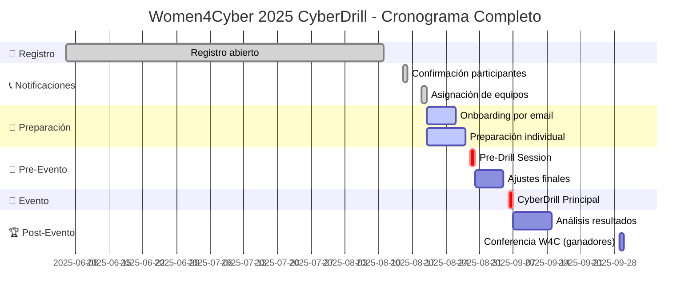

# 🛡️ Women4Cyber 2025 Professional CyberDrill
## Manual de Operaciones

> **Misión**: Demostrar excelencia técnica en ciberseguridad mientras cerramos la brecha de género.
---

## 🚨 RECURSOS DE APRENDIZAJE ACELERADO

### 📚 Materiales de Estudio CRÍTICOS (Orden de Prioridad)

#### 🥇 PRIORIDAD 1 - ESENCIAL PARA COMPETIR
1. **NIST Incident Response Framework**
   - **Tiempo**: 30 minutos
   - **Recurso**: [NIST SP 800-61 Rev. 2](https://csrc.nist.gov/publications/detail/sp/800-61/rev-2/final)
   - **Focus**: Fases: Prepare → Detect → Contain → Eradicate → Recover → Learn

2. **Common Attack Types & Indicators**
   - **Tiempo**: 45 minutos
   - **Cubrir**: Phishing, Malware, DDoS, Lateral Movement, Data Exfiltration
   - **Focus**: Cómo se ven en logs y network traffic

3. **ELK Stack Básico**
   - **Tiempo**: 1 hora
   - **Recurso**: [Elastic Getting Started](https://www.elastic.co/guide/en/elasticsearch/reference/current/getting-started.html)
   - **Focus**: Queries básicas, filtros, dashboard navigation

4. **Wireshark Essentials**
   - **Tiempo**: 45 minutos
   - **Focus**: Filtros básicos, follow streams, protocol analysis
   - **Practice**: Detectar tráfico sospechoso

#### 🥈 PRIORIDAD 2 - IMPORTANTE PARA DESTACAR
1. **Wazuh SIEM**
   - **Tiempo**: 30 minutos
   - **Focus**: Navigation, rule creation, alert analysis

2. **Network Traffic Analysis**
   - **Tiempo**: 30 minutos
   - **Tool**: Arkime (if available) o advanced Wireshark
   - **Focus**: Session analysis, anomaly detection

3. **MITRE ATT&CK Framework**
   - **Tiempo**: 30 minutos
   - **Focus**: Common TTPs, mapping attacks to framework

#### 🥉 PRIORIDAD 3 - NICE TO HAVE
1. **Malware Analysis Basics**
2. **Threat Intelligence Concepts**
3. **Advanced Correlation Techniques**

### 🎯 CHEAT SHEET RÁPIDO - COMANDOS CRÍTICOS

#### 🔍 ELK Stack Queries Esenciales
```json
# Buscar eventos por IP
source.ip: "192.168.1.100"

# Buscar por rango de tiempo
@timestamp:[2025-08-23T00:00:00 TO 2025-08-23T23:59:59]

# Buscar múltiples términos
message: "failed" AND "login"

# Buscar por tipo de evento
event.category: "network" OR event.category: "authentication"

# Agregaciones básicas
GET /_search
{
  "aggs": {
    "by_source_ip": {
      "terms": {"field": "source.ip"}
    }
  }
}
```

#### 🌐 Wireshark Filters Críticos
```bash
# Filtrar por IP
ip.addr == 192.168.1.100

# Filtrar tráfico HTTP sospechoso  
http.request.method == "POST"

# Buscar conexiones a puertos específicos
tcp.port == 80 or tcp.port == 443

# Filtrar tráfico DNS
dns

# Buscar conexiones establecidas
tcp.flags.syn == 1 and tcp.flags.ack == 1

# Detectar scans de puerto
tcp.flags.syn == 1 and tcp.flags.ack == 0
```

#### 🚨 Attack Indicators Cheat Sheet
| Attack Type | Key Indicators | Where to Look |
|-------------|----------------|---------------|
| **Phishing** | Suspicious domains, attachment execution | Email logs, DNS queries |
| **Malware** | Unusual processes, C&C communications | Process logs, network traffic |
| **DDoS** | High volume traffic, same source patterns | Network logs, bandwidth usage |
| **Brute Force** | Multiple failed logins, same source | Authentication logs |
| **Lateral Movement** | Admin account usage, unusual access patterns | Windows event logs, authentication |

### ⚡ SETUP TÉCNICO DE EMERGENCIA (15 minutos)

#### ✅ Checklist Técnico Mínimo
```bash
# 1. Test de conexión
ping google.com
# Target: <50ms latency

# 2. Speed test
# Usar speedtest.net
# Target: >25 Mbps down, >5 Mbps up

# 3. Browser prep
# Chrome/Firefox última versión
# Limpiar cache: Ctrl+Shift+Del
# Habilitar JavaScript
# Permitir pop-ups para cyberranges.com

# 4. Platform access test
# Ir a app.cyberranges.com
# Login exitoso
# Navigation fluida
```

#### 📞 CONTACTOS DE EMERGENCIA - TEMPLATE
```
EQUIPO WOMEN4CYBER 2025
========================
Team Captain: [NOMBRE] - [EMAIL] - [WHATSAPP] - [BACKUP_CONTACT]
Analista SIEM: [NOMBRE] - [EMAIL] - [WHATSAPP] - [BACKUP_CONTACT]  
Analista Red: [NOMBRE] - [EMAIL] - [WHATSAPP] - [BACKUP_CONTACT]
Especialista Malware: [NOMBRE] - [EMAIL] - [WHATSAPP] - [BACKUP_CONTACT]

COORDINACIÓN W4C
================
Email: w4c-contact@cyberranges.com
Emergency: [TBD durante Pre-Drill]

BACKUP PERSONAL
===============
Internet backup: [Plan de datos móvil]
Location backup: [Dirección alternativa con WiFi]
Contact backup: [Persona que puede ayudar técnicamente]
```

---

## 📋 Índice

1. [🎯 Información General del Evento](#-información-general-del-evento)
2. [📅 Timeline Completo](#-timeline-completo)
3. [⚙️ Preparación Técnica](#️-preparación-técnica)
4. [🧠 Preparación de Conocimientos](#-preparación-de-conocimientos)
5. [👥 Estrategias de Equipo](#-estrategias-de-equipo)
6. [📝 Checklists Diarios Detallados](#-checklists-diarios-detallados)
7. [🚀 Día del Evento](#-día-del-evento)
8. [🏆 Post-Evento y Seguimiento](#-post-evento-y-seguimiento)
9. [📞 Recursos de Emergencia](#-recursos-de-emergencia)
10. [📚 Anexos](#-anexos)

---

## 🎯 Información General del Evento

### 📊 Datos Clave
- **Fecha Principal**: 6 de Septiembre 2025, 15:00-20:30 CEST
- **Formato**: 100% Online, trabajo en equipo
- **Duración**: 4.5 horas de competición activa
- **Pre-Drill**: 29 de Agosto 2025, 15:00 CEST
- **Plataforma**: app.cyberranges.com
- **Idioma**: Inglés

### 🎖️ Premios y Reconocimientos
- **1º Lugar**: Viaje a conferencia W4C en Atenas + Acceso CITADEL Red Team Elite Training + Certificado Gold
- **2º Lugar**: Reconocimiento en comunicaciones W4C + Certificado Silver
- **3º Lugar**: Reconocimiento en comunicaciones W4C + Certificado Bronze
- **Todos**: Certificado de Participación

### 🎯 Objetivos del Evento
1. Probar capacidades de respuesta a incidentes cibernéticos reales
2. Visibilizar el papel de las mujeres en ciberseguridad
3. Fomentar networking profesional
4. Desarrollar habilidades técnicas avanzadas

---

## 📅 Timeline Completo



### 🗓️ Fechas Críticas

| Fecha | Evento | Prioridad | Acción Requerida |
|-------|--------|-----------|------------------|
| 15 Aug 2025 | Notificación de aceptación | 🔴 CRÍTICA | Confirmar participación inmediatamente |
| 19 Aug 2025 | Asignación de equipos | 🔴 CRÍTICA | Contactar con teammates |
| 20-26 Aug 2025 | Onboarding y preparación | 🟡 ALTA | Completar todos los checklists diarios |
| 29 Aug 2025 | Pre-Drill Session | 🔴 CRÍTICA | Asistencia OBLIGATORIA |
| 6 Sep 2025 | CyberDrill | 🔴 CRÍTICA | Evento principal |

---

## ⚙️ Preparación Técnica

### 💻 Requisitos de Hardware
- **Equipo**: Laptop o desktop con mínimo 8GB RAM
- **Procesador**: Intel i5 o equivalente AMD (mínimo)
- **Almacenamiento**: 50GB libres para logs y capturas
- **Pantalla**: Resolución mínima 1366x768 (recomendado: 1920x1080 o superior)

### 🌐 Requisitos de Conectividad
- **Internet**: Conexión estable mínimo 25 Mbps down/5 Mbps up
- **Backup**: Plan de datos móvil como respaldo
- **Latencia**: <100ms para Europa (test: ping google.com)
- **VPN**: Desactivar VPNs durante el evento (pueden causar problemas)

### 🖥️ Software y Navegador
```bash
# Test de navegador recomendado
# Chrome/Firefox/Edge versión más reciente
# JavaScript habilitado
# Cookies de terceros habilitados
# Pop-ups permitidos para app.cyberranges.com
```

### 🛠️ Herramientas de Apoyo (Opcionales pero Recomendadas)
- **Editor de texto**: Notepad++, VSCode, o Sublime
- **Calculadora científica**: Para análisis numérico
- **Herramienta de capturas**: Snagit, Greenshot, o nativo del SO
- **Timer/Cronómetro**: Para gestión de tiempo por ejercicio

### 🔒 Setup de Seguridad
- Deshabilitar antivirus/firewall que pueda bloquear conexiones
- Cerrar aplicaciones no esenciales
- Configurar modo "No molestar"
- Backup de contraseñas en gestor seguro

---

## 🧠 Preparación de Conocimientos

### 📚 Conocimientos OBLIGATORIOS

#### 🚨 Fundamentos de Respuesta a Incidentes
- **Marco NIST**: Identificar → Contener → Erradicar → Recuperar → Lecciones
- **Playbooks estándar**: DDoS, Malware, Phishing, Data Breach
- **Documentación**: Registro de evidencia, chain of custody
- **Comunicaciones**: Escalación interna y externa

#### 📊 Análisis de Logs con SIEM
```bash
# Herramientas clave a dominar:
- ELK Stack (Elasticsearch, Logstash, Kibana)
- Wazuh
- Splunk (conceptos básicos)
- Queries y filtros avanzados
- Correlación de eventos
- Creación de alertas
```

#### 🌐 Análisis de Tráfico de Red
- **Wireshark**: Filtros, análisis de protocolos, follow streams
- **Arkime**: Navegación de sesiones, búsqueda de patrones
- **TCPdump**: Captura en línea de comandos
- **Análisis de anomalías**: Bandwidth, connections, protocols

#### 🦠 Tipos de Ataques Comunes
| Tipo de Ataque | Indicadores Clave | Herramientas de Detección |
|----------------|-------------------|---------------------------|
| **Phishing** | Dominios sospechosos, attachments maliciosos | Email headers, URL reputation |
| **Malware** | Procesos anómalos, conexiones C&C | Process monitoring, network analysis |
| **Ransomware** | Encriptación masiva, notes de rescate | File system monitoring, behavioral analysis |
| **DDoS** | Volumen anómalo de tráfico | Network monitoring, rate analysis |
| **Lateral Movement** | Autenticaciones anómalas, accesos privilegiados | Event logs, authentication analysis |

### 📈 Conocimientos DESEABLES

#### 🔬 Análisis de Malware Intermedio
- **Análisis estático**: Strings, metadata, hashes
- **Análisis dinámico**: Sandboxing, behavioral monitoring
- **Herramientas**: Ghidra, x64dbg, Process Monitor
- **IOCs**: Extraction and documentation

#### 🎯 Técnicas Avanzadas de Detección
- **Threat Hunting**: Proactive searching, hypothesis-driven
- **Behavioral Analysis**: User/Entity Behavior Analytics (UEBA)
- **Threat Intelligence**: IOC integration, TTP mapping
- **Machine Learning**: Anomaly detection concepts

---

## 👥 Estrategias de Equipo

### 🎖️ Roles y Responsabilidades

#### 👑 Team Captain (Asignado por plataforma)
- **Pre-evento**: Cambiar nombre y avatar del equipo
- **Durante evento**: Coordinación general, toma de decisiones finales
- **Comunicación**: Punto de contacto con organización

#### 🔍 Analista de Logs/SIEM
- **Especialización**: ELK Stack, Wazuh, análisis de eventos
- **Responsabilidades**: Correlación de eventos, detección de patrones
- **Herramientas**: SIEM tools, query languages

#### 🌐 Analista de Red
- **Especialización**: Wireshark, Arkime, análisis de tráfico
- **Responsabilidades**: Análisis de paquetes, detección de anomalías
- **Herramientas**: Network analysis tools

#### 🦠 Especialista en Malware
- **Especialización**: Análisis estático/dinámico, IOCs
- **Responsabilidades**: Análisis de samples, threat intelligence
- **Herramientas**: Disassemblers, sandboxes, analysis platforms

#### 📝 Documentador/Comunicador
- **Especialización**: Technical writing, incident response
- **Responsabilidades**: Documentación de hallazgos, comunicación clara
- **Herramientas**: Documentation tools, presentation skills

### 🤝 Metodología de Trabajo

#### 🔄 Proceso de Resolución de Ejercicios
1. **Lectura colectiva** (2 min): Todos leen el problema
2. **Brainstorming** (3 min): Ideas y enfoques posibles
3. **Asignación de tareas** (1 min): Quién hace qué
4. **Trabajo paralelo** (tiempo variable): Ejecución
5. **Sincronización** (5 min): Compartir hallazgos
6. **Validación y envío** (2 min): Confirmar respuesta

#### 💬 Comunicación Efectiva
```
Estructura de comunicación recomendada:
- Estado: "Trabajando en X", "Completado Y", "Bloqueado en Z"
- Hallazgos: "Encontré [evidencia] que indica [conclusión]"
- Solicitud ayuda: "Necesito ayuda con [problema específico]"
- Tiempo: "Estimación: X minutos para completar"
```

#### 📊 Gestión de Tiempo por Ejercicio
- **Lectura y comprensión**: 15% del tiempo
- **Investigación y análisis**: 60% del tiempo
- **Validación y documentación**: 20% del tiempo
- **Buffer para imprevistos**: 5% del tiempo

---

## 📝 Checklists Diarios Detallados

## ⚡ INICIO ACELERADO - INCORPORACIÓN TARDÍA AL EQUIPO

> **🚨 SITUACIÓN ACTUAL**: Incorporación el 22 de agosto por reemplazo. Tiempo reducido para preparación - FOCO EN PRIORIDADES CRÍTICAS

### 🎯 Objetivos Inmediatos (23-29 Agosto)
1. **CRÍTICO**: Integración rápida con el equipo existente
2. **CRÍTICO**: Setup técnico completo y funcional
3. **ALTA**: Conocimientos mínimos viables para competir
4. **MEDIA**: Práctica básica con herramientas principales

---

### 📅 Plan Acelerado - Semana del 23-29 Agosto

#### 🗓️ Viernes 23 Agosto - INTEGRACIÓN URGENTE Y SETUP
**⏰ PRIORIDAD MÁXIMA - Día completo dedicado**

##### 🌅 Mañana (08:00 - 12:00)
- [ ] **08:00** - ☕ Desayuno energético y mentalización
- [ ] **08:30** - 📧 **CRÍTICO**: Revisar todos los emails desde el 19 agosto
- [ ] **09:00** - 📞 **CRÍTICO**: Contactar teammates INMEDIATAMENTE
  - [ ] WhatsApp/Telegram grupal
  - [ ] Email individual a cada miembro
  - [ ] LinkedIn connection si es necesario
- [ ] **09:30** - 💻 **CRÍTICO**: Setup técnico básico
  - [ ] Test de conexión (speedtest.net)
  - [ ] Actualizar navegador
  - [ ] Crear cuenta app.cyberranges.com
  - [ ] Verificar email y activar cuenta
- [ ] **10:30** - 📱 **CRÍTICO**: Primera videollamada de emergencia con equipo
  - [ ] Presentación express (5 min)
  - [ ] Estado actual del equipo
  - [ ] Roles ya asignados
  - [ ] Mi rol potencial
  - [ ] Materiales compartidos hasta ahora
- [ ] **11:30** - 📋 Recopilar TODO el material del equipo
  - [ ] Documentos compartidos
  - [ ] Recursos de estudio
  - [ ] Estrategias ya definidas
  - [ ] Calendarios de preparación

##### 🌤️ Tarde (14:00 - 18:00)
- [ ] **14:00** - 🧠 **SPEED LEARNING**: Conceptos críticos mínimos
  - [ ] NIST Incident Response Framework (30 min)
  - [ ] Tipos de ataques básicos (30 min)
- [ ] **15:00** - 🔧 **HERRAMIENTAS**: Setup y práctica básica
  - [ ] ELK Stack tutorial express (45 min)
  - [ ] Wireshark básico (30 min)
- [ ] **16:15** - 💻 **PLATAFORMA**: Familiarización profunda
  - [ ] Explorar toda la interface
  - [ ] Completar perfil
  - [ ] Test de funcionalidades
- [ ] **17:00** - 👥 **EQUIPO**: Segunda reunión - integración
  - [ ] Review de mi progreso del día
  - [ ] Asignación de mi rol específico
  - [ ] Plan para los próximos días
  - [ ] Tareas específicas para el weekend

##### 🌆 Noche (19:00 - 22:00)
- [ ] **19:00** - 📚 Lectura intensiva: incident response playbooks
- [ ] **20:30** - 📝 Crear mi propio cheat sheet básico
- [ ] **21:30** - 📋 Planning detallado para el weekend
- [ ] **22:00** - 💤 Descanso - necesario para retener información

#### 🗓️ Sábado 24 Agosto - ACELERACIÓN TÉCNICA
**⏰ Día intensivo de práctica y aprendizaje**

##### 🌅 Mañana (09:00 - 13:00)
- [ ] **09:00** - ☕ Setup del día + review de objetivos
- [ ] **09:30** - 🔍 **SIEM INTENSIVE**: ELK Stack profundo
  - [ ] Configuración básica
  - [ ] Queries esenciales
  - [ ] Análisis de logs sospechosos
  - [ ] Correlación de eventos
- [ ] **11:30** - 🌐 **NETWORK ANALYSIS**: Wireshark avanzado
  - [ ] Filtros críticos
  - [ ] Análisis de tráfico malicioso
  - [ ] Detección de anomalías
- [ ] **12:30** - 📊 Status check con equipo

##### 🌤️ Tarde (14:30 - 18:30)
- [ ] **14:30** - 🦠 **MALWARE BASICS**: Conceptos esenciales
  - [ ] Tipos de malware
  - [ ] Indicators of Compromise (IOCs)
  - [ ] Análisis básico
- [ ] **16:00** - 🎯 **ATTACK PATTERNS**: Estudio de casos
  - [ ] Phishing campaigns
  - [ ] DDoS attacks
  - [ ] Lateral movement
- [ ] **17:30** - 👥 **TEAM PRACTICE**: Primera práctica conjunta
  - [ ] Mock exercise (30 min)
  - [ ] Análisis de performance
  - [ ] Ajustes de comunicación

##### 🌆 Noche (19:00 - 21:00)
- [ ] **19:00** - 📝 Documentar todo lo aprendido
- [ ] **20:00** - 🔄 Review con teammates: progress update
- [ ] **20:30** - 🎯 Planificar domingo específicamente
- [ ] **21:00** - 💤 Descanso y desconexión

#### 🗓️ Domingo 25 Agosto - CONSOLIDACIÓN Y ESTRATEGIA
**⏰ Día de consolidación y preparación de equipo**

##### 🌅 Mañana (10:00 - 13:00)
- [ ] **10:00** - ☕ Inicio tranquilo + review mental
- [ ] **10:30** - 🔄 **CONSOLIDATION**: Repasar conceptos clave
- [ ] **11:30** - 🛠️ **TOOLS PRACTICE**: Usar todas las herramientas juntas
- [ ] **12:30** - 📋 Preparar questions para el equipo

##### 🌤️ Tarde (14:00 - 17:00)
- [ ] **14:00** - 👥 **TEAM STRATEGY SESSION** (1.5 horas)
  - [ ] Roles definitivos
  - [ ] Metodología de trabajo
  - [ ] Comunicación durante evento
  - [ ] División de tipos de ejercicios
  - [ ] Protocolos de toma de decisiones
- [ ] **15:30** - 🎮 **FULL MOCK DRILL** (1 hora)
  - [ ] Simulacro completo
  - [ ] Con timing real
  - [ ] Con comunicación real
- [ ] **16:30** - 📊 **POST-MOCK ANALYSIS**
  - [ ] Qué funcionó bien
  - [ ] Qué necesita mejora
  - [ ] Ajustes finales

##### 🌆 Noche (18:00 - 20:00)
- [ ] **18:00** - 📝 Finalizar cheat sheets personales
- [ ] **19:00** - 📞 Check-in final con equipo del día
- [ ] **19:30** - 🎯 Planning para la semana pre-evento
- [ ] **20:00** - 💤 Relax y preparación mental

#### 🗓️ Lunes 26 Agosto - PREPARACIÓN FINAL
#### 🗓️ Lunes 26 Agosto - PREPARACIÓN FINAL
**⏰ Día de consolidación técnica y team bonding**

- [ ] **08:00** - ☕ Start del día con mindset positivo
- [ ] **08:30** - 🔧 **TECH CHECK COMPLETO**
  - [ ] Test exhaustivo de setup técnico
  - [ ] Verificar acceso plataforma desde IP final
  - [ ] Performance check: RAM, CPU, storage
  - [ ] Backup de todas las configuraciones
- [ ] **10:00** - 🧠 **KNOWLEDGE GAPS**: Identificar y llenar huecos
  - [ ] Quick quiz personal sobre conceptos
  - [ ] Buscar recursos para temas débiles
  - [ ] Practice específica en áreas problemáticas
- [ ] **12:00** - 📋 **WORKSPACE SETUP**
  - [ ] Organización física del espacio
  - [ ] Preparar materials: agua, snacks, notas
  - [ ] Configurar modo "No molestar"
- [ ] **14:00** - 👥 **TEAM FINAL STRATEGY**
  - [ ] Reunión de 1 hora: estrategia definitiva
  - [ ] Confirmar roles y responsabilidades
  - [ ] Protocols de comunicación durante evento
  - [ ] Emergency contacts y backup plans
- [ ] **16:00** - 🎮 **FINAL MOCK EXERCISE**
  - [ ] Simulacro de 1 hora completa
  - [ ] Con toda la metodología aplicada
  - [ ] Timing exacto y comunicación real
- [ ] **17:30** - 📊 **FINAL ADJUSTMENTS**
  - [ ] Análisis del mock
  - [ ] Últimos ajustes de estrategia
  - [ ] Confirmar readiness para Pre-Drill
- [ ] **19:00** - 💤 **RELAX MODE**: Desconectar y relajar

#### 🗓️ Martes 27 Agosto - MANTENIMIENTO Y CONFIANZA
**⏰ Día de repaso ligero y building confidence**

- [ ] **09:00** - 🔄 **LIGHT REVIEW** (NO cramming)
  - [ ] Repaso de cheat sheets (30 min max)
  - [ ] Quick review de herramientas (30 min max)
- [ ] **10:00** - 📚 **DOCUMENTATION FINAL**
  - [ ] Organizar todos los materiales
  - [ ] Crear quick reference cards
  - [ ] Backup de todo en múltiples locations
- [ ] **11:00** - 🤝 **TEAM CHECK-IN** (30 min)
  - [ ] Status de todos los miembros
  - [ ] Resolver últimas dudas
  - [ ] Confirmar attendance para Pre-Drill
- [ ] **14:00** - 🎯 **CONFIDENCE BUILDING**
  - [ ] Review de todo lo aprendido (positivo)
  - [ ] Recordar fortalezas del equipo
  - [ ] Visualización de éxito en evento
- [ ] **15:00** - 🔧 **TECHNICAL MAINTENANCE**
  - [ ] Quick test de plataforma
  - [ ] Verificar que todo sigue funcionando
  - [ ] Preparar contingency plans
- [ ] **16:00** - 💪 **PERSONAL PREPARATION**
  - [ ] Actividad física ligera
  - [ ] Organizar schedule para resto de semana
  - [ ] Meal prep para días importantes
- [ ] **Evening** - 🎮 **RELAX**: Gaming, series, hobbies - NO cyber

#### 🗓️ Miércoles 28 Agosto - PRE-DRILL PREP
**⏰ Día de preparación específica para Pre-Drill Session**

- [ ] **09:00** - 📋 **PRE-DRILL CHECKLIST**
  - [ ] Revisar qué esperar de la sesión
  - [ ] Preparar lista de questions específicas
  - [ ] Test de setup técnico una vez más
- [ ] **10:00** - 👥 **TEAM SYNC** (30 min)
  - [ ] Confirmar que todos estarán en Pre-Drill
  - [ ] Shared expectations y objectives
  - [ ] Plan de comunicación durante sesión
- [ ] **11:00** - 🔧 **FINAL TECH PREPARATION**
  - [ ] Clean browser, clear cache
  - [ ] Test de internet speed
  - [ ] Verificar backup connection
  - [ ] Prepare workspace para mañana
- [ ] **14:00** - 🧠 **MENTAL PREPARATION**
  - [ ] Light review de platform navigation
  - [ ] Preparar mindset para hacer preguntas
  - [ ] Visualizar sesión exitosa
- [ ] **15:00** - 📝 **DOCUMENTATION READY**
  - [ ] Preparar template para notas de Pre-Drill
  - [ ] Tener cheat sheets accesibles
  - [ ] Organizar materials físicos
- [ ] **16:00** - 🎯 **TEAM FINAL ALIGNMENT**
  - [ ] Short meeting: expectations para mañana
  - [ ] Confirm roles durante Pre-Drill
  - [ ] Emergency contact confirmation
- [ ] **Evening** - 😌 **EARLY REST**: Dormir bien para estar fresh mañana

#### 🗓️ Jueves 29 Agosto - Pre-Drill Session
- [ ] **13:00** - Comida ligera y hidratación
- [ ] **14:00** - Setup completo y test de conexión
- [ ] **14:30** - Login en plataforma y navegación a lobby
- [ ] **14:45** - **CONECTAR A PRE-DRILL SESSION (15:00 CEST)**
- [ ] **15:00-16:00** - Participación activa en Pre-Drill:
  - [ ] Test de acceso y navegación
  - [ ] Familiarización con interface
  - [ ] Test de chat y comunicación
  - [ ] Prueba de envío de respuestas
  - [ ] Resolución de problemas técnicos
  - [ ] Q&A con organizadores
- [ ] **16:30** - Reunión post-PreDrill con equipo
- [ ] **17:00** - Documentar issues/learnings de Pre-Drill
- [ ] **17:30** - Ajustar setup basado en experiencia
- [ ] **18:00** - Confirmar readiness para evento principal
- [ ] **19:00** - Descanso y desconexión mental

### 📅 Semana del 2-6 Septiembre: Countdown Final

#### 🗓️ Lunes 2 Septiembre - Mantenimiento
- [ ] **09:00** - Review ligero de conceptos clave (no overdo)
- [ ] **10:00** - Organización final de materials y recursos
- [ ] **11:00** - Test de backup internet connection
- [ ] **14:00** - Comunicación con equipo: confirmar readiness
- [ ] **15:00** - Preparar meal prep para día del evento
- [ ] **16:00** - Organizar schedule personal para semana
- [ ] **17:00** - Backup de archivos importantes
- [ ] **18:00** - Review de contact info de emergencia
- [ ] **Noche** - Actividades relajantes, sleep hygiene

#### 🗓️ Martes-Jueves 3-5 Septiembre - Modo Mantenimiento
- [ ] **Daily**: Mantener rutina normal de trabajo/estudio
- [ ] **Daily**: 30 min review ligero de cheat sheets
- [ ] **Daily**: Check-in rápido con equipo (5 min)
- [ ] **Daily**: Test rápido de conexión y plataforma
- [ ] **Daily**: Mantener good sleep schedule
- [ ] **Daily**: Actividad física para mantener energía
- [ ] **Evitar**: Cramming intensivo o práctica pesada

---

## 🚀 Día del Evento - 6 Septiembre 2025

### 🌅 Rutina Pre-Evento (06:00 - 14:45)

#### ☀️ Mañana Temprana
- [ ] **06:00** - Despertar natural (sin alarma estresante)
- [ ] **06:30** - Ducha y rutina personal completa
- [ ] **07:00** - Desayuno nutritivo y balanceado
- [ ] **07:30** - Actividad física ligera (20 min walk/stretch)
- [ ] **08:00** - Review muy ligero de cheat sheets (15 min MAX)
- [ ] **08:30** - Actividades relajantes: música, lectura, meditación

#### 🌤️ Medio Día
- [ ] **10:00** - Snack ligero y hidratación
- [ ] **10:30** - Organizar workspace final
- [ ] **11:00** - Test rápido de todos los sistemas
- [ ] **11:30** - Backup de contactos y accesos
- [ ] **12:00** - Almuerzo ligero pero nutritivo
- [ ] **13:00** - Momento de tranquilidad y preparación mental
- [ ] **13:30** - Check-in con equipo: everyone ready?

#### ⚡ Setup Final (14:00 - 14:45)
- [ ] **14:00** - Setup completo de workspace
  - [ ] Laptop cargado y conectado a corriente
  - [ ] Internet principal + backup móvil tested
  - [ ] Navegador limpio con tabs necesarios
  - [ ] Agua, snacks saludables, servilletas
  - [ ] Notas, cheat sheets, y materiales físicos
  - [ ] Phone en silent, notifications off
- [ ] **14:15** - Login en app.cyberranges.com
- [ ] **14:30** - Join lobby y verificar team assignment
- [ ] **14:40** - Test de chat con teammates
- [ ] **14:45** - Mental preparation: breathe, focus, confidence

### 🎯 Timeline del Evento (15:00 - 20:30 CEST)

#### 🚪 Fase de Conexión (15:00 - 15:30)
**Objetivos**: Acceso verificado, comunicación establecida
- [ ] **15:00** - Conectar inmediatamente a lobby
- [ ] **15:02** - Confirmar presencia en chat general
- [ ] **15:05** - Verificar todos los teammates presentes
- [ ] **15:10** - Test de todas las funcionalidades
- [ ] **15:15** - Review rápido de strategy con equipo
- [ ] **15:20** - Resolver cualquier issue técnico
- [ ] **15:25** - Mental preparation para inicio oficial

#### 👋 Bienvenida W4C (15:30 - 15:45)
**Objetivos**: Información importante, motivación
- [ ] **Escucha activa** de instrucciones especiales
- [ ] **Tomar notas** de cambios o updates importantes
- [ ] **Mantener focus** mientras se chatting con equipo
- [ ] **Preparar mindset** para la explicación técnica siguiente

#### 🎓 Briefing CYBER RANGES (15:45 - 16:00)
**Objetivos**: Entender mecánica exacta, scoring, submission
- [ ] **Atención total** a explicación de dinámica
- [ ] **Notas detalladas** sobre:
  - [ ] Cómo enviar respuestas
  - [ ] Sistema de scoring y attempts
  - [ ] Timeouts y limitaciones
  - [ ] Formato esperado de respuestas
- [ ] **Preguntas** si algo no está claro
- [ ] **Confirm understanding** con teammates

#### 🏁 COMPETICIÓN PRINCIPAL (16:00 - 20:00)
**Objetivos**: Máximo rendimiento, trabajo colaborativo eficiente

##### ⏰ Gestión de Tiempo por Hora

**Primera Hora (16:00 - 17:00): Momentum Building**
- [ ] **16:00-16:05** - Quick team sync: roles confirmed, communication tested
- [ ] **16:05-16:15** - First challenge: read carefully, understand completely
- [ ] **16:15-16:45** - Execute first challenge with full methodology
- [ ] **16:45-16:55** - Submit and validate first response
- [ ] **16:55-17:00** - Quick debrief: what worked, what to adjust
- **Target**: 1-2 challenges completed, rhythm established

**Segunda Hora (17:00 - 18:00): Peak Performance**
- [ ] **17:00-17:05** - Energy check: snack/hydrate if needed
- [ ] **17:05-17:25** - Challenge 2: apply lessons from challenge 1
- [ ] **17:25-17:45** - Challenge 3: parallel work if possible
- [ ] **17:45-17:55** - Submissions and quick quality check
- [ ] **17:55-18:00** - Status update: pace assessment
- **Target**: 2-3 challenges completed, confidence high

**Tercera Hora (18:00 - 19:00): Sustained Excellence**
- [ ] **18:00-18:05** - Mid-event team check: energy, focus, issues
- [ ] **18:05-18:30** - Tackle more complex challenges
- [ ] **18:30-18:50** - Focus
